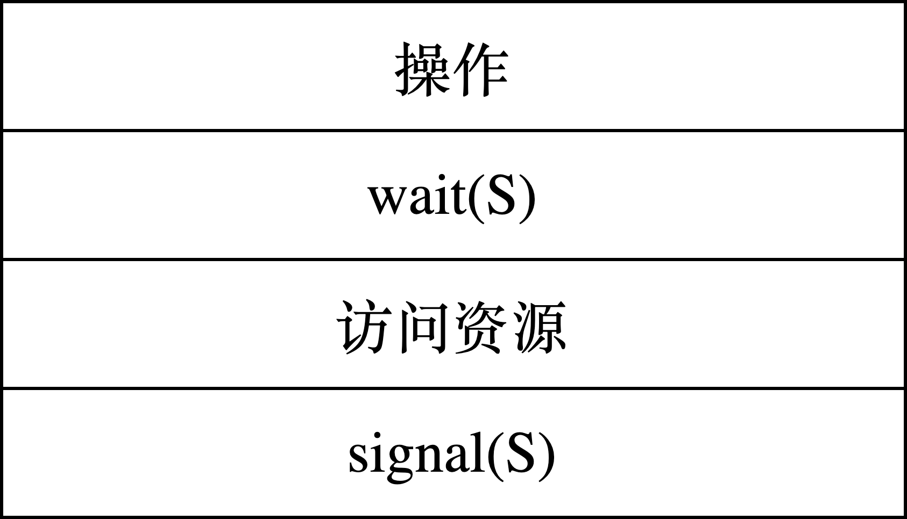
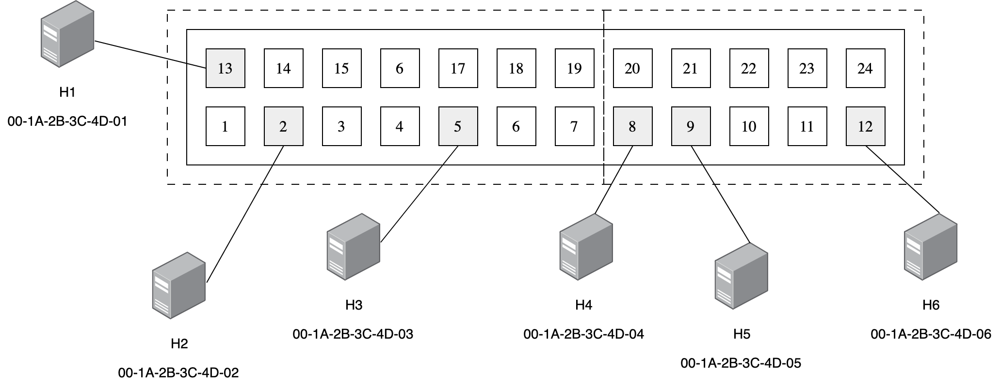
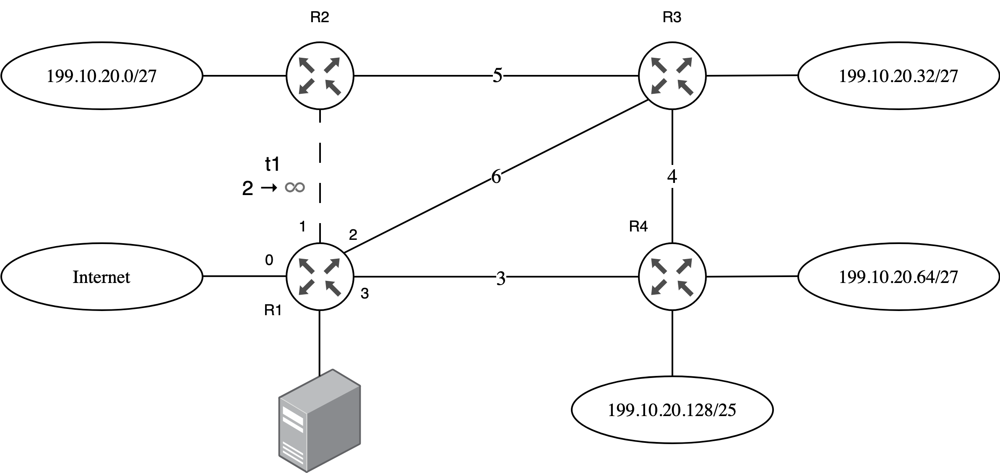
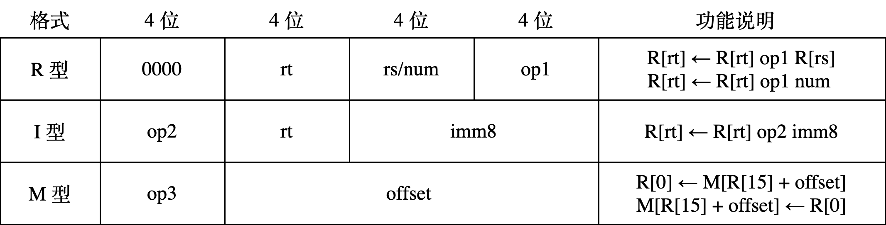
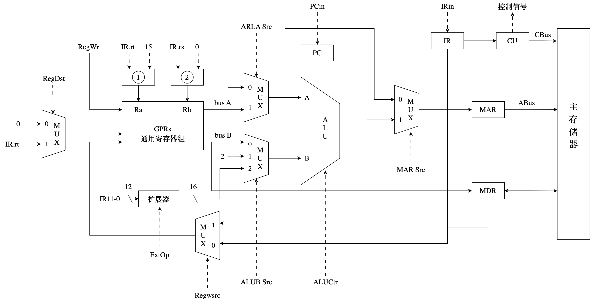
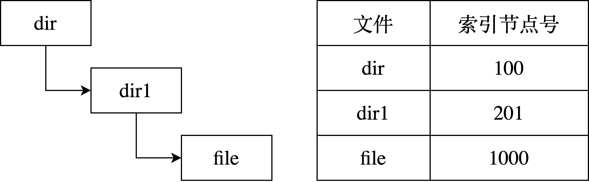
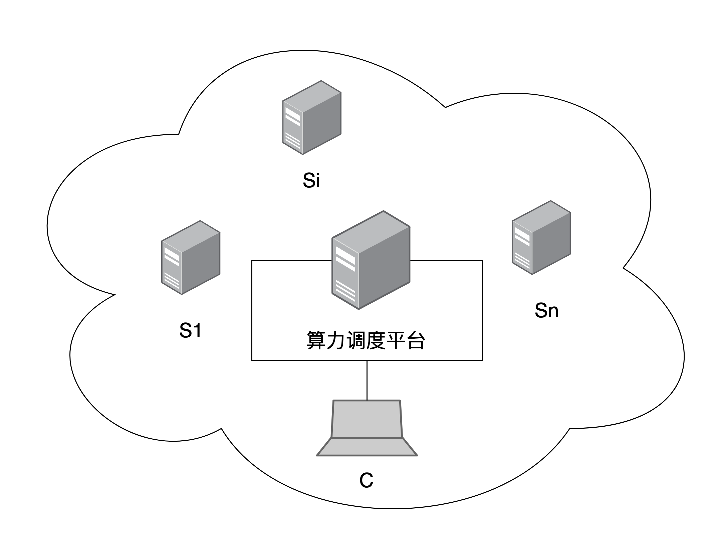

# 2026年全国硕士研究生招生考试 计算机学科专业基础综合（408）真题

> 说明：本卷为 2026 考研（初试于 2025 年 12 月举行）计算机学科专业基础综合（科目代码 408）真题还原版。共 47 题：单项选择题 40 题（80 分）+ 综合应用题 7 题（70 分）。官方不公布标准答案，文末答案为机构整理版，仅供参考。

## 一、单项选择题（1~40 题，每题 2 分，共 80 分）


### 数据结构

**1.** 当存储空间有足够的空闲空间时，在保持表内元素顺序相对不变的情况下，下列哪些操作会必然导致产生移动次数（ ）。

I. 表头插入一个元素
II. 表头删除一个元素
III. 表尾插入一个元素
IV. 表尾删除一个元素

A. I、II
B. I、III
C. II、IV
D. III、IV

**2.** 设有一个双向链表 `L`，结构为 `[p2, p1]`，头结点为 `head`。初始时 `head = cu`。现要将每个结点的 `p2` 指向 `p1` 指向结点的直接后继，应该进行的操作是（ ）。

A. while(cu!=NULL) {cu->p2=cu->p1->p1; cu=cu->p1;}
B. while(cu!=NULL && cu->p2!=NULL) {cu->p2 = cu->p1->p1; cu = cu->p1;}
C. while(cu!=NULL) {if(cu->p1!=NULL) {cu->p2=cu->p1->p1; cu=cu->p1;}}
D. while(cu!=NULL) {if(cu->p1!=NULL) {cu->p2=cu->p1->p1;} else {cu->p2=NULL;} cu=cu->p1;}

**3.** 已知二叉树 T 的中序遍历为 b, e, d, f, c, a, g。层序遍历为 a, b, g, c, d, e, f。则其后序遍历序列为多少？

A. c, e, d, f, b, g, a
B. c, e, f, d, b, g, a
C. e, f, d, c, b, g, a
D. e, g, f, d, b, c, a

**4.** 森林 F 中有 5 颗树，其节点个数分别为 2、3、4、5、7，森林中树的次序可以任意，问 F 对应的二叉树最小高度为多少？

A. 5
B. 6
C. 8
D. 10

**5.** 假设二叉树中节点权值为 a=1 , b=2 , c=4 , d=5 , e=8 , f=10 , g=12 。当带权路径长度（WPL）最小时，与节点 e （权值 8）处于相同深度的节点是哪些？

A. d
B. g
C. d,f
D. f,g

**6.** 有向图 G=(V,E) 采用邻接表存储，求某点入度的时间复杂度为？

A. 
B. 
C. 
D. 

**7.** 设有序向图 G=(V,E) ，其中顶点集 V 的大小为 n=∣V∣ ，每条边 e∈E 都标记有一个唯一的字符（不同边可标记相同字符）。定义字符串集 S 为：所有由 G 中任意一条路径（路径可包含单个顶点，对应空字符串）上的边标记按顺序拼接而成的字符串的集合。以下说法错误的是（ ）

A. 若
B. 若
C. 若
D. 若

**8.** 已知平衡二叉树（AVL 树）的定义为：树中任意一个节点的左右子树的高度差的绝对值不超过 1，且左右子树均为平衡二叉树。若某平衡二叉树的高度为 4（根节点的高度记为 1），则其根节点的左右子树的节点数之差最多为（ ）

A. 1
B. 2
C. 3
D. 5

**9.** 使用直接插入排序对序列进行升序排序，以下比较次数最少的是（ ）

A. 30,27,56,41,80,95,69
B. 31,43,26,55,63,99,77
C. 61,84,51,23,34,91,40
D. 93,32,48,81,50,21,72

**10.** 现有 n 名学生的成绩记录，每位学生的记录包含两门课程的成绩：课程 1（记为 C1​ ）和课程 2（记为 C2​ ）。

排序规则如下：
首先，依据 C1​ 成绩升序排列；若两名学生的 C1​ 成绩相同，则依据其总分（即 C1​+C2​ ）升序排列。
请从下列排序算法中，选择最适合实现上述需求的算法（ ）

A. 基数排序
B. 快速排序
C. 希尔排序
D. 选择排序

**11.** 在外部排序的 k 路归并过程中，归并趟数为 d 。下列关于 k 、 d 、初始归并段及内存大小的说法中，正确的是（ ）

Ⅰ. k 越大， d 越小
Ⅱ. 初始归并段数不影响 d
Ⅲ. 内存大小限制初始归并段的最大长度

A. Ⅰ
B. Ⅰ、Ⅱ
C. Ⅰ、Ⅲ
D. Ⅱ、Ⅲ


### 组成原理

**12.** 下列关于计算机的系统层次的叙述，错误的是

A. 最上层是应用软件层
B. 指令集体系结构是软件和硬件的接口
C. 计算机组成 (即微架构) 属于指令集体系结构的物理实现层
D. 操作系统可通过 ISA 进行抽象，向上层软件提供服务

**13.** 对机器数 `1010 0110B` 先执行算术右移 3 位，再执行算术左移 2 位，最终结果是（ ）。

A. 1101 0000B
B. 1101 0011B
C. 0101 0000B
D. 0101 0011B

**14.** 已知用 IEEE 754 单精度浮点数表示浮点型变量，采用就近舍入（中间值取偶数）。若浮点型变量 x 为 12.1 ，则 x 的机器数是（ ）

A. 4141 9999H
B. 4141 999AH
C. 41E0 CCCCH
D. 41E0 CCCDH

**15.** 用 8 个 64 M×8 bit 的 DRAM 芯片按交叉编址方式构成主存储器，并与一个宽度为 64 bit 的存储器总线相连。主存每次最多读写 64 bit，且按字节编址。则下列地址中，与主存地址 `0018 001DH` 位于同一芯片中的是（ ）

A. 0000 01D5H
B. 000F A020H
C. 0018 001EH
D. 0101 0011B

**16.** 下列不是由指令集体系结构规定的是（）

A. 输入输出指令
B. 采用向量中断
C. 虚拟存储管理方式
D. 指令流水线是否使用超级流水线技术

**17.** 哪些指令可能不改变程序下一条指令的地址？

Ⅰ. 条件转移
Ⅱ. 过程调用
Ⅲ. 陷入指令
Ⅳ. 返回

A. Ⅰ、Ⅱ
B. Ⅰ、Ⅳ
C. Ⅱ、Ⅲ
D. Ⅱ、Ⅳ

**18.** 某计算机按字节编址，数据 Cache 共有 1024 行，采用 4 路组相联映射，主存块大小为 32 B，若访问主存地址为 1028 的 4 字节数据，则该数据所在主存块对应的组号为（ ）

A. 4
B. 16
C. 32
D. 64

**19.** 某计算机按字节编址，虚拟地址为 16 位，页大小为 256B，页表项中包含装入位（P）、页框号（PPN）等字段。TLB 采用 4 路组相联映射，共有 16 个页表项，TLB 表项中包含标记（Tag）、有效位（V）等字段。在主存页表与 TLB 表项同步后，若主存页表中页号 22 对应的页表项中 P=0 ， PPN=2AH ，则下列不可能出现在组号为 2 的 TLB 表项中的是（ ）

A. Tag-05H, V-1, PPN=1CH
B. Tag=06H，V=1，PPN=2AH
C. Tag=16H，V=0，PPN=2AH
D. Tag-1AH，V=0，PPN-1CH

**20.** 在不考虑异常中断处理和访存的额外开销下，下列关于数据通路结构与 CPI 之间的关系正确的为（）

I. 单周期数据通路计算机的 CPI 等于 1
II. 多周期数据通路计算机的 CPI 大于 1
III. 流水线数据通路计算机的 CPI 等于 1

A. 仅 I、II
B. 仅 I、III
C. 仅 II、III
D. I、II、III

**21.** 在 I/O 子系统中，驱动程序和中断服务程序直接控制外设与主机之间的输入/输出操作，这一过程需要使用一些特权指令。下列指令中，不属于特权指令的是（）

A. I/O 指令
B. 关中断指令
C. 中断返回指令
D. 系统调用指令

**22.** 中断控制 I/O 方式下，实现 I/O 需要硬件和软件协同完成，中断响应和处理过程中所包含的下列工作中，必须由硬件完成的是（）

A. 开中断
B. 中断处理
C. 保存断点
D. 保存通用寄存器


### 操作系统

**23.** 下列操作中，在内核模式执行的是（）

A. 编译程序
B. 链接程序
C. 装入程序
D. 命令解释程序

**24.** 在支持虚拟存储器系统下的指令执行过程中，正确的是（）

A. 地址转换由操作系统完成
B. 页表项的内容由编译器确定
C. 缺页中断由硬件直接处理
D. 异常由操作系统处理

**25.** 下列关于的线程描述中，正确的是（）

A. 内核级线程和用户级线程都由操作系统创建
B. 多个内核级线程可以映射到一个用户级线程
C. 同一个进程下的多个内核级线程共享进程栈
D. 同一个进程下的多个线程共享进程堆

**26.** 系统中有 8 个进程，执行下图的操作，资源 S 的初始值为 5。若此时 S 的值为 -2，其中 m 表示执行到访问资源的进程个数，n 表示阻塞的进程个数，则 m 和 n 的值分别是（ ）




A. 5, 2
B. 5, 1
C. 6, 2
D. 7, 1

**27.** 假设进程 P 的读、写进程集合分别是 R(P) 和 W(P) ，进程 Q 的读、写进程集合分别为 R(Q) 和 W(Q) ，则进程 P 和 Q 并发执行中，不会发生错误的并发执行充要条件是（ ）

I. R(Q)∩W(P)=∅
II. R(P)∩R(Q)=∅
III. W(P)∩W(Q)=∅
IV. R(P)∩W(Q)=∅

A. I、II
B. I、II、III
C. I、III、IV
D. II、III

**28.** 若 64 位的系统采用三级虚拟分页存储管理方式，其结构如下图所示，第三级页表所占用的页框数是（ ）

```
| 补充位（25） | 一级页表（9） | 二级页表（9） | 三级页表（9） | 页内偏移（12） |

```

A. 1
B. 256
C. 256K
D. 256M

**29.** 下列方法中能够有效降低系统平均访存时间的是（）

I. TLB
II. 多级页表
III. 工作集概念
IV. 页表缓冲队列

A. I、III
B. II、III
C. I、III、IV
D. I、II、IV

**30.** 进程 P1 和 P2 共享一个文件 R，该文件的页表项分别是 R1 和 R2，其在 2 个进程中的虚拟地址分别是 W1 和 W2，则下列说法中正确的是（ ）

A. 页表项 R1 和 R2 的内容完全不同
B. W1 和 W2 映射的物理地址相同
C. 进程 P1 对 W1 的修改不会影响 P2 对 W2 的访问
D. W1 和 W2 虚拟地址相同

**31.** 下列关于驱动程序的描述中，错误的是（）

A. 驱动程序是硬件与操作系统之间的接口程序
B. 驱动程序需根据硬件特性定制开发
C. 驱动程序需要设置统一的接口
D. 字符设备、块设备都是同一种 IO 方式

**32.** 下列操作中，鼠标中断处理程序完成的是（）

A. 解析鼠标的输入指令含义
B. 将鼠标数据同步到用户应用程序缓冲区
C. 将数据从输入设备传输到数据寄存器
D. 将数据从数据寄存器传输到内核缓冲区


### 计算机网络

**33.** 下列关于分层网络体系结构的叙述中，错误的是（ ）

A. 每层都有明确的功能边界
B. 层次越多效率越高
C. 有利于各层技术独立演化
D. 上层无需关心下层的具体实现细节

**34.** 若在带宽 200kHz ，信噪比 S/N=1023 的信道上，发送一个长度为 1500B 的分组，则发送该分组的传输时延至少是 ()

A. 1ms
B. 2ms
C. 3ms
D. 6ms

**35.** 假设采用 CSMA/CA 的 IEEE 802.11 无线局域网，其数据传输速率为 300 Mbps，DIFS = 128 μs，SIFS = 28 μs。忽略除数据帧以外的其他帧的传输时延及信号传播时延，主机 H 发送一个总长度为 1500 B 的数据帧，则从开始发送数据帧至确认接收方收到所需的时间至少为（ ）。

A. 40 us
B. 68 us
C. 168 us
D. 196 us

**36.** 支持 VLAN 划分的以太网交换机，已按端口划分了两个 VLAN。VLAN 划分结果及各端口连接主机的 MAC 地址如图所示。下列具有不同目的 MAC 地址（DA）和源 MAC 地址（SA）的以太帧 F1–F4 中，H3 会接收到的是（ ）

F1: （DA）00-1A-2B-3C-4D-03；（SA）00-1A-2B-3C-4D-01
F2: （DA）00-1A-2B-3C-4D-04；（SA）00-1A-2B-3C-4D-05
F3: （DA）FF-FF-FF-FF-FF-FF；（SA）00-1A-2B-3C-4D-02
F4: （DA）00-1A-2B-3C-4D-06；（SA）00-1A-2B-3C-4D-03




A. 仅 F2、F4
B. 仅 F1、F3
C. 仅 F1、F2
D. 仅 F3、F4

**37.** 某网络在 t0​ 时刻的网络拓扑与 R1​ 的路由表如下图所示。 R1​∼R4​ 为路由器，基于链路状态路由算法进行路由计算。 S0​∼S4​ 为路由器 R1​ 的接口，链路上的数值为链路开销。若在 t1​ （ t1​>t0​ ）时刻， R1​ 检测到 R1​ 与 R2​ 之间的链路断开，则 R1​ 重新计算路由并进行充分路由聚合后，表中路由条目的数量为（ ）。




A. 3
B. 4
C. 5
D. 6

**38.** 下列路由协议中，能将一个自治系统划分为多个区域的内部网关协议是（ ）

I. OSPF
II. RIP
III. BGP

A. 仅 I
B. 仅 II
C. 仅 I、III
D. 仅 II、III

**39.** 若将 IP 网络 123.4.4.0/22 划分为规模均衡的 32 个子网，则 IP 地址 123.4.5.11 所在的子网是（）

A. 123.4.4.0/27
B. 123.4.4.32/27
C. 123.4.5.0/27
D. 123.4.5.32/27

**40.** 下列叙述中不属于 cookie 的技术典型用途的是（）

A. 用户跟踪
B. 个性化推荐
C. 构建虚拟购物车
D. 缩短 web 对象的响应时间


## 二、综合应用题（41~47 题，共 70 分）


### 数据结构

**41.** （本题满分 13 分）

假定二叉搜索树使用二叉链表存储，存储结构如下：

```
typedef struct BSTNode{
    int data;
    struct BSTNode *left,*right;
} BSTNode;
typedef BSTNode BTNode;

```
给一棵二叉搜索树 T 和整数 K，查找树中关键字与 K 之差的绝对值最小的所有结点，并输出该绝对值与结点中的关键字。

（1）给出算法的基本思想。（4 分）

（2）使用 C/C++ 描述算法思想。（8 分）

**42.** （本题满分 10 分）

栈的基本操作有出栈和入栈。将序列 1,2,3,…,n 依次入栈，回答下列问题：

(1) 当 n=9 时，可以得到出栈序列 {2,3,1,6,4,7,5,8} 吗？可以得到出栈序列 {2,3,1,4,6,5,7,8} 吗？（2 分）

(2) 假设 1,2,…,n 组成任意序列的出栈序列 P1​,P2​,…,Pn​ ，在序列中有 Pi​ 、 Pj​ 、 Pk​ （ i<j<k ），若该出栈序列不能由栈得到，则 Pi​ 、 Pj​ 、 Pk​ 的大小关系是？（2 分）

(3) 若 n=4 ，则以 2 开头的序列个数有多少个？（2 分）

(4) 若 n=k−1 时，出栈序列总共共有 M 个，如果 n=k ，那么以 1 开头的出栈序列个数有多少个？以 2 开头的出栈序列有多少个？总共的出栈序列有多少个？（4 分）


### 组成原理

**43.** （本题满分 10 分）

某 16 位计算机按字节编址，通用寄存器 R0～R15 的编号为 0～15，存储器地址为 16 位，采用定长指令字，指令格式有 R 型、I 型、M 型三种，如下表所示。

其中：
OP1 为 0001、0010 分别表示加、左移指令；OP2 为 0100 表示加立即数指令；OP3 为 1110、1111 分别表示取数、存数指令；R[r] 表示寄存器 r 中的内容；mm 表示移位位数；M[addr] 表示存储器地址 addr 中的内容。
请回答下列问题：

(1) 主存单元和通用寄存器的宽度各为多少位？（2 分）

(2) op1 和 op2 的编码是否可以相同？op2 和 op3 的编码是否可以相同？（2 分）

(3) 若 R(2)=ABCDH，R(9)=F001H，则指令 0000 0010 1001 0001 执行后，R2 和 R9 中的内容分别是多少？（2 分）

(4) 若变量 x 、 y 均为 16 位带符号整数，在存储器中依次从低地址向高地址连续存放， x 的地址在 R15 中。实现 y=16x−5 的 4 条指令 11–14 如题 43 表所示，写出 ①～④ 处的内容。（4 分）

题 43 表：
地址内容111​ 0000 0000 0000120000 2​ 0010130100 0000 3​141111 4​




**44.** （本题满分 15 分）

假定 43 题中计算机 C 的部分数据通路如题 44 所示。

图中带箭头虚线代表控制信号，IR.rt、IR.rs 分别表示 IR 中的 rt、rs 字段，IR₁₁₋₀ 为 IR 的低 12 位，要求取指令周期完成 PC 增量操作，请回答下列问题

（1）①和②是同一类部件，其名称是什么（1 分）

（2）I 型指令中 imm8 可以是带符号或无符号整数，M 型指令中 offset 是带符号整数，则 EXTOP 至少有几位？为什么？（2 分）

（3）取指周期中 MARSrC、ALUA SrC、ALUB SrC、RegWr 的取值各是什么？（4 分）

（4）左移指令周期中 ALUB SrC、RegWsrc、RegDst、RegWr 的取值各是什么？Extop 是否可以与 M 型指令中的 EXTop 相同？为什么？（2 分）




### 操作系统

**45.** （本题满分 7 分） 系统采用优先级（优先级越大表示优先级越高）与时间片轮转调度算法，仅当发生时钟中断时才触发抢占 CPU 操作，时钟中断间隔为 10 ms。进程首次进入就绪队列时，其时间片为 50 ms。若进程因时间片用完而返回就绪队列，其优先级值减 1；若进程被更高优先级进程抢占而返回就绪队列，其优先级值保持不变。当多个进程优先级相同时，先进入就绪队列的进程优先被调度。四个进程的到达时刻、初始优先级与 CPU 运行时间如下表所示：
进程到达就绪队列时间（ms）优先级CPU 运行时间（ms）P110395P210420P312240P414560
（1）从 10 ms 开始进程调度，直至所有进程调度结束，此时中断次数与 CPU 调度次数分别为多少？P1、P2、P3、P4 各自的首次调度发生在哪个时刻？（5 分）

（2）若时间片由 50 ms 改为 100 ms，CPU 调度次数将增大、不变还是减少？若时钟中断间隔由 10 ms 改为 1 ms，系统开销将增大、不变还是减少？（2 分）

**46.** （本题满分 8 分）

文件系统的目录项包括文件名和索引节点号。磁盘包含索引节点表、位图、目录、文件数据等元数据。若盘块大小为 4 KB，盘块号占 4 B，索引节点表存放了系统的所有文件，从 0 开始编号，存放在盘块号 100 开始连续的 4096 个盘块中。索引节点占用 128 B，包含直接地址项 5 个，一级间接地址项、二级间接地址项、三级间接地址项各 1 个。磁盘位示图和索引节点位示图分别记录磁盘和索引节点的使用情况，0 表示未使用，1 表示已使用。其中目录结构图与文件的索引节点表如下所示（此处假定图中信息已给出），file 文件占 30 KB。

（1）file 的索引节点所在的盘块号是多少？若 file 的索引节点已经读取到内存，要访问 file 文件中偏移地址 21460 的一个字节数据，则最多需要读多少个盘块？如果文件系统中有足够的磁盘空间，则最多可以存放多少个文件？（3 分）

（2）如果要删除目录 dir1，则需要对元数据进行哪些操作？（5 分）




### 计算机网络

**47.** （本题满分 9 分）

假设客户端 C 建立一条 TCP 连接，向服务器 Si 上传一个总长度为 2000 B 的计算任务描述文件。已知 C 的拥塞窗口初始阈值为 8 MSS，MSS = 500 B，Si 对收到的每个 TCP 段进行确认，且确认段不封装数据。接收窗口始终为 1000 B，RTT = 5 ms，C 建立连接时选择的初始序号为 1000，Si 选择的初始序号为 2000，SYN、ACK、FIN 为标志位，seq 为序号，ack_seq 为确认序号。在整个文件传输过程中未出现任何重传或报文丢失。

（1）C 与 Si 建立 TCP 连接过程需要几次握手？C 收到的 SYN = 1，ACK = 1 的 TCP 段的确认序号是多少？

（2）当 C 接收 Si 发送的 ACK = 1，seq = 2001，ack_seq = 2001，rwnd = 1000 确认段后，C 的拥塞窗口增加到多少？C 的发送窗口设置为多少？

（3）C 与 Si 释放 TCP 连接过程需要几次挥手？C 收到最后一个 TCP 报文段的序号（seq），确认序号（ack_seq），FIN 的值分别是多少？

（4）忽略报文段传输时延，且时间从 C 请求建立 TCP 连接时刻算起，则 C 确定 Si 已成功接收到文件的时间是多少？




---

## 参考答案速查

| 题号 | 答案 | 题号 | 答案 |
| --- | --- | --- | --- |
| 1 | A | 21 | D |
| 2 | D | 22 | C |
| 3 | C | 23 | C |
| 4 | B | 24 | D |
| 5 | D | 25 | D |
| 6 | D | 26 | A |
| 7 | B | 27 | C |
| 8 | D | 28 | C |
| 9 | B | 29 | C |
| 10 | A | 30 | B |
| 11 | C | 31 | D |
| 12 | C | 32 | D |
| 13 | A | 33 | B |
| 14 | B | 34 | D |
| 15 | A | 35 | B |
| 16 | D | 36 | B |
| 17 | B | 37 | C |
| 18 | C | 38 | A |
| 19 | A | 39 | C |
| 20 | D | 40 | D |

---

## 答案与解析


### 数据结构

**1.**

> 答案：A

在顺序存储结构中，元素连续存放以保持逻辑顺序。
表头插入元素时，需将所有现有元素后移一位为新元素腾出空间；
表头删除元素时，需将所有剩余元素前移一位以填补空位，这两种操作均必然导致元素移动。
而表尾插入或删除元素时，仅需在末尾进行操作，不影响其他元素的位置，因此不会产生移动次数。
故必然导致移动次数的操作是Ⅰ和Ⅱ。

**2.**

> 答案：D

【解析】
题意澄清

- 
双向链表结点结构为 `[p2, p1]`

- `p1`：后继指针（next）
- `p2`：需要被重新设置
- 
目标：
让每个结点的 `p2` 指向“`p1` 所指结点的直接后继”，即：`cu->p2 = cu->p1->p1`

- 
若 `cu->p1 == NULL`（尾结点），则不存在“`p1` 所指结点的直接后继”，此时应令：`cu->p2 = NULL`

- 
同时，遍历过程中必须始终推进 `cu`，否则会产生死循环。

逐项分析

❌ A

```
while(cu!=NULL) {
    cu->p2=cu->p1->p1;
    cu=cu->p1;
}

```
- 问题： 当 `cu` 是尾结点时，`cu->p1 == NULL`，此时继续访问 `cu->p1->p1` 会发生非法访问。
❌ B

```
while(cu!=NULL && cu->p2!=NULL) {
    cu->p2 = cu->p1->p1;
    cu = cu->p1;
}

```
- 问题 1：`cu->p2` 正是要被重新设置的指针，用它作为循环条件不合适。
- 问题 2：仍然没有判断 `cu->p1 == NULL`，尾结点处依然可能发生非法访问。
❌ C

```
while(cu!=NULL) {
    if(cu->p1!=NULL) {
        cu->p2=cu->p1->p1;
        cu=cu->p1;
    }
}

```
- 问题： 当 `cu->p1 == NULL` 时，说明 `cu` 到达尾结点。此时 `if` 语句不执行，`cu` 也不会更新，因此会产生死循环。
✅ D

```
while(cu!=NULL) {
    if(cu->p1!=NULL) {
        cu->p2=cu->p1->p1;
    } else {
        cu->p2=NULL;
    }
    cu=cu->p1;
}

```
- 对于非尾结点，令：`cu->p2 = cu->p1->p1`
- 对于尾结点，令：`cu->p2 = NULL`
- 每轮循环最后都执行 `cu=cu->p1`，保证遍历能够继续向后推进，不会死循环。
因此，正确答案为 D。

**3.**

> 答案：C

【解析】
首先，根据层序遍历序列 a,b,g,c,d,e,f 可知根节点为 a 。结合中序遍历 b,e,d,f,c,a,g ，确定左子树包含节点 b,e,d,f,c ，右子树仅包含 g 。

左子树的层序序列为 b,c,d,e,f ，中序序列为 b,e,d,f,c ，因此左子树的根为 b 。由于 b 在中序中为首，故无左子树，其右子树的根为层序中下一个节点 c 。

对于以 c 为根的子树，中序为 e,d,f,c ，故 c 无右子树，其左子树的根为层序中的 d 。对于以 d 为根的子树，中序为 e,d,f ，故 d 的左子节点为 e ，右子节点为 f 。

因此树的结构为：

- a 的左子节点为 b ，右子节点为 g ；
- b 的左子节点为空，右子节点为 c ；
- c 的左子节点为 d ，右子节点为空；
- d 的左子节点为 e ，右子节点为 f 。
后序遍历顺序为：左子树的后序、右子树的后序、根节点。左子树的后序依次为 e,f,d,c,b ，右子树的后序为 g ，根为 a ，故后序遍历序列为 e,f,d,c,b,g,a ，对应选项 C。

**4.**

> 答案：B

【解析】

这是一道 森林转二叉树 的经典题。

关键结论（必须掌握）

设森林中第 i 棵树对应二叉树的高度为 hi​ ，则森林转换为二叉树后：
二叉树高度=imax​{hi​+(i−1)}​
其中：

- 第 i 棵树表示森林中从左到右的第 i 棵树；
- (i−1) 来自各棵树根结点之间形成的右兄弟链；
- 为了使最终高度最小，应将高度较大的树排在前面。
先计算每棵树对应二叉树的最小高度

对于一棵有 n 个结点的普通树，采用左孩子-右兄弟表示法转换为二叉树后，由于根结点没有右孩子，因此最小高度为：
hmin​=1+⌈log2​n⌉
各棵树对应二叉树的最小高度如下：
结点数最小高度71+⌈log2​7⌉=451+⌈log2​5⌉=441+⌈log2​4⌉=331+⌈log2​3⌉=321+⌈log2​2⌉=2
按最优顺序（高度从大到小）排列：
4, 4, 3, 3, 2
计算最终二叉树高度
i树高 hi​hi​+(i−1)144245335436526
最大值为：
6​
因此答案为 B。

**5.**

> 答案：D

【解析】
为了最小化带权路径长度（WPL），需构建哈夫曼树。节点权值依次为 1, 2, 4, 5, 8, 10, 12。
构建过程如下：

- 合并权值 1 和 2，得到新节点 3；
- 合并 3 和 4，得到新节点 7；
- 合并 5 和 7，得到新节点 12；
- 合并 8 和 10，得到新节点 18；
- 合并原始权值 12（节点 g）与内部节点 12，得到新节点 24；
- 最后合并 18 和 24，得到根节点 42。
由此树结构可知，节点 e（权值 8）深度为 2（路径长度），同时节点 f（权值 10）和 g（权值 12）深度也为 2，而其他节点深度均不同（d 深度为 3，c 深度为 4，a、b 深度为 5）。
因此，与节点 e 处于相同深度的节点是 f 和 g。

**6.**

> 答案：D

【解析】 在邻接表存储中，求某点的入度需要检查所有顶点的出边链表，统计指向该点的边数。这需要访问所有 ∣V∣ 个顶点以及所有 ∣E∣ 条边，因此时间复杂度为 O(∣V∣+∣E∣) 。由于 O(∣V∣+∣E∣) 与 O(max(∣V∣,∣E∣)) 等价，故选项 D 正确。其他选项均不能完整描述该时间复杂度。

**7.**

> 答案：B

【解析】
对于选项 A：若图 G 无环，则任意路径不能重复经过顶点，否则会形成环，因此最长路径的边数不超过 n−1 。由于图是有限的，所有可能的路径数量有限，每条路径对应一个字符串（可能重复），但字符串集合 S 由有限个字符串组成，故 S 是有限集。A 正确。

对于选项 B：若图 G 无环，则任意路径最多经过 n 个不同的顶点，因此边数最多为 n−1 ，对应的字符串长度最多为 n−1 。所以 S 中不可能存在长度为 n 的字符串。B 错误。

对于选项 C：若图 G 有环，则存在一个环，可以从环上某点出发沿环行走任意多圈，得到任意长的路径，从而产生长度大于 n 的字符串。C 正确。

对于选项 D：若图 G 有环，S 中至少包含空字符串（长度为 0 ），而 0<2n （ n≥1 ），因此存在长度小于 2n 的字符串。D 正确。

综上，说法错误的是 B。

**8.**

> 答案：D

【解析】
平衡二叉树高度为 4（根节点高度为 1），因此左右子树的高度组合为：

- 两者均为 3，或
- 一个为 3、另一个为 2。
为最大化节点数之差，应使较高子树取最大节点数，较低子树取最小节点数。

- 高度 3 的平衡二叉树最大节点数为 7（满二叉树），
- 高度 2 的最小节点数为 2（根节点加一个子节点），
此时节点数之差为 7−2=5 。
若左右子树高度均为 3，节点数之差最大为 7−4=3 。
因此，根节点的左右子树节点数之差最多为 5。

**9.**

> 答案：B

【解析】 直接插入排序的比较次数取决于序列的初始有序程度。对于每个序列，从第二个元素开始，将其与前面已排序的元素从后往前比较，直到找到正确位置，记录比较次数。

- 选项 A：序列 30, 27, 56, 41, 80, 95, 69 的总比较次数为 1+1+2+1+1+3=9 次。
- 选项 B：序列 31, 43, 26, 55, 63, 99, 77 的总比较次数为 1+2+1+1+1+2=8 次。
- 选项 C：序列 61, 84, 51, 23, 34, 91, 40 的总比较次数为 1+2+3+4+1+5=16 次。
- 选项 D：序列 93, 32, 48, 81, 50, 21, 72 的总比较次数为 1+2+2+3+5+3=16 次。
比较次数最少的是选项 B，共 8 次。

**10.**

> 答案：A

【解析】排序规则要求先按 C1 成绩升序，再按总分升序，这属于多键排序问题。基数排序是一种稳定的排序算法，特别适合多键排序，因为它可以对每个键位进行独立排序，且稳定性保证了当主键（C1）相同时，次键（总分）的顺序得以保持。具体实现时，可以先按总分（低优先级键）进行稳定排序，再按 C1（高优先级键）进行稳定排序，从而满足规则。其他算法中，快速排序、希尔排序和选择排序都不是稳定的，虽然可以通过自定义比较函数在一次排序中处理多键，但稳定性和效率不如基数排序。此外，学生成绩通常为整数，基数排序对整数排序效率较高。因此，基数排序是最适合的算法。

**11.**

> 答案：C

【解析】 在外部排序的 k 路归并过程中，归并趟数 d 与初始归并段数 m 满足关系 d=⌈logk​m⌉ 。

- 对于说法Ⅰ： k 越大， logk​m 越小，因此 d 越小，正确。
- 对于说法Ⅱ： d 直接依赖于 m ，初始归并段数变化会影响 d ，错误。
- 对于说法Ⅲ：生成初始归并段时，数据需读入内存进行内部排序，因此初始归并段的最大长度受内存大小限制，正确。
综上，Ⅰ和Ⅲ正确，对应选项 C。


### 组成原理

**12.**

> 答案：C

【解析】
A 正确。 计算机系统可以按照抽象层次划分，最上层通常是应用软件层，其下依次涉及操作系统、指令集体系结构（ISA）、计算机组成（微架构）以及更底层的数字逻辑、电路与物理器件等。

B 正确。 指令集体系结构（ISA）是软件与硬件之间的接口。ISA 规定了处理器对软件可见的指令、寄存器、数据类型、寻址方式以及相关的行为规范等。软件只需要按照 ISA 编写和运行，而不需要了解处理器内部具体采用何种微架构。

C 错误。 计算机组成（微架构）是 ISA 的具体实现，而不能简单称为 ISA 的“物理实现层”。 ISA 描述的是处理器对软件呈现的功能规范和抽象接口，而微架构则规定了如何通过流水线、运算部件、Cache、控制器、寄存器组织等具体硬件结构来实现这些 ISA 功能。

因此，更准确的关系是：

> 
ISA 规定“实现什么” → 微架构规定“具体怎么实现” → 数字逻辑、电路和器件进一步完成物理实现。

所以将“计算机组成（微架构）”直接表述为 ISA 的物理实现层是不准确的。严格来说，微架构本身也不是最底层的物理实现，下面还存在数字逻辑、电路和器件等层次。

D 基本正确。 操作系统运行在 ISA 所定义的机器抽象之上，并利用 ISA 提供的指令、特权级、中断/异常等机制管理底层硬件，再向上层软件提供进程、虚拟内存、文件和 I/O 等抽象与服务。

需要注意的是，这里的“通过 ISA 进行抽象”并不是说操作系统只通过 ISA就能提供全部硬件抽象；操作系统还需要利用具体硬件提供的机制，并通过驱动程序等完成设备管理。选项的核心含义是：ISA 为操作系统提供了与处理器硬件交互的统一机器接口。

因此，本题错误选项为 C。

**13.**

> 答案：A

【解析】
机器数 `1010 0110B` 是一个 8 位有符号数（二进制补码表示）。先执行算术右移 3 位，再执行算术左移 2 位。

- 
算术右移 3 位：符号位（最高位为 1）被保留并向左扩展。
原始位从高位到低位记为 A0​ 到 A7​ （ A0​ 为符号位），右移后得到 B0​ 到 B7​ ，其中 B0​ 到 B3​ 均填充为 A0​ （1）， B4​ 到 B7​ 依次为 A1​ （0）、 A2​ （1）、 A3​ （0）、 A4​ （0），结果为 `1111 0100B`（即 -12 的二进制补码）。

- 
算术左移 2 位：将 `1111 0100B` 左移 2 位，高位丢弃，低位补 0，得到 `1101 0000B`（即 -48 的二进制补码）。

最终结果为 `1101 0000B`，对应选项 A。

**14.**

> 答案：B

【解析】
1. 确定数量级（指数部分）
12.110​∈[8,16)⇒12.1=1.5125×23
- 符号位：0
- 指数：(3 + 127 = 130 = 1000,0010_2)
2. 计算尾数

把 1.5125 转成二进制小数：
1.5125=1+0.5125
对小数部分反复乘 2：
步骤值0.5125 × 2 = 1.02510.025 × 2 = 0.0500.05 × 2 = 0.100.1 × 2 = 0.200.2 × 2 = 0.400.4 × 2 = 0.800.8 × 2 = 1.610.6 × 2 = 1.21……
得到二进制近似：

```
1.10000001100110011001100…₂

```
3. 就近舍入（中间值取偶）

IEEE 754 单精度尾数 23 位，截断时：

```
…10011001100110011001100 1100…

```
- 被舍弃部分 > 0.5 ULP
- 或者正好在中间且最低位为奇数
👉 需要进 1

因此尾数末位变为 `…10011010`

4. 拼装 IEEE 754 单精度
部分内容符号0指数10000010尾数10000011001100110011010
转换为十六进制：

```
0 | 10000010 | 10000011001100110011010
↓
4141999A₁₆

```
最终答案

B `4141 999AH`

**15.**

> 答案：A

【解析】
由 8 个 64M×8bit 的 DRAM 芯片按交叉编址方式构成主存储器，每个芯片容量为 64MB，总容量为 512MB。按字节编址，地址线共 29 位。交叉编址时，地址的低位用于选择芯片，高位用于芯片内地址。由于有 8 个芯片，地址的低 3 位（模 8）决定芯片编号。

给定地址 `0018 001DH` 的十六进制值为 0x0018001D，低 3 位二进制为 101（因为 0x1D 的低 3 位为 101），即模 8 余 5。因此，与它位于同一芯片的地址必须模 8 余 5。

- 选项 A：`0000 01D5H`，低 3 位为 101（0xD5 的低 3 位为 101），余 5，符合。
- 选项 B：`000F A020H`，低 3 位为 000，余 0，不符合。
- 选项 C：`0018 001EH`，低 3 位为 110（0x1E 的低 3 位为 110），余 6，不符合。
- 选项 D：`0101 0011B` 为二进制数，低 3 位为 011，余 3，不符合。
故只有选项 A 与给定地址位于同一芯片。

**16.**

> 答案：D

**【解析】**指令集体系结构（ISA）定义了软件与硬件之间的接口规范，包括指令集、寄存器、内存模型、中断机制等，但不涉及硬件实现细节。

- 选项 A 的输入输出指令是 ISA 的一部分，用于控制 I/O 设备；
- 选项 B 的向量中断属于中断处理机制，通常由 ISA 规定中断向量表和处理流程；
- 选项 C 的虚拟存储管理方式属于 ISA 规定的内容：是否支持虚拟存储、采用页式还是段式、地址转换机制、页表基址寄存器与 TLB 维护指令、特权级的划分，这些都是机器语言程序可见的接口规范，换一种方式原有的机器语言程序（包括操作系统本身）就无法运行。C 是本题最强的干扰项，容易被误认为「虚存是操作系统的事，所以不属于 ISA」——实际上操作系统只是在 ISA 提供的机制之上填写页表、决定置换策略，机制本身由 ISA 规定；
- 选项 D 的指令流水线是否使用超级流水线技术是微架构（microarchitecture）的实现选择，属于处理器内部设计优化，不属于 ISA 的规定范畴，因此 D 不是由指令集体系结构规定的。
【通用判据】 拿不准某个特性属不属于 ISA 时，做一次反事实检验：换一台同 ISA 但不同型号的机器（如 i5 换成 i9），这个特性变了，原来的机器语言程序还能不能原样运行？

- 能原样运行 → 属于微架构：流水线级数、是否超标量／超流水／乱序执行、Cache 的有无与容量／映射／替换策略、数据通路与内部总线宽度、控制器是硬布线还是微程序、主频与 CPI。
- 不能运行或结果不同 → 属于 ISA：指令格式与操作码、寻址方式、数据类型与格式（含大小端）、可见寄存器的个数与位数、存储空间大小与编址方式、异常与中断的类型及响应方式（含向量中断）、存储管理方式、特权级、I/O 指令。
本题的 D 正是「换型号仍能原样跑」的那一类。

**17.**

> 答案：B

【解析】
最省力的解法：只判定 Ⅱ。 过程调用指令必然把控制转移到子程序入口，一定改变下一条指令的地址，所以 Ⅱ 为假；而 Ⅱ 出现在 A、C、D 三个选项中，一次判定就排除三项，直接锁定 B。这道题不需要、也不应该去逐项纠缠 Ⅲ 和 Ⅳ。

各项说明：

- Ⅰ 条件转移：条件不满足时程序继续顺序执行，PC 仍为「当前地址 + 指令长度」，可能不改变，Ⅰ 为真。
- Ⅱ 过程调用：无条件转移到子程序入口，一定改变，Ⅱ 为假。
- Ⅲ 陷入指令：无条件陷入操作系统的相应处理程序，一定改变，Ⅲ 为假。
- Ⅳ 返回：返回到调用点之后的那条指令。以「程序原本的执行流」为参照，返回指令只是把此前的偏离修正回来，并未把程序引向新的位置，标准答案据此计为「可能不改变」。这一项的表述本身存在歧义，是本题唯一说不清的地方——考场上不要在它身上花时间，判 Ⅱ 排除即可。
答案为 B（Ⅰ、Ⅳ）。

**18.**

> 答案：C

【解析】
Cache 共有 1024 行，采用 4 路组相联映射，因此组数为 1024/4=256 组。
主存块大小为 32 B，块内偏移地址占 5 位（ 25=32 ）。
访问主存地址为 1028（十进制），按字节编址。
组号由块地址对组数取模得到：块地址为地址除以块大小的整数部分，即

1028/32=32(整数除法)
组索引

=32mod256=32
因此，该数据所在主存块对应的组号为 32。

**19.**

> 答案：A

【解析】
虚拟地址为 16 位，页大小为 256 B，因此页内偏移占 8 位，页号占 8 位。
TLB 为 4 路组相联，共 16 个表项，故分为 4 组，组索引占 2 位，标记占 6 位。

页号 22 的二进制为 00010110，高 6 位标记为 05H，低 2 位组索引为 10（即 2），因此页号 22 属于组 2。

已知主存页表中页号 22 对应的表项 P=0、PPN=2AH，同步后 TLB 中若存在该页表项，则有效位 V 应与 P 一致（即 V=0），且 PPN 应为 2AH。

选项 A 的标记为 05H，对应页号 22，但 V=1、PPN=1CH，与页表项冲突，不可能出现在组 2 的 TLB 中。
其他选项对应不同页号（如 B 对应页号 26，C 对应页号 90，D 对应页号 106），其页表项未知，故可能出现在 TLB 中。

**20.**

> 答案：D

【解析】
在不考虑异常中断处理和访存的额外开销下，单周期数据通路中每条指令在一个时钟周期内完成，因此 CPI 等于 1。

多周期数据通路中每条指令需要多个时钟周期执行，因此 CPI 大于 1。

流水线数据通路在理想情况下（无冒险和停顿）可以实现每个时钟周期完成一条指令，因此 CPI 等于 1。

故 I、II、III 均正确。

> 
注意：II 在理想情况下（完美的 overlap，运行的时间无限长)，CPI 是趋向于 1 的，但是这一题显然不是考察的理想情况，所以 II 是正确的。

**21.**

> 答案：D

【解析】
在计算机系统中，特权指令是指只能在操作系统内核态下执行的指令，用于保护系统资源和稳定性。

A 项 I/O 指令直接控制外设操作，若用户程序随意执行可能干扰系统，因此属于特权指令；
B 项关中断指令用于禁用中断，防止关键代码被中断打断，若用户程序可随意关闭中断会导致系统无法响应关键事件，故为特权指令；
C 项中断返回指令用于从中断处理程序返回，涉及处理器状态恢复和权限切换，通常需在内核态执行，也属于特权指令。

D 项系统调用指令（如 syscall 或 int 指令）是用户程序请求操作系统服务的接口，该指令本身可在用户态执行，通过触发陷入机制切换到内核态，由操作系统内核处理具体操作，因此不属于特权指令。

**22.**

> 答案：C

【解析】
参考 中断处理流程，在中断控制 I/O 方式下，中断响应和处理需要硬件和软件协同工作。

- 保存断点（即程序计数器的值）必须由硬件自动完成。因为中断发生时需立即保存返回地址，以确保后续能正确恢复执行。
- 开中断是通过软件指令实现的，用于允许或禁止中断嵌套。
- 中断请求由硬件设备产生，但响应和处理过程涉及软硬件配合。
- 保存通用寄存器通常由中断服务程序（软件）完成，以保护原程序的上下文。
因此，只有保存断点必须由硬件完成。


### 操作系统

**23.**

> 答案：C

【解析】 在操作系统中，内核模式用于执行特权指令和访问核心资源，如硬件管理和进程控制。编译程序、链接程序和命令解释程序通常作为用户空间的应用程序运行，在用户模式下执行；而装入程序负责将可执行文件加载到内存并启动进程，这一过程涉及内存分配和进程创建等特权操作，因此由操作系统内核在内核模式下执行。

**24.**

> 答案：D

【解析】 在支持虚拟存储器的系统中，地址转换由硬件（如内存管理单元 MMU）完成，操作系统仅负责管理页表；页表项的内容由操作系统在运行时动态设置，而非编译器；缺页中断由硬件触发，但实际处理（如加载页面）由操作系统完成；异常（包括缺页异常、非法指令等）在触发后统一由操作系统处理。因此，选项 D 正确。

**25.**

> 答案：D

【解析】
用户级线程由用户空间的线程库创建和管理，操作系统内核不参与其创建，因此 A 错误。
在线程映射模型中，常见的是多个用户级线程映射到一个内核级线程（多对一模型），或多个用户级线程映射到多个内核级线程（多对多模型），但多个内核级线程映射到一个用户级线程并不符合典型模型，故 B 错误。
栈是线程私有的，每个线程（包括内核级线程）都有自己的栈，因此同一进程下的多个内核级线程不共享进程栈，C 错误。
堆是进程级别的资源，同一进程下的所有线程（包括用户级和内核级线程）共享进程堆，因此 D 正确。

**26.**

> 答案：A

【解析】
资源 S 是一个计数信号量，初始值为 5，表示最多允许 5 个进程同时访问资源。
当信号量值 S 为负数时，其绝对值表示阻塞的进程数。当前 S = -2，因此阻塞进程数 n = 2。
同时，当 S < 0 时，所有初始资源均被占用，即有 5 个进程正在访问资源（处于临界区）。
m 表示执行到访问资源的进程个数，在此情境下理解为正在访问资源的进程数，故 m = 5。
因此，m 和 n 的值分别为 5 和 2。

**27.**

> 答案：C

【解析】
在进程并发执行中，不发生错误（即避免数据竞争和冲突）的充要条件基于 Bernstein 条件。Bernstein 条件指出，两个进程 P 和 Q 可安全并发执行当且仅当满足以下三个条件：

- W(P)∩R(Q)=∅ （避免写后读冲突）；
- R(P)∩W(Q)=∅ （避免读后写冲突）；
- W(P)∩W(Q)=∅ （避免写后写冲突）。
读 - 读冲突（即 R(P)∩R(Q) ）不会导致数据不一致，因此不是必要条件。

对比题目中的条件：
I 对应 W(P)∩R(Q)=∅ ，
III 对应 W(P)∩W(Q)=∅ ，
IV 对应 R(P)∩W(Q)=∅ ，
而 II 是 R(P)∩R(Q)=∅ ，无需满足。

因此，充要条件是 I、III 和 IV，对应选项 C。

**28.**

> 答案：C

在三级虚拟分页存储管理方式中，虚拟地址结构包括一级页表索引（9 位）、二级页表索引（9 位）、三级页表索引（9 位）和页内偏移（12 位）。
页内偏移 12 位对应页面大小为 4 KB（ 212 字节）。
每个页表索引为 9 位，因此每个页表有 29=512 个页表项。
假设每个页表项大小为 8 字节（典型 64 位系统），则每个页表大小为 512×8=4096 字节，恰好占用一个页框。

三级页表的数量由一级和二级页表决定：

- 一级页表有 512 个条目，每个条目指向一个二级页表，因此最多有 512 个二级页表；
- 每个二级页表有 512 个条目，每个条目指向一个三级页表，因此三级页表的最大数量为 512×512=262144 个。
每个三级页表占用一个页框，所以三级页表总共占用的页框数为 262144，即 256 K（因为 256×1024=262144 ）。
因此，正确答案为 C。

**29.**

> 答案：C

【解析】 TLB（快表）能够缓存虚拟地址到物理地址的转换结果，在 TLB 命中时直接获取物理地址，避免访问内存中的页表，从而有效降低访存延迟。工作集概念用于指导页面置换算法，通过维持进程最近访问的页面集合在内存中，减少缺页中断的发生，降低缺页率，进而减少平均访存时间。页表缓冲队列可以缓存页表项，减少访问主存页表的次数，加速地址转换过程，也有助于降低平均访存时间。多级页表的主要目的是节省页表占用的内存空间，但可能增加地址转换的步数，导致访存延迟增加，因此不能有效降低平均访存时间。故正确选项为 I、III、IV，即 C。

**30.**

> 答案：B

【解析】
进程 P1 和 P2 共享文件 R，这意味着它们通过各自的页表项 R1 和 R2 将虚拟地址 W1 和 W2 映射到相同的物理内存区域，因此 W1 和 W2 映射的物理地址相同。

- 选项 A 错误，因为页表项 R1 和 R2 至少物理地址部分相同，内容并非完全不同；
- 选项 C 错误，由于共享物理内存，P1 对 W1 的修改会影响 P2 对 W2 的访问；
- 选项 D 错误，虚拟地址是进程独立的，W1 和 W2 不一定相同。

**31.**

> 答案：D

【解析】
驱动程序是硬件与操作系统之间的接口程序，使操作系统能够控制和管理硬件，因此 A 正确；
由于不同硬件具有不同的特性和操作方式，驱动程序需要针对具体硬件进行定制开发，因此 B 正确；
为了便于操作系统统一管理和调用，驱动程序需要遵循操作系统提供的统一接口规范，因此 C 正确；
字符设备和块设备是两种不同的 I/O 方式：字符设备以字符流为单位进行数据传输（例如键盘），而块设备以固定大小的数据块为单位（例如硬盘），因此 D 错误。

**32.**

> 答案：D

【解析】 鼠标中断处理程序的主要职责是在硬件中断触发时，快速从数据寄存器中读取鼠标的原始数据，并将其送入内核缓冲区，以便操作系统内核或输入子系统后续处理。选项 D 直接描述了这一核心操作；而选项 A 涉及高级解析，通常由驱动程序或应用程序完成；选项 B 涉及用户空间同步，一般由内核的其他部分负责；选项 C 涉及硬件传输，可能由硬件或 DMA 完成，并非中断处理程序的主要职责。


### 计算机网络

**33.**

> 答案：B

【解析】 分层网络体系结构中，每层都有明确的功能边界（A 正确），这有助于模块化和功能划分；分层设计允许各层技术独立演化（C 正确），只要接口保持不变；上层通过接口使用下层服务，无需关心下层的具体实现细节（D 正确）。但层次越多并不一定效率越高（B 错误），因为过多的层次会增加封装、解封装等处理开销，可能导致延迟增加和效率降低，因此分层设计需权衡层次数量与性能。

**34.**

> 答案：D

【解析】
首先，根据香农定理，信道容量为

C=Blog2​(1+S/N)
其中带宽 B=200 kHz=2×105 Hz ，信噪比 S/N=1023 。
计算 1+1023=1024 ，且 log2​(1024)=10 ，因此

C=2×105×10=2×106 bit/s=2 Mbps.
分组长度为 1500 B ，即 1500×8=12000 bits 。
传输时延是分组长度除以数据传输速率，在理想情况下，最大速率为信道容量，故最小传输时延为

T=2×10612000​=0.006 s=6 ms.
因此，发送该分组的传输时延至少是 6 ms。

**35.**

> 答案：B

【解析】
在 IEEE 802.11 CSMA/CA 协议 中，主机 H 发送数据帧的过程为：先等待 DIFS（本题中起始点从“开始发送数据帧”算起，故 DIFS 已过，不包含在计算内），然后传输数据帧，之后接收方等待 SIFS 后发送 ACK 确认帧。根据题目，忽略除数据帧外的其他帧传输时延（即 ACK 帧传输时延为 0），且忽略信号传播时延。数据帧长度为 1500 B，数据传输速率为 300 Mbps。

数据帧传输时间

300×106 bits/s1500×8 bits​=30000000012000​ s=40 μs
SIFS = 28 μs.

从数据帧开始发送到发送方收到 ACK 的时间

40 μs+28 μs=68 μs
因此，所需时间至少为 68 μs。

**36.**

> 答案：B

【解析】
1. 主机和端口的对应关系

- VLAN 1（左半部分）
- 端口范围：1–7、13–19
- H1 → 端口 13 → MAC …-01
- H2 → 端口 2 → MAC …-02
- H3 → 端口 5 → MAC …-03 ✅（我们关心的主机）
- VLAN 2（右半部分）
- 端口范围：8–12、20–24
- H4 → 端口 8 → MAC …-04
- H5 → 端口 9 → MAC …-05
- H6 → 端口 12 → MAC …-06
👉 H3 位于 VLAN 1 中。

2. 交换机与 VLAN 的转发规则

- 单播帧
- 仅在源端口所属的 VLAN 内查询 MAC 地址表并进行转发。
- 若目的 MAC 地址不在本 VLAN 的地址表中，则不会转发该帧。
- 广播帧
- 仅在本 VLAN 内的所有端口（除源端口）进行广播。
- VLAN 间完全隔离
- 在没有三层设备的情况下，不同 VLAN 之间无法直接通信。
3. 逐帧判断 H3 能否收到

- F1
- 目的地址（DA）= …-03（H3）
- 源地址（SA）= …-01（H1，属于 VLAN 1）
- 分析：帧源自 VLAN 1，目的 MAC 地址正是 H3。属于同 VLAN 单播通信。
- ✅ H3 会接收此帧。
- F2
- 目的地址（DA）= …-04（H4，属于 VLAN 2）
- 源地址（SA）= …-05（H5，属于 VLAN 2）
- 分析：整个帧的源和目的均位于 VLAN 2 内，该帧的通信被限制在 VLAN 2 中。
- ❌ H3 接收不到此帧。
- F3
- 目的地址（DA）= FF-FF-FF-FF-FF-FF（广播地址）
- 源地址（SA）= …-02（H2，属于 VLAN 1）
- 分析：这是一个广播帧，且源位于 VLAN 1。广播范围仅限于 VLAN 1 内的所有端口（发送端口除外）。
- ✅ H3 位于 VLAN 1，因此会收到此广播帧。
- F4
- 目的地址（DA）= …-06（H6，属于 VLAN 2）
- 源地址（SA）= …-03（H3，属于 VLAN 1）
- 分析：帧源自 VLAN 1，但目的 MAC 地址属于 VLAN 2。交换机在 VLAN 1 的 MAC 地址表中查不到该目的地址，且单播帧不会跨 VLAN 进行泛洪。
- ❌ H3 收不到此帧（实际上这是 H3 自己发出的帧）。
最终结论

H3 能够接收到的帧是：

- ✅ F1
- ✅ F3
对应选项为：B 仅 F1、F3

**37.**

> 答案：C

【解析】 在链路状态路由算法中，每个路由器维护全网的拓扑信息。当 R1​ 检测到与 R2​ 之间的链路断开后，会更新链路状态数据库并重新计算最短路径树。根据给定的网络拓扑（图中显示）， R1​ 直连多个网络，并通过其他路由器学习到远程网络的路由。重新计算后，由于链路断开，部分路由的路径发生变化，但所有网络仍可达。进行充分路由聚合时，可以将多个连续子网汇总为一个路由条目，从而减少路由表规模。根据拓扑结构、子网划分以及聚合原则，聚合后路由表结构如下：
目标网络接口199.10.20.0/272199.10.20.32/272199.10.20.64/273199.10.20.128/2540.0.0.01
所以路由表的个数仍然为 5，答案选择 C。

**38.**

> 答案：A

【解析】 OSPF（开放最短路径优先）是一种内部网关协议（IGP），它支持分层设计，可以将自治系统划分为多个区域（如骨干区域和其他区域），以提高网络的可扩展性和管理效率。RIP（路由信息协议）也是一种内部网关协议，但它采用距离向量算法，不支持区域划分。BGP（边界网关协议）是外部网关协议（EGP），用于自治系统间的路由交换，不属于内部网关协议，也不支持区域划分。因此，只有 OSPF 符合题意。

**39.**

> 答案：C

【解析】
1. 原始网络信息

给定网络： 123.4.4.0/22

- /22 表示网络位共有 22 位
- 主机位 = 32 − 22 = 10 位
- 地址总数 = (2^{10} = 1024)
该 /22 网络覆盖范围是：

```
123.4.4.0  ～  123.4.7.255

```
2. 划分为 32 个规模均衡的子网

需要 32 个子网：
32=25
⇒ 从主机位中 再借 5 位作为子网位

- 新前缀长度： 22+5=27
子网前缀为 /27

3. /27 子网的地址块大小

/27：

- 主机位 = 5 位
- 每个子网地址数 = (2^5 = 32)
也就是说，每个子网 步长是 32。

4. 确定 123.4.5.11 属于哪个 /27 子网

看第三个字节为 5 的情况：

```
123.4.5.0     ~ 123.4.5.31     （第一个 /27）
123.4.5.32    ~ 123.4.5.63     （第二个 /27）

```
IP 地址 123.4.5.11 落在：

```
123.4.5.0 ~ 123.4.5.31

```
5. 结论

该 IP 所在子网是：

123.4.5.0/27

**40.**

> 答案：D

【解析】Cookie 主要用于在客户端存储状态信息，以支持用户会话和个性化体验。选项 A（用户跟踪）、B（个性化推荐）和 C（构建虚拟购物车）都是 Cookie 的典型应用，分别用于记录用户行为、存储偏好以提供定制内容以及维护购物车状态。而选项 D（缩短 Web 对象的响应时间）并非 Cookie 的用途，响应时间的优化通常依赖于缓存、内容分发网络（CDN）或服务器端技术，Cookie 反而可能因增加请求头大小而轻微影响性能。


### 数据结构

**41.**
(1)

算法设计思想：
由于二叉搜索树的中序遍历序列为递增序列，本算法采用中序递归遍历二叉树，并记录当前找到的最小绝对值差值 `min`。
遍历过程中，每访问一个结点时计算目标值与当前结点值之差的绝对值：

- 若该值小于 `min`，则更新 `min`；
- 若该值大于或等于 `min`，说明后续结点的差值会更大，此时可停止查找（可通过标志变量 `flag` 控制递归终止）。
最后输出所有差值为 `min` 的结点。
> 
注意：题目要求输出与目标值差的绝对值最小的所有结点，可能不止一个结点。例如下图中：

结点 5、15 与目标值 10 的差的绝对值均为 5，此时应全部输出。

满足条件的结点最多只可能有两个。

```
  10
 /  \
5   15

```
(2) 算法实现：

```
// 当前的绝对值差值最小值
int min = INT_MAX;
// 最小绝对值差值是否已经找到
int flag = 0;
// 存储待输出的结点关键字
int min_data[2];
int min_idx = 0;

void searchMinDiff(BTNode *root, int K) {
    if (!root) return;
    if (flag) return;
    searchMinDiff(root->left, K);
    // 中序遍历
    int diff = abs(K - root->data);
    if (diff < min) {
        min = diff;
        min_data[0] = root->data;
        min_idx = 1;
    } else if (diff == min) {
        min_data[min_idx++] = root->data;
    } else {
        flag = 1;
    }
    searchMinDiff(root->right, K);
}

void solve(BTNode *root, int K) {
    searchMinDiff(root, K);
    printf("min diff: %d\n", min);
    for (int i = 0; i < min_idx; i++) {
        printf("min element: %d\n", min_data[i]);
    }
}

```

**42.**
（1）当 n=9 时，出栈序列的可能性分析

- 
序列 {2,3,1,6,4,7,5,8} （假设包含 9 ，即 {2,3,1,6,4,7,5,8,9} ）：
存在下标 i=4,j=5,k=7 ，满足 Pj​=4<Pk​=5<Pi​=6 ，即存在“312”模式，因此不能由栈得到。

- 
序列 {2,3,1,4,6,5,7,8} （假设包含 9 ，即 {2,3,1,4,6,5,7,8,9} ）：
不存在任何三个下标 i<j<k 满足 Pj​<Pk​<Pi​ ，因此可以由栈得到。

答案：第一个序列不能得到，第二个序列可以得到。

（2）不能由栈得到的出栈序列中 Pi​,Pj​,Pk​ 的大小关系

若出栈序列 P1​,P2​,…,Pn​ 不能由栈得到，则存在三个下标 i<j<k ，满足

Pj​<Pk​<Pi​.

即第二个出栈的数最小，第三个出栈的数居中，第一个出栈的数最大。

答案： Pj​<Pk​<Pi​ .

（3） n=4 时以 2 开头的出栈序列个数

枚举所有以 2 开头的出栈序列：
{2,1,3,4},{2,1,4,3},{2,3,1,4},{2,3,4,1},{2,4,3,1}.

共 5 个。

答案： 5 个。

（4） n=k 时，以 1 开头、以 2 开头的序列个数及总个数

已知当 n=k−1 时，栈可得到的出栈序列总数为
Ck−1​=M
其中 Cn​ 为第 n 个卡特兰数。

以 1 开头的出栈序列个数

若第一个出栈元素为 1，则操作只能是：

```
push(1) → pop(1)

```
此后对 2,3,…,k 的出栈过程不再受限制，因此剩余元素的出栈序列个数就是规模为 k−1 时的总数，即
Ck−1​=M
因此，以 1 开头的出栈序列个数为 M 。

以 2 开头的出栈序列个数

若第一个出栈元素为 2，则操作前缀必为：

```
push(1), push(2), pop(2)

```
此时栈中剩余元素为 1，尚未入栈的元素为 3,4,…,k 。

接下来的过程可以看作：在栈中已经保留元素 1 的基础上，继续对 3,4,…,k 进行正常的入栈、出栈操作。将元素 3,4,…,k 分别减去 1 后，与规模为 k−1 的序列 1,2,…,k−1 的合法出栈过程一一对应，因此合法出栈序列个数同样为
Ck−1​=M
因此，以 2 开头的出栈序列个数也为 M 。

出栈序列总数

卡特兰数满足递推关系：
Ck​=k+12(2k−1)​Ck−1​
由 Ck−1​=M ，得：
Ck​=k+12(2k−1)​M
所以：

- 以 1 开头的出栈序列个数： M​
- 以 2 开头的出栈序列个数： M​
- 出栈序列总数： k+12(2k−1)​M​


### 组成原理

**43.**
(1) 主存单元和通用寄存器的宽度

- 
该计算机是 按字节编址 → 所以主存单元存储的是字节即 8 位

- 
通用寄存器 R0∼R15 用于参与算术、移位、访存等运算， 且指令中的运算（如加法、移位、取数/存数）都是以“字”为基本操作单位 → 寄存器必须能容纳一个完整的字。

结论：

- 主存单元宽度：8 位
- 通用寄存器宽度：16 位
(2) op1 和 op2 可以相同，因为两者在指令中占据不同位。op2 和 op3 不能相同，因为两者在指令中占据相同位，若相同会导致指令冲突。

(3) 0000 0010 1001 0001 属于 R 型指令，下表中给出了每个字段的具体含义：
字段 1字段 2字段 3字段 40000001010010001R 型指令前缀目标寄存器为 R[2]源寄存器为 R[9]op 字段为加
所以这个指令的实际含义为：

- `R[2] ← R[2] + R[9]`
- `R[2] = ABCDH + F001H = 9BCEH`
所以 R2 中的内容变为 9BCEH，R9 中的内容保持不变为 F001H。

(4) `y = x * 16` 需要通过四个步骤得到：

- 从 `x` 的地址中获取 `x` 的值：通过取数指令
- 通过移位指令实现 `x * 16` 的乘法操作
- 通过减法指令实现 `- 5` 的操作
- 将 `x * 16 - 5` 的值存储到 `y` 中：通过存数指令
所以四条指令的二进制如下：

- `R[0] ← M[R[15]]`：`1110 0000 0000 0000`
- `R[0] ← R[0] << 4`: `0000 0000 0100 0010`
- `R[0] ← R[0] + (-5)`：`0100 0000 1111 1011`
- `M[R[15] + 2] ← R[0]`: `1111 0000 0000 0010`
所以 ① = 1110，② = 0000 0100，③ = 1111 1011，④ = 0000 0000 0010。

**44.**
(1) 多路选择器

R 型指令需要用到寄存器编号 rs 和 rt，M 型指令需要用到寄存器 0 和 15，所以需要通过二路选择器进行选择。

(2) 只需要 1 位，因为只需要 1 位就可以实现零扩展和符号扩展这两种操作。

(3) 先解释各个控制信号的含义：
信号本质问题MARSrC访问内存的地址来自 PC 还是 ALUALUASrCALU 的 A 端用 PC 还是寄存器ALUBSrCALU 的 B 端用 Rb / 常数 / 立即数RegWr要不要写寄存器RegWsrc写回数据来自 ALU 还是 MDRRegDst写哪个寄存器2R指令分阶段送给控制器
在取指阶段需要读取 PC 地址的指令内容，并且要计算 PC=PC+2 获取下一条指令的地址，不涉及到通用寄存器的写入。

所以 MARSrc=0, ALUA Src=0, ALUB Src=1, RegWr = 0

(4) 左移指令需要通过扩展器获取到左移的立即数，所以 ALUB Src=2，计算结果通过 ALU 写回到通用寄存器中，所以 RegWSrc=1，RegWr=1，写入的寄存器位 R[rt]，所以 RegDst=1。

综上：ALUB Src=2, RegWSrc=1, RegDst=1, RegWr=1


### 操作系统

**45.**
（1）中断次数、CPU 调度次数与各进程首次调度时刻

模拟调度过程，考虑时钟中断每 10 ms 发生一次，进程到达、完成及调度事件如下：

- 10 ms：P1、P2 到达，CPU 空闲，调度 P2 运行（首次调度）。
- 20 ms：时钟中断，P2 运行 10 ms 后被更高优先级的 P4 抢占，调度 P4 运行（首次调度）。
- 70 ms：时钟中断，P4 时间片用完，优先级减 1，调度 P2 运行。
- 80 ms：时钟中断，P2 完成，调度 P4 运行。
- 90 ms：时钟中断，P4 完成，调度 P1 运行（首次调度）。
- 140 ms：时钟中断，P1 时间片用完，优先级减 1，调度 P3 运行（首次调度）。
- 180 ms：时钟中断，P3 完成，调度 P1 运行。
- 225 ms：P1 完成，所有进程结束。
中断次数：从 10 ms 开始，时钟中断时刻为 10, 20, …, 220 ms，共 22 次。
CPU 调度次数：共 7 次（10 ms、20 ms、70 ms、80 ms、90 ms、140 ms、180 ms）。
首次调度时刻：

- P1:90 ms
- P2:10 ms
- P3:140 ms
- P4:20 ms
（2）参数变化的影响

- 时间片由 50 ms 改为 100 ms：时间片增大，进程因时间片用完而让出 CPU 的次数减少，更多进程可能一次运行完成，从而降低进程切换频率，CPU 调度次数减少。
- 时钟中断间隔由 10 ms 改为 1 ms：中断更频繁，每次中断均需进行调度检查，可能增加上下文切换次数与中断处理时间，系统开销增大。

**46.**
（1）

- 
文件的索引节点所在盘块号：
盘块大小为 4 KB，索引节点占用 128 B，每个盘块可存放 4096÷128=32 个索引节点。
索引节点表从盘块号 100 开始，连续占用 4096 个盘块，索引节点从 0 开始编号。
对于索引节点号 1000，块内偏移为 1000÷32=31 （余 8），因此 盘块号为 100+31=131 。

- 
访问偏移地址 21460 的一个字节最多需要读的盘块数：
盘块大小为 4 KB，逻辑块号为 ⌊21460÷4096⌋=5 ，块内偏移为 21460mod4096=980 。
索引节点有 5 个直接地址项（对应逻辑块号 0～4），逻辑块号 5 需通过一级间接地址项访问。
索引节点已在内存，但一级间接块需从磁盘读取，再读取数据块，因此 最多需要读 2 个盘块（一级间接块和数据块）。

- 
最多可存放的文件数：
索引节点表占用 4096 个盘块，每个盘块含 32 个索引节点，因此索引节点总数为 4096×32=131072 。
每个文件（含目录）占用一个索引节点，故 最多可存放 131072 个文件。

（2）
删除目录 dir1（非空）需递归删除其下文件 file，再删除自身，对元数据的操作包括：

- 删除文件 file：
- 根据 file 的索引节点（节点号 1000）释放其占用的所有数据块（包括直接块、间接块及间接块本身），在磁盘位示图中将对应位清零。
- 在索引节点位示图中将节点 1000 对应位清零。
- 修改 dir1 的目录数据块，删除 file 的目录项。
- 删除目录 dir1：
- 释放 dir1 目录文件占用的数据块（存放目录项的数据块），在磁盘位示图中将对应位清零。
- 在索引节点位示图中将 dir1 的索引节点（节点号 201）对应位清零。
- 修改父目录 dir 的目录数据块，删除 dir1 的目录项。


### 计算机网络

**47.**
（1）TCP 连接需要 三次握手。C 收到的 SYN=1、ACK=1 的 TCP 段是第二次握手，其确认序号为 C 的初始序号加 1，即 1000 + 1 = 1001。

（2）收到该确认段时，C 的拥塞窗口增加 1 MSS，从 2 MSS 增加到 3 MSS 即 1500B。发送窗口取拥塞窗口和接收窗口的最小值，即 min(3 MSS, 1000 B) = 1000 B。

（3）TCP 连接释放需要 四次挥手。C 收到的最后一个报文段是 Si 发送的 FIN+ACK 段，其序列号 seq 为 Si 的初始序号加 1（SYN 消耗一个序号），即 2000 + 1 = 2001；确认序号为 C 的 FIN 序号加 1，C 发送的数据最后一个字节序号为 3000，FIN 段序号为 3001，故确认号为 3001 + 1 = 3002；FIN 标志位为 1。

（4）忽略报文段传输时延，整体流程如下：

首先是建立 TCP 连接，从 C 发送 SYN 到 C 收到 SYN+ACK，需要：
1RTT=5ms
因此此时：
t=5ms
C 可以开始发送数据。

- 数据传输，初始：cwnd=1MSS
接收窗口：
rwnd=1000B=2MSS
因此发送过程为：
时间`cwnd`本轮发送数据说明5 ms1 MSS1 MSS初始 `cwnd=1 MSS`10 ms2 MSS2 MSS收到 ACK 后，慢开始增大到 2 MSS15 ms4 MSS1 MSS收到两个 ACK 后，`cwnd` 可增至 4 MSS，但 `rwnd=2 MSS`，且只剩 1 MSS20 ms——收到最后一个 ACK
总文件大小：
2000B=4MSS
实际发送：
1MSS+2MSS+1MSS=4MSS​
因此数据传输需要：
3RTT=15ms
再加上连接建立的：
1RTT=5ms
所以 C 确定 Si 已成功接收整个文件的时间为：
4RTT=20ms​
