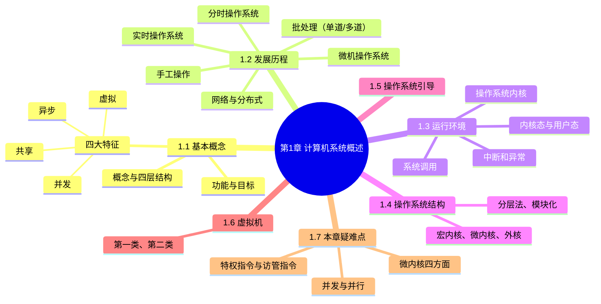

# 第 1 章 计算机系统概述 · 学习笔记

> **来源**：《王道 2027 操作系统考研复习指导》第1章（原书第 1–36 页）。
> **体例**：本笔记为考点笔记，原文单独存放于《第1章计算机系统概述原文.md》。每个知识点的出处链接可精确跳转到原文存档中对应的知识点段落（block 锚点 `^p页-序号`；原文存档无独立锚点处则退化为页锚点）。
> **反例核查**：对有争议、有条件、可能被推翻的结论标注反例、例外、适用条件；原文未出现的标注「原文未见反例」。
> **说明**：已去除习题内容；由视觉模型识别（扫描版）+ 结构化整理（deepseek-v4-pro）两阶段生成，并经独立审查。页码以原书印刷页为准，建议结合原书核验。

## 知识导图

## 本章备考概览

- **考纲内容**：（一）操作系统的基本概念；（二）操作系统的发展历程；（三）程序运行环境（CPU 运行模式：内核模式与用户模式；中断和异常的处理；系统调用；程序的链接与装入；程序运行时内存映像与地址空间）；（四）操作系统结构（分层、模块化、宏内核、微内核、外核）；（五）操作系统引导；（六）虚拟机。[第1页](<第1章计算机系统概述原文.md#第1章 计算机系统概述 原文存档>)
- **复习提示**：本章通常以选择题形式考查，要求宏观上把握操作系统的整体架构，微观上掌握关键概念与核心机制；作为全书导引章节，有助于构建对操作系统的整体认知框架，为后续进程管理、内存管理、文件系统等核心内容奠定基础。[第1页](<第1章计算机系统概述原文.md#第1章 计算机系统概述 原文存档>)

## 历年考频速览

| 考点 | 历年真题 |
|------|---------|
| 并行性的定义及分析 | 2009 |
| 操作系统为应用程序提供的接口 | 2010 |
| 两种模式下发生或执行的事件分析 | 2011、2012、2014、2021 |
| 中断处理子程序调用的比较 | 2012 |
| 用户态切换到内核态的事件分析 | 2013、2015 |
| 可能引发中断或异常的指令分析 | 2013、2015 |
| 操作系统运行的存储器 | 2013 |
| 批处理系统的特点 | 2016 |
| 中断机制在多道程序设计中的作用 | 2016 |
| 中断和异常的分类 | 2016 |
| 多任务操作系统的特点 | 2018 |
| 时钟中断服务的内容 | 2018 |
| 系统调用的定义、功能及性质 | 2019、2021、2024 |
| 操作系统的引导过程 | 2021、2022 |
| 特权指令和非特权指令的特点 | 2022 |
| 中断和异常的处理过程 | 2015、2020、2024 |

## 1.1 操作系统的基本概念

### 1.1.1 操作系统的概念

从使用层次看，计算机系统自下而上可分为四层：硬件、操作系统、应用程序、用户（该划分侧重人机交互视角，不同于计算机组成原理中的结构分层）。[第1页](<第1章计算机系统概述原文.md#1.1.1 操作系统的概念>)

| 层次（自下而上） | 作用 |
| --- | --- |
| 硬件 | 提供基本计算资源（如中央处理器、内存、输入/输出设备等） |
| 操作系统 | 管理硬件资源、为应用程序提供运行环境、充当硬件与用户之间的桥梁 |
| 应用程序 | 利用这些资源解决用户的实际问题（如文字处理软件、电子表格、编译器、浏览器等） |
| 用户 | 位于最上层 |

操作系统通过有效协调多个应用程序对硬件资源的访问，确保系统高效、安全地运行。[第1页](<第1章计算机系统概述原文.md#1.1.1 操作系统的概念>)

**操作系统（Operating System，OS）定义**：操作系统是控制和管理计算机系统软/硬件资源、合理调度任务与分配资源，并为用户及其他软件提供统一接口与运行环境的最基本的系统软件。[第1页](<第1章计算机系统概述原文.md#1.1.1 操作系统的概念>)

反例核查：上述四层划分侧重人机交互视角，不同于计算机组成原理中的结构分层；操作系统定义本身原文未见反例。[第1页](<第1章计算机系统概述原文.md#1.1.1 操作系统的概念>)

### 1.1.2 操作系统的功能和目标

为多道程序提供良好的运行环境，操作系统需具备四大核心功能：处理机管理、存储器管理、设备管理和文件管理。此外，为方便用户使用，操作系统还需提供用户接口；同时，它通过抽象与虚拟化技术扩充硬件功能，从而提供更便捷的服务并提升资源利用率。[第2页](<第1章计算机系统概述原文.md#1.1.2 操作系统的功能和目标>)

（"工人"类比：把用户视为"雇主"、计算机视为"机器"，操作系统如同"工人"——协调和控制各部件工作体现资源管理功能；接收命令并执行任务对应用户接口；使原本复杂的机器简单易用并充分发挥价值即"扩充机器"作用。）[第2页](<第1章计算机系统概述原文.md#1.1.2 操作系统的功能和目标>)

反例核查：原文未见反例。[第2页](<第1章计算机系统概述原文.md#1.1.2 操作系统的功能和目标>)

**1. 操作系统作为计算机系统资源的管理者**

四大核心功能如下表：[第2页](<第1章计算机系统概述原文.md#1. 操作系统作为计算机系统资源的管理者>)

| 功能 | 核心内容 | 主要任务/功能 |
| --- | --- | --- |
| 处理机管理 | 多道程序环境下，处理机的分配和运行都以进程（或线程）为基本单位，本质上是对进程的管理 | 进程控制、进程同步、进程通信、死锁处理、处理机调度 |
| 存储器管理 | 为多道程序提供良好的内存运行环境，方便用户使用并提高内存利用率 | 内存分配与回收、地址映射、内存保护与共享、内存扩充 |
| 文件管理 | 用户可见的持久化信息通常以文件形式组织，负责文件管理的部分称为文件系统 | 文件存储空间的管理、目录管理、文件读/写操作及访问保护 |
| 设备管理 | 处理用户的 I/O 请求，屏蔽设备差异，方便用户使用各类外设，并提高设备利用率 | 缓冲管理、设备分配、设备驱动处理、虚拟设备 |

其中，处理机管理引出并发概念：并发是指多个进程在一段时间内交替执行，宏观上呈现同时运行的特征。[第2页](<第1章计算机系统概述原文.md#1. 操作系统作为计算机系统资源的管理者>)

上述资源管理任务均由操作系统（"工人"）自动完成，用户（"雇主"）无须关注。[第2页](<第1章计算机系统概述原文.md#1. 操作系统作为计算机系统资源的管理者>)

反例核查：原文未见反例。[第2页](<第1章计算机系统概述原文.md#1. 操作系统作为计算机系统资源的管理者>)

**2. 操作系统作为用户与计算机硬件系统之间的接口**

操作系统是用户与计算机硬件系统之间的接口，位于用户与硬件之间，是用户使用硬件的必经媒介；正是有了操作系统的支撑，用户才能更方便、更可靠地操作硬件设备和运行用户程序。[第2页](<第1章计算机系统概述原文.md#2. 操作系统作为用户与计算机硬件系统之间的接口>)

![[王道2027操作系统-高清带书签.pdf#page=14&rect=175,139,377,224|王道2027操作系统-高清带书签, p.14]]

从交互方式看，终端用户通过命令行和图形界面与操作系统通信，应用程序则通过系统调用请求操作系统服务。根据服务对象与使用场景的不同，交互方式分为两大类：[第2页](<第1章计算机系统概述原文.md#2. 操作系统作为用户与计算机硬件系统之间的接口>)

| 接口类型 | 面向对象 | 具体形式 |
| --- | --- | --- |
| 用户接口 | 普通终端用户 | 命令方式、图形方式 |
| 程序接口（系统调用） | 应用程序 | 系统调用 |

（1）用户接口（三类）[第3页](<第1章计算机系统概述原文.md#1.1.2 操作系统的功能和目标>)

| 接口 | 面向场景 | 组成/特点 |
| --- | --- | --- |
| 联机用户接口（命令行接口） | 交互式用户 | 由键盘命令与命令解释程序组成；用户输入命令后系统立即解释并执行，完成后返回控制权；适用于实时交互场景 |
| 脱机用户接口（作业控制语言） | 批处理系统 | 用户将作业控制命令写入作业说明书，连同作业一并提交；系统调度到该作业时自动解释并执行说明书中的命令，无须用户实时干预 |
| 图形用户接口（GUI） | 提升易用性 | 通过图标、菜单、对话框等图形元素替代文本命令；用户借助鼠标等设备操作，底层通过系统调用与内核交互，显著降低使用门槛 |

（2）程序接口[第3页](<第1章计算机系统概述原文.md#1.1.2 操作系统的功能和目标>)

程序接口是应用程序在运行时请求操作系统服务、访问系统资源的唯一合法途径，其核心是一组系统调用。每个系统调用对应内核中实现某个特定功能的子程序，当应用程序需要操作系统服务时，必须通过调用相应的系统调用来完成。[第3页](<第1章计算机系统概述原文.md#1.1.2 操作系统的功能和目标>)

- 早期的系统调用多基于汇编语言实现，仅能在汇编程序中直接使用；在高级语言（如 C 语言）环境中，程序员通常调用标准库函数（如 `printf()`、`open()` 等）来间接触发系统调用。[第3页](<第1章计算机系统概述原文.md#1.1.2 操作系统的功能和目标>)
- 库函数本身并非操作系统接口，它们只是对系统调用的封装。[第3页](<第1章计算机系统概述原文.md#1.1.2 操作系统的功能和目标>)
- 例：`printf()` 最终通过 `write` 系统调用输出数据；`malloc()` 在需要更多内存时可能调用 `brk` 或 `mmap` 系统调用；而 `strlen()`、`sqrt()` 等纯计算类库函数则完全在用户空间中运行，不涉及任何系统调用。[第3页](<第1章计算机系统概述原文.md#1.1.2 操作系统的功能和目标>)

结论：尽管库函数在编程中被频繁使用，但操作系统真正提供给应用程序的接口本质上仍是系统调用。[第3页](<第1章计算机系统概述原文.md#1.1.2 操作系统的功能和目标>)

反例核查：库函数本身并非操作系统接口——反例是 `strlen()`、`sqrt()` 等纯计算类库函数完全在用户空间运行、不涉及任何系统调用；其余结论原文未见反例。[第3页](<第1章计算机系统概述原文.md#1.1.2 操作系统的功能和目标>)

**3. 操作系统实现了对计算机资源的扩充**

未安装任何软件的计算机称为**裸机**，它仅构成计算机系统的物质基础。实际呈现在用户面前的计算机系统，是经过多层软件增强后的逻辑实体；裸机位于最内层，其外层覆盖着操作系统。[第3页](<第1章计算机系统概述原文.md#1.1.2 操作系统的功能和目标>)

操作系统通过资源管理功能和用户服务功能，将裸机抽象并扩展为一台功能更强、使用更便捷的逻辑机器，这种被操作系统抽象和扩展后的机器称为**扩充机器**。[第3页](<第1章计算机系统概述原文.md#1.1.2 操作系统的功能和目标>)

说明：本章重点在于理解操作系统如何控制和协调处理器、存储器、设备和文件四大资源；关于接口与扩充机器的概念，只需理解其基本思想即可。[第3页](<第1章计算机系统概述原文.md#1.1.2 操作系统的功能和目标>)

反例核查：原文未见反例。[第3页](<第1章计算机系统概述原文.md#1.1.2 操作系统的功能和目标>)

### 1.1.3 操作系统的特征

操作系统是一种系统软件，但与其他系统软件和应用软件有显著不同，具有自身的特殊性，其基本特征包括：并发、共享、虚拟、异步。这些概念对理解和掌握操作系统的核心至关重要，将贯穿于后续各章节。[第3页](<第1章计算机系统概述原文.md#1.1.3 操作系统的特征>)

反例核查：原文未见反例。[第3页](<第1章计算机系统概述原文.md#1.1.3 操作系统的特征>)

**1. 并发（Concurrency）**

并发是指两个或多个事件在同一时间间隔内发生。[第3页](<第1章计算机系统概述原文.md#1.1.3 操作系统的特征>)

> 📌 **拓展**：并发（时间间隔）与并行（时刻）的底层辨析、单核并发 vs 多核真并行的区别。[详见：并发与并行的底层辨析](<第1章计算机系统概述拓展.md#拓展1 并发与并行的底层辨析>)

在多道程序环境下，内存中同时驻留若干道程序，操作系统通过调度机制，在一道程序因 I/O 操作而暂停时立即切换到另一道程序运行，从而实现多道程序的交替执行，使 CPU 保持高利用率。[第3页](<第1章计算机系统概述原文.md#1.1.3 操作系统的特征>)

并行是指两个或多个事件在同一时刻真正同时发生。[第3页](<第1章计算机系统概述原文.md#1.1.3 操作系统的特征>)

| 对比项 | 并发 | 并行 |
| --- | --- | --- |
| 定义 | 两个或多个事件在同一时间间隔内发生 | 两个或多个事件在同一时刻真正同时发生 |

单处理机系统中，宏观上多道程序看似同时运行，但微观上任一时刻仅有一个程序在执行，因此属于并发而非并行；而 CPU 与 I/O 设备之间、多个 I/O 设备之间则可实现真正的硬件并行。若要实现进程级别的并行，则需多核 CPU 或多处理器等硬件支持。[第4页](<第1章计算机系统概述原文.md#1.1.3 操作系统的特征>)

在操作系统中，引入进程这一概念，其核心目的之一就是支持程序的并发执行。[第4页](<第1章计算机系统概述原文.md#1.1.3 操作系统的特征>)

反例核查：单处理机系统中"看似同时运行"实为并发而非并行（同一时刻仅一个程序执行）；硬件并行仅存在于 CPU 与 I/O 设备之间、多个 I/O 设备之间；进程级并行需多核 CPU 或多处理器等硬件支持。[第4页](<第1章计算机系统概述原文.md#1.1.3 操作系统的特征>)

**2. 共享（Sharing）**

共享是指系统中的资源可供内存中多个并发执行的进程共同使用。[第4页](<第1章计算机系统概述原文.md#1.1.3 操作系统的特征>)

根据资源特性与访问方式的不同，共享主要分为互斥共享和同时访问两种形式。[第4页](<第1章计算机系统概述原文.md#1.1.3 操作系统的特征>)

（1）互斥共享方式[第4页](<第1章计算机系统概述原文.md#1.1.3 操作系统的特征>)

系统中的某些资源（如打印机、磁带机等）虽然可供多个进程使用，但为避免所打印或记录的结果混淆，必须保证在任一时刻内仅有一个进程访问该资源。当进程 A 访问某资源时需先提出请求；若资源空闲则系统将其分配给 A；此后若其他进程请求访问而 A 尚未释放，则必须等待；仅当 A 使用完毕并释放资源后，才允许另一进程访问。[第4页](<第1章计算机系统概述原文.md#1.1.3 操作系统的特征>)

**临界资源**：在一段时间内只允许一个进程访问的资源。计算机系统中的大多数独占型物理设备（如打印机），以及软件中的栈、变量、表格等，均属于临界资源，必须以互斥共享方式访问。[第4页](<第1章计算机系统概述原文.md#1.1.3 操作系统的特征>)

（2）同时访问方式[第4页](<第1章计算机系统概述原文.md#1.1.3 操作系统的特征>)

系统中还存在另一类资源，允许多个进程在宏观上"同时"访问；此处的"同时"通常指逻辑上的并发访问，微观上这些进程可能通过分时交替方式访问资源，即分时共享。典型的可同时访问资源包括磁盘上的文件（尤其是只读文件），以及用重入代码编写的程序。[第4页](<第1章计算机系统概述原文.md#1.1.3 操作系统的特征>)

| 共享方式 | 特征 | 典型资源 |
| --- | --- | --- |
| 互斥共享 | 资源在任意时刻仅响应一个请求，否则将导致数据混乱 | 打印机、磁带机、栈、变量、表格 |
| 同时访问 | 宏观"同时"（逻辑并发）、微观分时交替（分时共享），最终效果对用户等同于连续访问 | 磁盘上的文件（尤其只读文件）、重入代码程序 |

并发与共享是操作系统两个最基本的特征，二者互为前提：[第4页](<第1章计算机系统概述原文.md#1.1.3 操作系统的特征>)

1. 资源共享以程序的并发执行为前提——若系统仅支持单道程序，则无须考虑资源共享。
2. 有效的资源共享机制是并发执行的基础——若无法协调资源访问，则并发程序将因竞争冲突而无法正常运行。

反例核查：互斥共享要求资源在任意时刻仅响应一个请求，否则导致数据混乱（如多个进程同时向打印机输出，可能使文档 A 与文档 B 的内容交错混杂）；同时访问的"同时"通常指逻辑并发，微观上为分时交替，只要最终效果对用户等同于连续访问即可。[第4页](<第1章计算机系统概述原文.md#1.1.3 操作系统的特征>)

**3. 虚拟（Virtual）**

虚拟是指通过某种技术手段，将一个物理实体映射为多个逻辑上的对应物。物理实体是真实存在的硬件资源，逻辑对应物则是用户或程序所感知的抽象资源。[第4页](<第1章计算机系统概述原文.md#1.1.3 操作系统的特征>)

操作系统主要通过两类复用技术实现虚拟：时分复用（如处理器的分时共享）和空分复用（如虚拟存储器）。[第4页](<第1章计算机系统概述原文.md#1.1.3 操作系统的特征>)

| 虚拟技术 | 原理 | 效果 |
| --- | --- | --- |
| 处理器分时共享（时分复用） | 利用多道程序设计技术，通过时间片轮转实现的处理器抽象 | 单个物理 CPU 在逻辑上表现为多个处理单元，每个用户都仿佛独占一个 CPU |
| 虚拟存储器（空分复用） | 将有限的物理内存扩展为更大的逻辑地址空间 | 逻辑容量通常超过实际物理内存，实现存储容量的扩充 |
| 虚拟设备（如 SPOOLing） | 将某些独占型物理 I/O 设备（如打印机）转化为多台逻辑设备，系统在后台将请求排队处理 | 原本需要互斥访问的临界资源转化为可并发使用的共享资源 |

反例核查：虚拟设备技术（如 SPOOLing）可将原本需要互斥访问的临界资源转化为可并发使用的共享资源；处理器分时共享对应时分复用，虚拟存储器对应空分复用。[第4页](<第1章计算机系统概述原文.md#1.1.3 操作系统的特征>) [第5页](<第1章计算机系统概述原文.md#1.1.3 操作系统的特征>)

**4. 异步（Asynchronism）**

在多道程序环境下，多个进程并发执行，但由于系统资源有限，进程的执行并非连续进行，而是以不可预知的速度断续推进，这种特性称为进程的异步性。[第5页](<第1章计算机系统概述原文.md#4. 异步 (Asynchronism)>)

异步性使操作系统运行于高度不确定的环境中，若对共享资源的访问缺乏协调，可能导致与时间相关的错误（例如多个进程并发修改全局变量而未加同步保护）。[第5页](<第1章计算机系统概述原文.md#4. 异步 (Asynchronism)>)

在程序正确使用操作系统提供的同步机制的前提下，其执行结果的正确性与可再现性能够得到保障。[第5页](<第1章计算机系统概述原文.md#4. 异步 (Asynchronism)>)

反例核查："与时间相关的错误"的适用条件是"对共享资源的访问缺乏协调"；在正确使用同步机制的前提下，执行结果的正确性与可再现性可得到保障，原文未见其他反例。[第5页](<第1章计算机系统概述原文.md#4. 异步 (Asynchronism)>)

---

## 1.2 操作系统发展历程

操作系统的发展遵循"从无到有、从人工到自动、从单道到多道、从批处理到交互与实时、再到网络/分布式与微机"的演进脉络：手工操作阶段 → 脱机 I/O → 批处理阶段（单道、多道）→ 分时/实时操作系统 → 网络/分布式/微机操作系统。

### 1.2.1 手工操作阶段（未配置操作系统）

此阶段尚未配置操作系统，程序的装入、执行与结果输出等全过程均依赖人工操作。[第7页](<第1章计算机系统概述原文.md#1.2.1 手工操作阶段（未配置操作系统）>)

**1. 人工操作方式**

用户将程序和数据穿孔在纸带或卡片上，装入输入设备后手动控制读入内存并启动程序运行。随着计算机硬件性能不断提升，人机速度之间的矛盾日益突出，系统资源利用率低下的问题也愈发严重。

手工操作阶段存在两个突出缺点：

- ① 用户独占全机，虽无资源竞争，但系统资源利用率极低；
- ② CPU 长时间空闲，等待人工完成 I/O 操作，导致其计算能力未能充分发挥。

改进思路：用高速设备替代人工操作，来控制作业流程。

**2. 脱机 I/O 方式**

为缓解人机速度不匹配以及 CPU 与外设之间的速度差异，诞生了脱机 I/O 技术。其核心思想是引入一台外围机（如小型专用计算机），在 CPU 不参与的情况下预先完成 I/O 准备工作：

- 输入时，外围机将纸带或卡片上的程序和数据读入磁带，供 CPU 后续调入内存；
- 输出时，CPU 将结果先写入磁带，再由外围机将磁带内容输出至外设。

术语区分：

- **脱机 I/O**：I/O 操作完全由外围机独立完成，脱离了主机的直接控制。
- **联机 I/O**：由主机直接管理 I/O 设备的方式。

脱机 I/O 的主要优点：

- ① 装带、卸带及数据传输等操作在脱机状态下由外围机完成，显著减少了 CPU 空闲时间；
- ② CPU 可直接从高速磁带读取或写入数据，大幅提升了 I/O 效率。

### 1.2.2 批处理阶段（操作系统开始出现）

在脱机 I/O 技术的基础上，为实现作业的自动连续处理并进一步提升 CPU 与系统资源的利用率，批处理系统应运而生。按发展历程，可分为单道批处理系统和多道批处理系统。

**1. 单道批处理系统**（命题提示：批处理系统的特点，2016）[第7页](<第1章计算机系统概述原文.md#1.2.2 批处理阶段（操作系统开始出现）>)

系统先将一批作业以脱机方式输入到磁带，并配备一个监督程序（Monitor）。在其控制下，作业能自动、顺序地逐个运行。尽管作业成批提交，但内存中始终仅驻留一道用户程序。

单道批处理系统的三大特征：

| 特征 | 含义 |
| --- | --- |
| 自动性 | 在正常情况下，磁带上的作业可自动连续执行，无须人工干预 |
| 顺序性 | 作业按磁带上的顺序依次装入内存，先装入者先完成 |
| 单道性 | 内存中仅允许一道用户程序运行；监督程序每次仅从磁带调入一道作业，待其完成或异常终止后才装入下一道 |

局限：当正在运行的作业发起 $I/O$ 请求时，高速 CPU 不得不空闲等待低速 $I/O$ 操作结束，导致资源利用率低下。[第8页](<第1章计算机系统概述原文.md#1.2.2 批处理阶段（操作系统开始出现）>)

**反例核查：** 上述"自动性"以"在正常情况下"为前提，原文已明示该条件；"顺序性、单道性"及局限本身原文未见反例。

**2. 多道批处理系统**（考点提醒：多道批处理系统的特点，2017、2022）[第8页](<第1章计算机系统概述原文.md#2. 多道批处理系统>)

用户提交的作业首先存放在外存的后备队列中。作业调度程序按一定算法从该队列中选取若干作业调入内存，使其在管理程序的控制下并发执行，并共享系统资源。当某道程序因 $I/O$ 请求而暂停运行时，CPU 立即切换至另一就绪程序继续执行。该机制依赖**中断**技术，使系统各部件尽可能保持忙碌，从而显著提升整体吞吐量和资源利用率。这种采用多道程序设计技术的批处理系统称为多道批处理系统，它将用户作业成批送入内存，由作业调度程序自动选择运行。

多道程序设计的三个核心特点：

| 特点 | 含义 |
| --- | --- |
| 多道 | 内存中同时驻留多道相互独立的程序 |
| 宏观上并行 | 多道程序均处于运行过程中，但尚未全部完成 |
| 微观上串行 | 各程序轮流占用 CPU，交替执行 |

实现多道程序设计需解决的关键问题：

1. 处理器的分配策略；
2. 多道程序的内存分配与保护机制；
3. $I/O$ 设备的分配与调度方法；
4. 大量程序与数据的组织、存储方式，以及安全性与一致性保障。

优缺点：

- 优点：资源利用率高，多道程序共享 CPU、内存、$I/O$ 设备等资源；系统吞吐量大，各部件保持高负载状态。
- 缺点：缺乏交互能力，用户无法了解程序运行状态或进行干预，响应时间较长。

**反例核查：** "微观上串行"隐含单处理机前提（原文在此处未明示该前提）；其余结论原文未见反例。

单道与多道批处理系统对比：

| 对比项 | 单道批处理系统 | 多道批处理系统 |
| --- | --- | --- |
| 内存中程序 | 仅驻留一道用户程序 | 同时驻留多道相互独立的程序 |
| 执行特征 | 自动、顺序、单道 | 多道、宏观上并行、微观上串行 |
| 关键机制 | 监督程序（Monitor）控制作业自动顺序运行 | 依赖中断技术，$I/O$ 暂停时切换至另一就绪程序 |
| 资源利用率 | $I/O$ 时 CPU 空闲等待，利用率低 | 资源利用率高、吞吐量大 |

### 1.2.3 分时操作系统 [第8页](<第1章计算机系统概述原文.md#1.2.3 分时操作系统>)

**分时技术**：将处理器时间划分为很短的时间片，轮流分配给各用户程序使用。若某程序在其时间片内未完成计算，则暂停运行、释放处理器给其他用户程序，待下一轮再继续执行。由于计算机运行速度极快、程序轮转迅速，每个用户均能获得"独占计算机"的交互体验。

**分时操作系统**：允许多个用户通过终端同时连接到一台主机，并与系统进行交互，彼此互不干扰。其实现的核心在于：当用户在终端输入命令时，系统必须能够及时接收、快速处理并立即返回结果。分时操作系统基于多道程序设计，但与多道批处理系统有本质区别：后者追求高吞吐量和资源利用率、无须人工干预；前者**以人机交互为核心目标**。

分时操作系统的四大特征：

| 特征 | 含义 |
| --- | --- |
| 同时性（多路性） | 允许多个终端用户同时使用同一台计算机 |
| 交互性 | 用户可通过终端以人机对话方式直接控制程序运行，并与程序进行交互 |
| 独立性 | 各用户的操作相互隔离，任一用户均感觉系统为其独占 |
| 及时性 | 用户请求能在较短时间内获得响应，满足交互需求 |

**反例核查：** 分时系统的"及时性"仅为"较短时间内"获得响应，不保证严格时限与确定性；原文指出在需严格限时响应并保证确定性与时限性的场景下，需改用实时操作系统。

### 1.2.4 实时操作系统 [第8页](<第1章计算机系统概述原文.md#1.2.4 实时操作系统>)

实时操作系统是为在**严格的时间限制**内完成关键任务而设计的系统。它摒弃了分时操作系统的时间片轮转机制，转而采用基于任务紧迫性或截止时间的调度策略，确保高优先级任务能够及时获得处理器资源。

按时限要求的严格程度分为两类：

| 类型 | 时限要求 | 后果/要求 | 典型例子 |
| --- | --- | --- | --- |
| 硬实时操作系统 | 任务必须在规定的截止时间前完成 | 否则可能引发灾难性后果，必须提供绝对可靠的时间保证 | 飞机的控制系统、导弹的制导系统 |
| 软实时操作系统 | 允许偶尔错过截止时间 | 只要不造成永久性损害即可，短暂延迟通常可被容忍 | 飞机订票系统、银行管理系统 |

在实时操作系统的控制下，计算机在接收到外部事件后，能够在可预测且有保障的时限内完成处理。其主要特点包括：**确定性**（响应时间可预测）、**高可靠性**和**强时效性**。

**反例核查：** 硬实时与软实时的区分（是否允许错过截止时间及后果差异）原文已明示，其余结论原文未见反例。

### 1.2.5 网络操作系统和分布式系统 [第9页](<第1章计算机系统概述原文.md#1.2.5 网络操作系统和分布式系统>)

**网络操作系统**：在单机操作系统基础上扩展网络功能而形成的系统，主要用于支持计算机之间的通信、数据传输以及资源共享（如文件、打印机共享等）。在该系统中，各计算机保持独立运行，用户需显式指定远程资源的位置才能访问，系统不提供统一的全局视图。

**分布式系统**：由多台计算机组成的集合，具有以下特征：

- 节点地位对等，无固定的主从关系；
- 系统资源可被所有用户透明地共享；
- 具备良好的可扩展性与容错能力，支持动态重组；
- 能够将一个任务分解为多个子任务，并分布到不同节点上并行执行、协同完成。

用于管理此类系统的操作系统称为**分布式操作系统**，其核心特点包括**分布性、并行性和透明性**。其中，透明性尤为关键：用户无须感知底层的多机结构，操作体验如同使用一台计算机。

网络操作系统与分布式操作系统的区别：

| 对比项 | 网络操作系统 | 分布式操作系统 |
| --- | --- | --- |
| 实现功能 | 仅实现资源共享与通信功能 | 通过协同机制，使多台计算机共同完成同一任务 |
| 用户操作 | 用户需主动干预远程操作，显式指定远程资源位置 | 用户无须感知底层多机结构（透明） |
| 系统视图 | 各计算机保持独立，不提供统一全局视图 | 提供**单一系统映像** |

**反例核查：** 原文未见反例。

### 1.2.6 微机操作系统 [第9页](<第1章计算机系统概述原文.md#1.2.6 微机操作系统>)

微机操作系统是为微型计算机（如个人计算机、工作站等）设计的操作系统，广泛应用于日常计算与办公环境。根据用户数量和任务并发能力，可分为以下三类：

| 类型 | 用户与任务 | 特点 | 典型代表 |
| --- | --- | --- | --- |
| 单用户单任务操作系统 [第9页](<第1章计算机系统概述原文.md#1. 单用户单任务操作系统>) | 仅允许一个用户登录并运行一个程序 | 结构简单，但资源利用率低 | 早期的 MS-DOS（16 位） |
| 单用户多任务操作系统（考点提醒：多任务操作系统的特点，2018）[第9页](<第1章计算机系统概述原文.md#2. 单用户多任务操作系统>) | 支持一个用户同时运行多个应用程序 | 通过时间片轮转实现任务切换，交互体验与资源利用率显著提升；当前主流微机操作系统，兼具良好人机交互性、高效率与稳定性 | Windows XP 及后续版本、macOS 以及现代 Linux 桌面版 |
| 多用户多任务操作系统 [第9页](<第1章计算机系统概述原文.md#3. 多用户多任务操作系统>) | 允许多个用户通过终端或网络同时登录，各自并发执行多个任务 | 资源共享且互不干扰，常用于服务器或高性能工作站 | UNIX、Linux 服务器版和 Windows Server 系列 |

**反例核查：** 原文未见反例。

### 图 1.2 操作系统的发展历程

![[王道2027操作系统-高清带书签.pdf#page=22&rect=95,556,456,689|王道2027操作系统-高清带书签, p.22]]

| 阶段 | 特点（原文转录） |
| --- | --- |
| 手工阶段 | 独占计算机资源、利用率低 |
| 脱机处理 | 减少了 CPU 的空闲时间，提高 I/O 速度 |
| 早期批处理 | 高效利用 CPU 的资源 |
| 多道批处理 | 多道、宏观上并行、微观上串行 |
| 分时操作系统 | 交互性强 |
| 实时操作系统 | 及时性和可靠性、交互性不如分时系统 |
| 网络操作系统 | 服务于计算机网络，集中控制方式 |
| 分布式操作系统 | 建立在网络操作系统之上，控制功能均为分布式 |
| 微机操作系统 | 目前最广泛 |

此外，还有嵌入式操作系统、服务器操作系统、智能手机操作系统等。[第10页](<第1章计算机系统概述原文.md#图 1.2 操作系统的发展历程>)

**反例核查：** 图 1.2 称实时操作系统"及时性和可靠性、交互性不如分时系统"，与正文所述实时系统"确定性、高可靠性、强时效性"存在表述差异，理解时应留意两处语境；其余图注结论原文未见反例。

---

## 1.3 操作系统的运行环境

### 1.3.1 操作系统内核

**定义**：现代操作系统通常采用分层架构，将与硬件紧密相关的模块（如中断处理程序、设备驱动程序）、运行频率较高的模块（如时钟管理、进程调度），以及各模块共用的基础操作，集中置于紧靠硬件的层次并常驻内存，这部分核心组件称为**操作系统内核**。[第15页](<第1章计算机系统概述原文.md#1.3.1 操作系统内核>)

内核设计有两个主要目的：

1. 保护核心模块免受应用程序破坏；
2. 提升操作系统的运行效率。[第15页](<第1章计算机系统概述原文.md#1.3.1 操作系统内核>)

> 反例核查：原文说明“不同操作系统的内核功能存在一定差异”，内核功能并非统一固定，但“大多数”都包含下述两类功能。原文未见反例。

**1. 支撑功能**：为操作系统其他模块提供基础支持，保障系统稳定、高效运行。[第15页](<第1章计算机系统概述原文.md#1. 支撑功能>)

- **时钟管理**：时钟是计算机系统的关键部件，功能包括计时和产生定时中断。操作系统通过时钟管理向用户提供标准系统时间，并利用时钟中断实现任务调度——分时系统中通过时间片轮转切换进程、实时系统中依据截止时间控制任务执行、批处理系统中衡量作业运行进度。[第15页](<第1章计算机系统概述原文.md#1. 支撑功能>)
- **中断机制**：中断是现代操作系统运行的基础，允许 CPU 在 I/O 操作期间执行其他指令以提高资源利用率。中断来源包括键盘输入、鼠标事件、系统调用、设备驱动和文件访问等；发生中断时，内核保存当前进程现场、转移控制权至相应处理程序、处理完成后恢复现场，提升并发处理能力。[第15页](<第1章计算机系统概述原文.md#1. 支撑功能>)
- **原语**：由若干条指令组成、用于完成特定功能的操作，具有**原子性**（执行过程不可被中断，必须一气呵成）。原语通常运行在内核态，执行时间短、调用频繁，常见如进程切换、进程同步、资源分配等；常通过关闭中断等手段保证原子性。[第15页](<第1章计算机系统概述原文.md#1. 支撑功能>)

> 反例核查：原语“通常”运行在内核态，为限定性表述，存在例外可能（原文未展开）；原子性依赖关中断实现。原文未见反例。

**2. 系统资源管理功能**：操作系统通过进程控制块、设备控制块、内存分配表、缓冲区等核心数据结构对系统资源统一管理，内核提供三类基本管理功能。[第15页](<第1章计算机系统概述原文.md#2. 系统资源管理功能>)

| 管理功能 | 职责 |
| --- | --- |
| 进程管理 | 进程的创建与撤销、状态转换、调度与分派，并维护进程控制块（PCB）等核心数据结构 |
| 存储器管理 | 内存的分配与回收、地址映射、内存保护及页面置换等，确保多道程序安全、高效地共享主存资源 |
| 设备管理 | 设备的分配与回收、缓冲区管理、I/O 调度及设备驱动调用，屏蔽硬件差异，为用户提供统一的设备访问接口 |

[第15页](<第1章计算机系统概述原文.md#2. 系统资源管理功能>)

### 1.3.2 处理机的双重工作模式

**定义**：为确保操作系统正确运行，必须严格区分操作系统代码与用户程序的执行环境。绝大多数计算机系统通过硬件支持实现这一区分，为处理机设置至少两种独立运行模式：**用户态**（也称目态）和**内核心态**（也称管态或系统态）。硬件通过一个**模式位**标识当前运行模式（如 0 表示内核心态，1 表示用户态），明确当前执行的是系统任务还是用户任务。[第16页](<第1章计算机系统概述原文.md#1.3.2 处理机的双重工作模式>)

**状态切换**：系统引导时，硬件从内核心态开始工作，完成操作系统加载后切换到用户态执行用户程序；一旦发生中断或陷阱，硬件自动从用户态切换至内核心态（模式位置 0）。操作系统一旦获得控制权就处于内核心态；交还控制权给用户程序前，切换回用户态（模式位置 1）。[第16页](<第1章计算机系统概述原文.md#1.3.2 处理机的双重工作模式>)

**内核态与用户态对比**：

| 对比项 | 内核心态（管态/系统态） | 用户态（目态） |
| --- | --- | --- |
| 模式位（示例） | 0 | 1 |
| 执行任务 | 系统任务 | 用户任务 |
| 特权指令 | 可执行 | 不可执行 |
| 地址访问 | 全部地址空间（用户空间+系统空间） | 仅用户地址空间 |

[第16页](<第1章计算机系统概述原文.md#1.3.2 处理机的双重工作模式>)

**特权指令与非特权指令对比**：

| 对比项 | 特权指令 | 非特权指令 |
| --- | --- | --- |
| 执行模式 | 仅能在内核心态执行 | 可在任意模式下执行，通常运行在用户态 |
| 地址访问 | 可访问全部地址空间（用户空间和系统空间） | 内存访问限制在用户地址空间 |
| 功能 | 启动外设、设置系统时钟、关闭中断、修改模式位、返回用户态等关键操作 | 一般计算和数据处理，无法直接操作硬件或系统核心资源 |

[第16页](<第1章计算机系统概述原文.md#1.3.2 处理机的双重工作模式>)

**硬件保护**：上述限制由硬件强制实施；若用户程序试图执行特权指令，硬件产生非法指令异常，操作系统捕获后终止该程序并重新调度。[第16页](<第1章计算机系统概述原文.md#1.3.2 处理机的双重工作模式>)

> 反例核查：原文用“绝大多数”限定双重模式依赖硬件支持，即并非所有系统都必须如此；未给出具体反例。原文未见反例。

### 1.3.3 中断和异常的概念

**进入内核态的唯一合法途径**：系统在内核中设立若干称为“门”的受控入口；**用户程序进入内核心态的唯一合法途径就是中断或异常**。当 CPU 运行用户程序时发生中断（如 I/O 完成）或异常（如系统调用、除零错误），硬件自动将处理器切换至内核态，并跳转至内核中对应的处理程序，该机制由硬件强制保障，确保切换的安全性与原子性。[第16页](<第1章计算机系统概述原文.md#1.3.3 中断和异常的概念>)

**中断机制的重要性**：中断机制是现代操作系统实现高效并发与资源共享的基础。操作系统的演进本质上是不断提升资源利用率的过程；当程序因等待 I/O 等事件无法继续执行时，系统将其挂起并调度其他就绪程序，在抢占式多任务系统中该调度主要依赖中断（尤其时钟中断）触发。[第16页](<第1章计算机系统概述原文.md#1.3.3 中断和异常的概念>)

> 反例核查：原文称“唯一合法途径”为中断或异常，未给出其他合法途径；原文未见反例。

> 📌 **拓展**：中断·异常·系统调用从触发到返回的完整时序（保存现场→查向量表→处理→恢复）。[详见：中断异常系统调用的完整时序](<第1章计算机系统概述拓展.md#拓展2 中断异常系统调用的完整时序>)

**1. 中断和异常的定义**：

| 概念 | 别名 | 来源 | 说明/举例 |
| --- | --- | --- | --- |
| 中断（Interrupt） | 外中断 | 来自 CPU 执行指令**外部**的事件 | 通常用于信息输入/输出；如设备 I/O 结束中断、时钟中断（固定时间片已到，用于系统计时、进程调度或启动定时任务） |
| 异常（Exception） | 内中断 | 来自 CPU 执行指令**内部**的事件 | 如非法操作码、地址越界、运算溢出、虚存系统的缺页、专门的陷入指令等 |

[第16页](<第1章计算机系统概述原文.md#1. 中断和异常的定义>)

异常一旦发生就必须立即处理，**不可被屏蔽**。[第16页](<第1章计算机系统概述原文.md#1. 中断和异常的定义>)

> 反例核查：原文明确“异常不可被屏蔽”，未给出反例；原文未见反例。

**2. 中断和异常的分类**：

**外中断**（2 类）：

| 子类 | 说明 |
| --- | --- |
| 可屏蔽中断 | 通过 INTR 线发出中断请求，改变屏蔽字可实现多重中断，处理更灵活 |
| 不可屏蔽中断 | 通过 NMI 线发出中断请求，通常为紧急硬件故障，如电源掉电 |

**异常**（3 类）：

| 子类 | 说明 |
| --- | --- |
| 故障（Fault） | 由指令执行引起，如非法操作码、缺页故障、除数为 0、运算溢出等 |
| 自陷（Trap，也称陷入） | 事先安排的“异常”事件，用于用户态下调用操作系统内核程序，如条件陷阱指令、系统调用指令 |
| 终止（Abort） | CPU 无法继续执行的硬件故障，如控制器出错、存储器校验错等 |

[第17页](<第1章计算机系统概述原文.md#2. 中断和异常的分类>)

**归属关系**：故障和自陷异常属于软件中断（程序性异常），终止异常和外中断属于硬件中断；异常也是不能被屏蔽的。[第17页](<第1章计算机系统概述原文.md#2. 中断和异常的分类>)

![[王道2027操作系统-高清带书签.pdf#page=29&rect=161,535,366,648|王道2027操作系统-高清带书签, p.29]]

**3. 中断和异常的处理过程**：

当 CPU 执行用户程序第 $i$ 条指令时，若该指令引发异常（如缺页、除零），或在指令执行结束后检测到中断请求信号，则 CPU 打断当前程序，转入相应的中断或异常处理程序。[第17页](<第1章计算机系统概述原文.md#3. 中断和异常的处理过程>)

- 若问题可被处理程序解决：异常通常在处理完成后返回第 $i$ 条指令重新执行（如缺页处理完成后重访原内存地址）；中断在处理完成后返回第 $i+1$ 条指令继续执行。
- 若处理程序判定为不可恢复的致命错误：终止该用户程序。[第17页](<第1章计算机系统概述原文.md#3. 中断和异常的处理过程>)

**中断处理子程序与子程序调用的区别**：

| 对比项 | 中断处理程序 | 子程序调用 |
| --- | --- | --- |
| 关联性 | 与被中断的程序相互独立，无固定关联 | 与主程序属同一程序的主从关系 |
| 触发 | 产生通常是随机的 | 由 CALL 指令显式触发，程序员事先安排 |
| 实现 | 需要硬件电路支持 | 完全由软件实现 |
| 入口地址 | 由中断向量表直接提供 | 由 CALL 指令中的地址码指定 |
| PC 保护 | 硬件在中断响应过程中自动保存 | CALL 指令执行时将当前 PC 压入栈中 |
| 优先级裁决 | 响应时需对同时到达的多个中断请求裁决 | 不存在此类操作 |

[第17页](<第1章计算机系统概述原文.md#3. 中断和异常的处理过程>)

> 反例核查：处理过程的返回依赖“若问题可被处理程序解决”这一条件；不可恢复的致命错误则终止程序。原文未见反例。

### 1.3.4 系统调用

**定义**：系统调用是操作系统提供给应用程序（程序员）使用的接口，可视为一种特殊的公共子程序调用。凡涉及共享资源的操作（如存储分配、I/O 传输、文件管理等）都必须通过系统调用向操作系统提出服务请求，由操作系统代为完成并将结果返回给应用程序，以保证系统稳定安全、防止非法操作。[第17页](<第1章计算机系统概述原文.md#1.3.4 系统调用>)

一个操作系统提供的系统调用有几十条乃至上百条，每个系统调用都有**唯一的系统调用号**。[第17页](<第1章计算机系统概述原文.md#1.3.4 系统调用>)

> 📌 **拓展**：系统调用的实现细节（陷入指令、参数传递三方式、与普通过程调用的本质区别）。[详见：系统调用的实现细节](<第1章计算机系统概述拓展.md#拓展3 系统调用的实现细节>)

**系统调用按功能分类**：

| 类别 | 功能 |
| --- | --- |
| 设备管理 | 设备的请求或释放，以及设备启动等 |
| 文件管理 | 文件的读、写、创建及删除等 |
| 进程控制 | 进程的创建、撤销、阻塞及唤醒等 |
| 进程通信 | 进程之间的消息传递或信号传递等 |
| 内存管理 | 内存的分配、回收，以及获取作业占用内存区的大小和起始地址等 |

[第17页](<第1章计算机系统概述原文.md#1.3.4 系统调用>)

系统调用涉及系统资源管理、进程管理等关键操作，必须由操作系统内核程序在**内核态**下完成；其核心目的是让应用程序安全地间接调用内核功能。系统调用本质上是一种特殊的过程调用，与普通过程调用存在显著差异。[第17页](<第1章计算机系统概述原文.md#1.3.4 系统调用>)

**系统调用与普通过程调用的区别**：

| 对比项 | 系统调用 | 普通过程调用 |
| --- | --- | --- |
| 运行状态 | 调用者运行在用户态，被调用者运行在内核态 | 调用者与被调用者运行在同一特权级 |
| 状态转换 | 通过陷入指令（Trap）触发，先从用户态切换到内核态，再由内核分派 | 无须特权级切换，可直接跳转 |
| 返回机制 | 执行完毕后内核可能根据调度策略决定是否切换进程 | 总是直接返回原调用点 |
| 嵌套调用限制 | 嵌套深度受内核栈空间限制 | 嵌套深度通常仅受用户栈大小约束 |

[第17页](<第1章计算机系统概述原文.md#1.3.4 系统调用>)

**系统调用的处理过程**（4 个阶段）：

1. **传递系统调用参数**：用户程序将系统调用号及所需参数压入堆栈（或通过寄存器），为内核服务做准备。
2. **执行陷入指令并切换至内核态**：用户程序执行陷入指令，触发 CPU 从用户态切换至内核态；硬件与内核协同保存现场，将 PC、PSW 及通用寄存器内容压入内核堆栈。
3. **定位并执行相应服务程序**：内核根据系统调用号查询系统调用表，找到对应处理程序的入口地址，并执行具体服务逻辑。
4. **恢复现场并返回用户态**：内核恢复被中断进程的 CPU 现场，将运行模式切换回用户态，交还控制权，使程序从断点继续执行。[第18页](<第1章计算机系统概述原文.md#考点点睛>)

![[王道2027操作系统-高清带书签.pdf#page=31&rect=126,575,418,686|王道2027操作系统-高清带书签, p.31]]

系统调用执行过程：用户程序通过陷入指令主动将 CPU 控制权移交操作系统内核，内核完成请求后再将控制权交还，确保用户程序无法直接执行高危操作，必须通过受控接口请求操作系统代为执行。[第18页](<第1章计算机系统概述原文.md#考点点睛>)

**操作系统的运行环境概括**：用户程序运行在受限的用户态，通过系统调用（主动）或异常/中断（被动）两种受控途径进入内核态，请求内核提供资源管理与服务支持；内核处理完毕后安全返回用户态继续执行。这种用户态与内核态的隔离构成现代操作系统安全、高效运行的基础环境。[第18页](<第1章计算机系统概述原文.md#考点点睛>)

**常见的用户态转向内核态的情形**：

1. 用户程序请求操作系统服务（系统调用）；
2. 发生中断（如 I/O 完成、时钟信号）；
3. 用户程序执行过程中产生异常（如除零、缺页）；
4. 用户程序试图执行特权指令，从而触发异常。[第19页](<第1章计算机系统概述原文.md#1.3.4 系统调用>)

从内核态返回用户态由内核通过特定的返回指令（如 IRET）完成，该操作在内核态执行。[第19页](<第1章计算机系统概述原文.md#1.3.4 系统调用>)

> 反例核查：系统调用与普通过程调用的差异中，普通过程调用嵌套深度“通常”仅受用户栈约束，为限定性表述；系统调用返回时内核“可能”决定切换进程。原文未见反例。

---

## 1.4 操作系统结构

随着操作系统功能的不断扩展和代码规模的持续增长，采用合理的结构设计对降低系统复杂度、提升安全性和可靠性至关重要。[第26页](<第1章计算机系统概述原文.md#1.4 操作系统结构>)（原文无 block 锚点）

> 📌 **拓展**：宏内核、微内核、外核的性能/可靠性/灵活性权衡，以及现实中的混合内核折中。[详见：宏内核微内核外核的权衡](<第1章计算机系统概述拓展.md#拓展4 宏内核微内核外核的权衡>)

### 1. 分层法

**定义**：分层法将操作系统划分为若干层次，最底层（层 0）为硬件，顶层（层 N）为用户接口。各层仅可调用其紧邻下层所提供的功能与服务（单向依赖）。[第26页](<第1章计算机系统概述原文.md#1. 分层法>)（原文无 block 锚点）

![[王道2027操作系统-高清带书签.pdf#page=38&rect=70,196,218,367|王道2027操作系统-高清带书签, p.38]]

| 方面 | 内容 |
| --- | --- |
| 优点① 便于调试与验证 | 系统可自底向上逐层开发与测试；层 1 验证无误后再开发层 2（因其仅依赖已验证的下层）；某层出错可定位在该层内部（因其所有依赖的下层均已通过验证） |
| 优点② 易于扩充与维护 | 在保持层间接口不变的前提下，可独立修改、替换或新增某一层的实现，不影响其他层次的功能 |
| 问题① 层次划分困难 | 合理界定各层功能边界较为复杂，依赖关系一旦固化，系统架构可能缺乏灵活性 |
| 问题② 运行效率较低 | 执行高层功能需穿越多个中间层，每层间的参数传递与控制转移引入额外开销 |

反例核查：原文未见反例。

### 2. 模块化

**定义**：模块化是将操作系统按功能划分为若干具有一定独立性的模块。每个模块实现特定的管理功能，并明确定义与其他模块的接口；还可将模块细分为子模块并规定子模块之间的接口（模块-接口法）。[第26页](<第1章计算机系统概述原文.md#2. 模块化>)（原文无 block 锚点）

![[王道2027操作系统-高清带书签.pdf#page=39&rect=119,557,412,688|王道2027操作系统-高清带书签, p.39]]

划分粒度：模块过小虽可降低单个模块的复杂性，但会导致模块间交互频繁、增加系统整体复杂度；模块过大则模块内部结构复杂、难以维护，需在粒度大小之间取得合理平衡。[第27页](<第1章计算机系统概述原文.md#2. 模块化>)（原文无 block 锚点）

| 标准 | 含义 | 与模块独立性的关系 |
| --- | --- | --- |
| 内聚性 | 模块内部各组成部分间联系的紧密程度 | 内聚性越高，模块独立性越好 |
| 耦合度 | 模块间相互依赖和影响的程度 | 耦合度越低，模块独立性越好 |

| 方面 | 内容 |
| --- | --- |
| 优点 | ① 提高了操作系统设计的正确性、可理解性和可维护性；② 增强了系统的可适应性，便于功能扩展；③ 支持并行开发，加速操作系统研制进程 |
| 缺点 | ① 模块间的接口规定很难满足对接口的实际需求；② 各模块设计者齐头并进，每个决定无法建立在上一已验证的正确决定的基础上，因此无法找到一个可靠的决策顺序 |

反例核查：原文未见反例。

### 3. 宏内核与微内核

从操作系统的内核架构来划分，可分为宏内核和微内核。

**宏内核**（也称单内核或大内核）：将系统的主要功能模块集成在一个紧密耦合的整体中，运行于内核态，从而为用户程序提供高效的系统服务。各模块共享地址空间，可直接调用彼此的函数，减少了上下文切换和消息传递开销，具有较高的性能优势。[第27页](<第1章计算机系统概述原文.md#3. 宏内核>)

随着体系结构和应用需求的发展，宏内核代码规模急剧膨胀，导致维护困难、可靠性下降（“软件危机”）。为提升模块化、可扩展性与安全性，微内核技术应运而生：仅保留最基本的功能（如进程调度、进程间通信等）在内核中，而将文件系统、设备驱动等非核心服务移至用户态运行。[第27页](<第1章计算机系统概述原文.md#3. 宏内核>)

发展现状：当前主流操作系统（如 Linux、Windows、Android）主要采用宏内核或混合内核架构，同时吸收微内核的部分设计理念；macOS 和 iOS 的 XNU 内核融合了 Mach 微内核与 BSD 宏内核的特性；谷歌 Fuchsia 与华为 HarmonyOS NEXT 采用微内核架构。宏内核与微内核并非对立，而是相互借鉴、融合发展。[第27页](<第1章计算机系统概述原文.md#3. 宏内核>)

| 对比维度 | 宏内核 | 微内核 |
| --- | --- | --- |
| 运行位置 | 主要功能模块运行于内核态 | 仅最基本功能保留在内核，非核心功能移至用户态 |
| 模块关系 | 紧密耦合整体，共享地址空间，直接调用彼此函数 | 非核心功能组织为独立用户态服务器，经消息传递机制交互 |
| 性能 | 高（减少上下文切换和消息传递开销） | 较低（系统调用延迟增加） |
| 可靠性/维护性 | 代码膨胀、维护困难、可靠性下降（软件危机） | 模块化、可扩展性、安全性较好 |
| 典型实例 | Linux、Windows、Android（宏内核或混合内核） | Fuchsia、HarmonyOS NEXT（微内核） |

反例核查：原文未见反例；原文强调二者并非对立而是融合发展（XNU、Fuchsia、HarmonyOS NEXT 为佐证）。

### 4. 微内核

### (1) 微内核的基本概念

微内核架构是指将操作系统中最基本的功能保留在内核，将其他非核心功能移至用户态运行，从而降低内核的复杂性。这些移出的功能被组织为若干独立的服务器，运行在用户态，彼此之间以及与客户进程之间的交互均通过微内核提供的消息传递机制完成。[第27页](<第1章计算机系统概述原文.md#(1) 微内核的基本概念>)

微内核结构将操作系统划分为两大部分：微内核和多个服务器。微内核是精心设计的小型内核，仅实现最核心的机制，通常包括：① 与硬件紧密相关的部分；② 基本的资源管理机制；③ 客户与服务器间的通信支持。操作系统的绝大部分功能放在微内核外的一组服务器（进程）中实现，运行在用户态（如进程/线程服务器、虚拟存储器服务器）。[第27页](<第1章计算机系统概述原文.md#(1) 微内核的基本概念>)

![[王道2027操作系统-高清带书签.pdf#page=40&rect=126,559,430,632|王道2027操作系统-高清带书签, p.40]]

可靠性：仅微内核运行在内核态，其余模块均运行在用户态。某一模块（如文件服务器）发生故障时，仅该模块崩溃，系统可通过重启该服务恢复，不会导致整个系统宕机；相比之下，宏内核中文件系统运行于内核态，其崩溃将直接引发系统崩溃。[第28页](<第1章计算机系统概述原文.md#(1) 微内核的基本概念>)（原文无 block 锚点）

### (2) 微内核的基本功能

微内核操作系统遵循“机制与策略分离”的设计原则：与硬件紧密相关的机制置于微内核中，策略交由用户态服务器实现。进程管理、存储器管理和 I/O 管理等功能均被分解为“机制（微内核内）+ 策略（外部服务器）”两部分，使微内核得以保持极小规模。[第28页](<第1章计算机系统概述原文.md#(2) 微内核的基本功能>)（原文无 block 锚点）

| 功能 | 机制（微内核内） | 策略（用户态服务器） |
| --- | --- | --- |
| 进程（线程）管理 | 进程/线程的创建、切换、调度队列管理等机制 | 进程分类、优先级分配等策略 |
| 低级存储器管理 | 与硬件相关的地址转换机制（页表管理、逻辑地址到物理地址的映射） | 页面置换算法、内存分配策略 |
| 中断和陷入处理 | 捕获硬件中断和陷入事件，识别类型后分发给相应用户态服务器（捕获及分发机制属微内核核心功能） | （原文未单列策略侧） |

### (3) 微内核的特点

考点点拨（2023）：微内核操作系统的特点。[第28页](<第1章计算机系统概述原文.md#考点 点拨 ★ 微内核操作系统的特点（2023）>)

| 优点 | 说明 |
| --- | --- |
| 扩展性和灵活性 | 新增或修改功能只需调整相应服务器，无须改动内核 |
| 可靠性和安全性 | 用户态服务的故障不会导致系统崩溃，且攻击面更小 |
| 可移植性 | 仅微内核包含硬件相关代码，其余服务器与平台无关，便于移植 |
| 分布式计算 | 客户/服务器间通过消息传递通信，易于扩展至网络环境 |

缺点：性能问题——每次服务请求需多次穿越内核态与用户态，导致系统调用延迟增加。[第28页](<第1章计算机系统概述原文.md#考点 点拨 ★ 微内核操作系统的特点（2023）>)

缓解与应用：部分现代系统采用混合内核设计，在保留微内核思想的同时将高频服务移入内核以提升性能，但会使微内核的容量明显增大；微内核因高可靠性和可验证性，被广泛应用于关键任务领域（实时操作系统、工业控制、航空航天、军事等）。[第28页](<第1章计算机系统概述原文.md#考点 点拨 ★ 微内核操作系统的特点（2023）>)

反例核查：微内核“可靠性/安全性”优点以性能下降为代价，属有条件结论；原文未见其他反例。

### 5. 外核

**定义**：与传统操作系统通过抽象层向应用程序提供统一接口不同，外核（exokernel）将物理资源直接暴露给用户级系统，自身仅负责资源的安全分配与隔离。[第28页](<第1章计算机系统概述原文.md#5. 外核>)（原文无 block 锚点）

外核是运行于内核态的极小程序，其核心职责是将底层硬件资源（如磁盘块、内存页、网络包缓冲区等）划分为互不重叠的子集，分配给不同用户级系统；通过权限检查机制确保各用户级系统仅能访问被明确授权的资源，防止越权访问。外核之上可在用户空间构建库操作系统（library OS），自主实现文件系统、进程调度、虚拟内存管理等传统操作系统功能，直接操作物理资源，避免不必要的数据拷贝、地址转换及上下文切换开销。[第28页](<第1章计算机系统概述原文.md#5. 外核>)（原文无 block 锚点）

| 优点 | 说明 |
| --- | --- |
| 减少抽象开销 | 允许用户级系统按需定制资源使用方式，显著降低系统开销（传统 OS 强制引入虚拟内存、虚拟文件系统等映射层） |
| 提升灵活性与性能 | 用户级系统可根据应用特性优化资源管理策略（如数据库可直接管理磁盘块） |
| 清晰分离保护与实现 | 外核仅负责资源保护，功能实现完全置于用户空间，系统结构简洁且易于验证 |

> 上表外核优点见[第29页](<第1章计算机系统概述原文.md#5. 外核>)。

反例核查：原文未见外核的缺点或反例。

## 1.5 操作系统引导

操作系统以程序形式存储于硬盘等外部存储设备中。操作系统引导是指计算机通过执行一系列引导程序，依次定位启动设备、确定可引导分区、加载其中的操作系统内核，最终完成系统启动的链式过程。[第29页](<第1章计算机系统概述原文.md#1.5 操作系统引导>)（原文无 block 锚点）

> 📌 **拓展**：BIOS/UEFI 引导全流程（POST→MBR/GPT→Bootloader→内核加载）。[详见：操作系统引导深入](<第1章计算机系统概述拓展.md#拓展6 操作系统引导深入>)

常见操作系统的引导过程如下：

| 步骤 | 内容 |
| --- | --- |
| ① CPU 激活与 BIOS 初始化 | 通电后 CPU 从 ROM 读取并执行 BIOS（基本输入/输出系统）程序；BIOS 初始化基本硬件，建立中断向量表 |
| ② 硬件自检与启动设备选择 | BIOS 执行通电自检（POST），检测 CPU、内存及外设；依据 CMOS 设置（主板上由电池供电的配置存储器，保存启动顺序、系统时间等参数）确定启动设备优先级，选择首个有效启动设备（如硬盘、U盘） |
| ③ 加载主引导记录（MBR） | BIOS 将所选启动设备的首扇区（主引导记录，即 MBR）加载到内存；MBR 包含引导代码与硬盘分区表两部分 |
| ④ 定位活动分区并加载分区引导记录（PBR） | MBR 中的引导代码解析分区表，识别标记为“活动”的分区，将其首扇区（分区引导记录，即 PBR）加载到内存 |
| ⑤ 加载启动管理器 | PBR 中的代码加载活动分区内的启动管理器（Linux 的 GRUB、Windows 的 Bootmgr），提供多操作系统或内核版本的选择界面 |
| ⑥ 加载操作系统内核 | 启动管理器将选定的操作系统内核映像加载到内存并跳转执行；内核完全接管系统控制权，重建中断处理机制，不再依赖 BIOS 服务 |
| ⑦ 内核初始化与用户环境启动 | 内核初始化核心子系统：内存管理（内核页表、用户进程地址空间框架）、进程调度（PCB 链表、就绪队列、阻塞队列）、设备驱动（设备控制块、设备分配表、I/O 缓冲区管理结构）；启动首个用户态进程（如 Linux 的 init） |

反例核查：原文仅介绍 BIOS/MBR 传统引导链路，未涉及 UEFI/GPT；原文未见反例。

## 1.6 虚拟机

### 1.6.1 虚拟机的基本概念

统考大纲：虚拟化技术的原理与特点（2025）。

虚拟机是指通过虚拟化技术，将一台物理计算机抽象为多台逻辑上独立计算的环境，每台虚拟机都表现为完全硬件系统的精确复制品。虚拟化技术的核心在于隐藏底层物理硬件的细节，向上层提供统一且隔离的执行平台。目前主流的虚拟化方案分为两类。[第30页](<第1章计算机系统概述原文.md#1.6.1 虚拟机的基本概念>)

> 📌 **拓展**：虚拟机与容器（Docker）的区别、第一/二类 VMM 对比。[详见：虚拟机与容器](<第1章计算机系统概述拓展.md#拓展5 虚拟机与容器>)

### 第一类虚拟机管理程序（裸金属架构）

直接运行在物理硬件之上，是系统中唯一处于最高特权级的软件，类似于一个轻量级的操作系统，负责管理硬件资源和并发调度多个虚拟机。每个虚拟机均可安装独立的操作系统（客户操作系统），彼此完全隔离。[第30页](<第1章计算机系统概述原文.md#1. 第一类虚拟机管理程序>)

敏感指令处理：
- 客户操作系统运行于虚拟内核态，它认为自己处于真实的 CPU 内核态（实际上并非如此）；其用户进程则运行在真实的用户态。
- 客户操作系统执行一条仅允许在真实内核态下执行的敏感指令时，会触发异常并陷入虚拟机管理程序。
- 支持硬件虚拟化的 CPU：虚拟机管理程序根据执行上下文判断指令源自客户操作系统还是用户程序——若为前者，则代为完成其功能；若为后者（用户程序非法执行敏感指令），则模拟真实硬件的异常响应行为。
- 早期不支持硬件虚拟化的 CPU：所有敏感指令均被透明重定向到虚拟机管理程序，由软件模拟实现相应功能。[第30页](<第1章计算机系统概述原文.md#1. 第一类虚拟机管理程序>)

反例核查/条件：敏感指令的处理依赖 CPU 是否支持硬件虚拟化（上述两种情况），原文已明确区分。

### 第二类虚拟机管理程序（寄居架构）

以应用程序的形式运行在宿主操作系统（如 Windows 或 Linux）之上，依赖宿主系统进行资源分配与调度，本质上是一个用户态进程；但仍向客户操作系统伪装成完整的硬件平台。VMware Workstation 是 x86 平台上首个广泛使用的第二类虚拟机管理程序。[第30页](<第1章计算机系统概述原文.md#2. 第二类虚拟机管理程序>)

首次启动时，第二类虚拟机管理程序模拟一台新计算机的行为，用户可将客户操作系统安装到虚拟磁盘（实际上是宿主操作系统中的一个普通文件），安装完成后即可正常启动和运行。[第30页](<第1章计算机系统概述原文.md#2. 第二类虚拟机管理程序>)

![[王道2027操作系统-高清带书签.pdf#page=42&rect=124,301,433,464|王道2027操作系统-高清带书签, p.42]]

| 对比维度 | 第一类（裸金属架构） | 第二类（寄居架构） |
| --- | --- | --- |
| 运行位置 | 直接运行在物理硬件之上 | 以应用程序形式运行在宿主操作系统之上 |
| 特权级/本质 | 系统中唯一处于最高特权级的软件，类似轻量级操作系统 | 本质上是一个用户态进程，依赖宿主系统资源分配与调度 |
| 职责 | 管理硬件资源、并发调度多个虚拟机 | 向客户操作系统伪装成完整的硬件平台 |
| 典型实例 | （原文未举例） | VMware Workstation（x86 平台首个广泛使用） |

Web 主机领域的应用：若无虚拟化，服务商只能提供共享托管（用户无法控制软件环境）或独占托管（成本高昂）；借助虚拟化，单台物理服务器可同时运行多个虚拟机，每个虚拟机对用户而言都是一台完整的服务器，支持自定义操作系统与软件，成本显著降低——这正是当前主流云服务器服务的基础。[第30页](<第1章计算机系统概述原文.md#2. 第二类虚拟机管理程序>)（原文“每个虚”处曾被截断，内容续至第31页）

反例核查：原文未见反例。

---

## 1.7 本章疑难点

本节集中辨析本章易混、易错的知识点：并发与并行的区别、特权指令与访管指令、微内核结构的四个方面。[第35页](<第1章计算机系统概述原文.md#1.7 本章疑难点>)

### 1. 并行性与并发性的区别和联系

**并行性**：指多个事件在同一**时刻**发生。[第35页](<第1章计算机系统概述原文.md#1. 并行性与并发性的区别和联系>)

**并发性**：指多个事件在同一**时间间隔**内发生。[第35页](<第1章计算机系统概述原文.md#1. 并行性与并发性的区别和联系>)

| 对比项 | 并行性 | 并发性 |
| --- | --- | --- |
| 定义 | 多个事件在同一时刻发生 | 多个事件在同一时间间隔内发生 |
| 多道程序环境中的表现 | 可将并发执行的程序分配至不同处理器，实现真正的并行 | 宏观上多个程序同时运行 |
| 单处理器系统中的表现 | 无法实现（需多处理器支持） | 任一时刻仅能执行一个程序，微观上分时交替执行 |

[第35页](<第1章计算机系统概述原文.md#1. 并行性与并发性的区别和联系>)

**反例核查**：并发不等同于并行。在多道程序环境下，并发性表现为宏观上多个程序同时运行；但在单处理器系统中，任一时刻仅能执行一个程序，微观上这些程序分时交替执行，故属并发而非并行。只有系统配备多个处理器时，才可将并发执行的程序分配至不同处理器，实现真正的并行（适用条件：需多处理器支持）。原文未见反例。[第35页](<第1章计算机系统概述原文.md#1. 并行性与并发性的区别和联系>)

### 2. 特权指令与非特权指令

**特权指令**：一类具有特殊权限的指令，用于执行清内存、置时钟、分配系统资源、修改虚存页表、调整用户访问权限等关键操作；由于其权限极高，使用不当可能导致系统崩溃。[第35页](<第1章计算机系统概述原文.md#2. 特权指令与非特权指令>)

*注：本知识点内容跨第 35—36 页。第 35 页末“为保障系”与第 36 页首“统安全”因图片边界截断被分置两页，合并读为“为保障系统安全”。*

- 为保障系统安全，特权指令仅允许在内核态执行；实际上，CPU 在内核态下可执行完整的指令集。[第35页](<第1章计算机系统概述原文.md#2. 特权指令与非特权指令>)
- 为防止用户程序误用特权指令，用户态下仅允许执行非特权指令；当用户程序试图执行特权指令时，硬件将触发异常以阻止该操作。[第35页](<第1章计算机系统概述原文.md#2. 特权指令与非特权指令>)
- 操作系统中涉及特权操作的部分必须运行于内核态，从而确保系统的安全性与可靠性。[第35页](<第1章计算机系统概述原文.md#2. 特权指令与非特权指令>)
- 从用户态切换至内核态的唯一途径是中断或异常。[第35页](<第1章计算机系统概述原文.md#2. 特权指令与非特权指令>)

**特权指令 vs 非特权指令**：

| 对比项 | 特权指令 | 非特权指令 |
| --- | --- | --- |
| 权限 | 具有特殊权限 | 原文本节未单独展开（仅说明用户态下仅允许执行） |
| 典型用途 | 清内存、置时钟、分配系统资源、修改虚存页表、调整用户访问权限等 | — |
| 允许执行环境 | 仅允许在内核态执行 | 用户态下允许执行（用户态下仅允许执行非特权指令） |
| 风险 | 使用不当可能导致系统崩溃 | — |

[第35页](<第1章计算机系统概述原文.md#2. 特权指令与非特权指令>)

**内核态 vs 用户态**（本节相关结论）：

| 对比项 | 内核态 | 用户态 |
| --- | --- | --- |
| 可执行指令 | 可执行完整的指令集 | 仅允许执行非特权指令 |
| 特权指令 | 允许执行 | 禁止执行；试图执行时硬件触发异常 |
| 特权操作 | 涉及特权操作的部分必须运行于内核态 | — |

[第35页](<第1章计算机系统概述原文.md#2. 特权指令与非特权指令>)

**反例核查**：“从用户态切换至内核态的唯一途径是中断或异常”为强结论；访管指令所引发的访管中断属自愿中断，仍归属“中断”这一途径，并非例外。原文未见反例。[第35页](<第1章计算机系统概述原文.md#2. 特权指令与非特权指令>)

### 3. 访管指令与访管中断

*注：原文存档此处（第 36 页）无独立 block 锚点，故以页面锚点标注出处。*

**访管指令（Trap 指令）**：一条可在用户态执行的特殊指令。当用户程序需要请求操作系统服务时，会主动执行该指令，从而引发一个**自愿中断**——**访管中断**，使系统从用户态切换至内核态，由操作系统内核处理相应请求。[第36页](<第1章计算机系统概述原文.md#3. 访管指令与访管中断>)

- 系统调用正是通过访管指令实现的。[第36页](<第1章计算机系统概述原文.md#3. 访管指令与访管中断>)
- 引入访管指令的原因：用户程序运行于用户态，而诸如 I/O 操作、进程创建、内存分配等任务涉及特权资源，无法在用户态直接完成，必须借助访管指令主动触发中断，进入内核态以获取所需服务。[第36页](<第1章计算机系统概述原文.md#3. 访管指令与访管中断>)
- 访管指令本身并非特权指令，其核心作用是为用户提供一种受控且主动的内核态入口机制，在保障系统安全的同时，实现用户程序与操作系统的高效交互。[第36页](<第1章计算机系统概述原文.md#3. 访管指令与访管中断>)

| 项目 | 说明 |
| --- | --- |
| 定义 | 可在用户态执行的特殊指令 |
| 触发结果 | 主动执行后引发自愿中断（访管中断），使系统从用户态切换至内核态 |
| 与系统调用关系 | 系统调用通过访管指令实现 |
| 是否特权指令 | 并非特权指令 |
| 引入原因 | 用户态无法直接完成 I/O、进程创建、内存分配等涉及特权资源的任务 |
| 核心作用 | 为用户提供受控且主动的内核态入口机制 |

[第36页](<第1章计算机系统概述原文.md#3. 访管指令与访管中断>)

**反例核查**：访管指令可在用户态执行，但本身并非特权指令，二者不可混淆。原文未见反例。[第36页](<第1章计算机系统概述原文.md#3. 访管指令与访管中断>)

### 4. 定义微内核结构 OS 的四个方面

*注：原文存档此处（第 36 页）无独立 block 锚点，故以页面锚点标注出处。*

微内核结构 OS 可从以下四个方面定义：[第36页](<第1章计算机系统概述原文.md#4. 定义微内核结构 OS 的四个方面>)

| 方面 | 要点 |
| --- | --- |
| 足够小的内核 | 仅包含最基础的核心功能，如进程间通信、基本调度等 |
| 基于客户/服务器模式 | 内核作为服务器提供基础服务，应用程序作为客户端请求服务 |
| 机制与策略分离 | 机制保留在内核中，策略移至用户态服务进程 |
| 采用面向对象技术 | 通过“抽象”“封装”“继承”等特性控制复杂性，提升正确性、可靠性与可扩展性 |

[第36页](<第1章计算机系统概述原文.md#4. 定义微内核结构 OS 的四个方面>)

**机制 vs 策略**：

| 对比项 | 机制 | 策略 |
| --- | --- | --- |
| 定义 | 实现功能的具体执行机构 | 在机制基础上通过参数或算法实现优化或差异化目标 |
| 传统操作系统中的位置 | 置于底层 | 置于高层 |
| 微内核 OS 中的位置 | 保留在内核中 | 移至用户态服务进程（从而显著减小内核规模） |

[第36页](<第1章计算机系统概述原文.md#4. 定义微内核结构 OS 的四个方面>)

**反例核查**：机制与策略分离一项，微内核 OS 与传统操作系统相反——传统操作系统将机制置于底层、策略置于高层；微内核 OS 则将机制保留在内核中、策略移至用户态服务进程，从而显著减小内核规模。原文未见反例。[第36页](<第1章计算机系统概述原文.md#4. 定义微内核结构 OS 的四个方面>)
