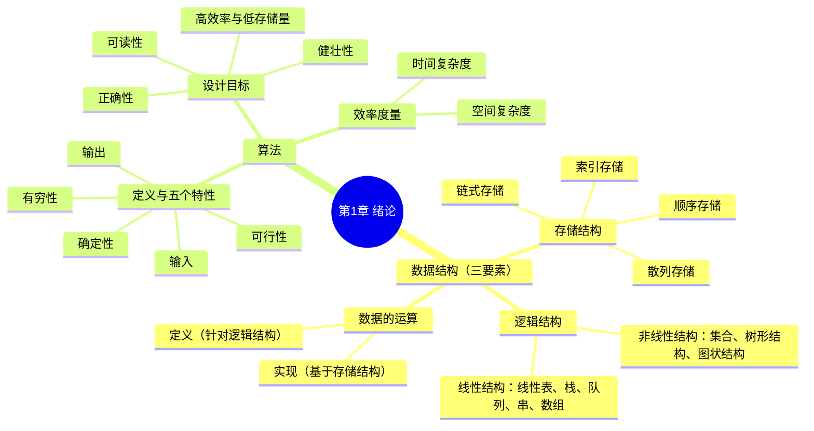

# 第 1 章 绪论 · 学习笔记

> **来源**：《王道 2027 数据结构考研复习指导》第1章（原书第 1–12 页）。
> **体例**：本笔记为考点笔记，原文单独存放于《第1章绪论原文.md》。每个知识点的出处以 `[第N页](第1章绪论原文.md#对应小节标题)` 链接（链接文字为页码、锚点精确指向小节标题）。
> **反例核查**：对有争议、有条件、可能被推翻的结论标注反例、例外、适用条件；原文未出现的标注「原文未见反例」。
> **说明**：已去除习题内容；由视觉模型识别（扫描版）+ 结构化整理（deepseek-v4-pro）两阶段生成，并经独立审查。

## 知识导图



## 本章备考概览

- **考纲内容**：（一）数据结构的基本概念；（二）算法的基本概念，算法的时间复杂度和空间复杂度。[第1页](<第1章绪论原文.md#第 1 章 绪 论>)
- **复习提示**：本章概述数据结构，帮助读者整体认识数据结构，重点在于掌握算法时间复杂度和空间复杂度的分析方法。在统考真题中，无论是算法设计题还是选择题，通常都会要求分析算法的时间复杂度（有时也包括空间复杂度），因此要熟练掌握相关内容。[第1页](<第1章绪论原文.md#第 1 章 绪 论>)

## 1.1 数据结构的基本概念

### 1.1.1 基本概念和术语

**1．数据**
数据是信息的载体，是描述客观事物属性的数、字符，以及所有能输入到计算机中并被计算机程序识别和处理的符号的集合。数据是计算机程序加工的原料。[第1页](<第1章绪论原文.md#1. 数据>)

**2．数据元素**
数据元素是数据的基本单位，通常作为一个整体进行考虑和处理。一个数据元素可由若干数据项组成，而数据项是构成数据元素的不可分割的最小单位。例如，一条学生记录就是一个数据元素，它由学号、姓名、性别等数据项组成。[第1页](<第1章绪论原文.md#2. 数据元素>)

**3、数据对象**
数据对象是具有相同性质的数据元素的集合，是数据的一个子集。例如，整数数据对象可表示为集合 $N = \{0, \pm 1, \pm 2, \cdots\}$。[第2页](<第1章绪论原文.md#3. 数据对象>)

**4、数据类型**
数据类型是一个值的集合以及定义在该集合上的一组操作的总称。[第2页](<第1章绪论原文.md#4. 数据类型>)

| 类型 | 定义 |
|------|------|
| 原子类型 | 其值不可再分的数据类型。 |
| 结构类型 | 其值可进一步分解为若干成分（分量）的数据类型。 |
| 抽象数据类型（ADT） | 一个数学模型以及定义在该模型上的一组操作。它通常是对数据的某种抽象，规定了数据的取值范围、结构形式以及可执行的操作集合。 |

> 📌 **拓展**：抽象数据类型（ADT）由「数据对象、数据关系、基本操作」三要素构成，是"逻辑抽象+操作"与实现分离的体现。[详见：抽象数据类型ADT深入理解](<第1章绪论拓展.md#拓展1 抽象数据类型ADT深入理解>)

**5、数据结构**
数据结构是相互之间存在一种或多种特定关系的数据元素的集合。在任何问题中，数据元素都不是孤立存在的，它们之间存在某种关系，这种关系称为结构（Structure）。数据结构包括三方面的内容：逻辑结构、存储结构和数据的运算。[第2页](<第1章绪论原文.md#5. 数据结构>)

数据的逻辑结构与存储结构密不可分：算法的设计取决于所采用的逻辑结构，而算法的实现则依赖于所选择的存储结构。[第2页](<第1章绪论原文.md#5. 数据结构>)

> ⚠️ 反例核查：该论断为教材的一般性结论，原文未见反例、例外或附加适用条件。

### 1.1.2 数据结构三要素

> 📌 **拓展**：三要素中"逻辑结构独立于存储、存储结构依赖实现"，同一逻辑结构可用多种存储结构实现（如线性表可用顺序表或链表）。[详见：数据结构三要素辨析](<第1章绪论拓展.md#拓展2 数据结构三要素辨析>)

**1. 数据的逻辑结构**
逻辑结构是指数据元素之间的逻辑关系，即从逻辑角度对数据的描述方式。它与数据在计算机中的存储方式无关，是独立于具体系统的。数据的逻辑结构可分为线性结构和非线性结构。例如，线性表是典型的线性结构；集合、树和图则是典型的非线性结构。[第2页](<第1章绪论原文.md#1. 数据的逻辑结构>)

| 逻辑结构 | 数据元素之间的关系 |
|---------|-------------------|
| 集合 | 结构中的数据元素之间除“同属一个集合”外，别无其他关系。 |
| 线性结构 | 结构中的数据元素之间仅存在一对一的关系。 |
| 树形结构 | 结构中的数据元素之间存在一对多的关系。 |
| 图状结构（或网状结构） | 结构中的数据元素之间存在多对多的关系。 |

> ⚠️ 反例核查：逻辑结构“与存储方式无关、独立于具体系统”的结论，以及四类基本结构的划分，原文未见反例或例外。

**2. 数据的存储结构**
存储结构是指数据结构在计算机中的表示形式，也称物理结构，包括数据元素的表示及其相互关系的表示。它是逻辑结构在计算机中的具体实现，依赖于所采用的编程语言。常见的存储结构有顺序存储、链式存储、索引存储和散列存储。[第3页](<第1章绪论原文.md#2. 数据的存储结构>)

| 存储结构 | 定义 | 优点 | 缺点 |
|---------|------|------|------|
| 顺序存储 | 将逻辑上相邻的数据元素存储在物理位置也相邻的存储单元中，元素间的关系由存储单元的邻接关系体现。 | 可以实现随机存取，每个元素占用最少的存储空间。 | 要求使用连续的存储空间，可能导致较多的外部碎片。 |
| 链式存储 | 不要求逻辑上相邻的元素在物理位置上也相邻，而是通过指针指示元素的存储地址来表示其逻辑关系。 | 不会出现碎片现象，能充分利用所有存储单元。 | 每个元素因存储指针而额外占用存储空间，且只能顺序存取。 |
| 索引存储 | 在存储元素信息的同时，额外建立索引表。索引表中的每一项称为索引项，通常包含关键字和地址。 | 检索速度快。 | 需要的额外存储空间用于索引表，且增加或删除数据时需更新索引表，带来额外的时间开销。 |
| 散列存储 | 根据元素的关键字直接计算出其存储地址，也称哈希（Hash）存储。 | 检索、插入和删除操作都非常快速。 | 如果散列函数设计不当，可能会产生冲突（也称哈希冲突），解决冲突会增加时间和空间成本。 |

> ⚠️ 反例核查：散列存储的“检索、插入和删除都非常快速”以散列函数设计得当为前提——原文已注明“散列函数设计不当可能产生冲突”，并指出解决冲突会增加时间与空间成本；顺序、链式、索引存储的优缺点原文未见反例或例外。

**3. 数据的运算**
数据的运算包括定义与实现两个方面：定义针对逻辑结构，说明运算的功能；实现则基于存储结构，描述具体的操作步骤。[第3页](<第1章绪论原文.md#3. 数据的运算>)

| 方面 | 针对对象 | 说明 |
|------|---------|------|
| 定义 | 逻辑结构 | 说明运算的功能。 |
| 实现 | 存储结构 | 描述具体的操作步骤。 |

> ⚠️ 反例核查：运算“定义针对逻辑结构、实现基于存储结构”的对应关系，原文未见反例或例外。

---

## 1.2 算法和算法评价

### 1.2.1 算法的基本概念

算法（Algorithm）是对特定问题求解步骤的描述，是一个有穷的指令序列，其中每条指令表示一个或多个操作。[第4页](<第1章绪论原文.md#1.2.1 算法的基本概念>)

一个有效的算法应具备以下五个重要特性：

| 特性 | 含义 |
| --- | --- |
| 有穷性 | 算法必须在执行有穷步后结束，且每一步都能在有限时间内完成。 |
| 确定性 | 算法中每条指令必须有明确的含义，对于相同的输入，只能产生相同的输出。 |
| 可行性 | 算法中所描述的操作都可以通过已实现的基本运算执行有限次来完成。 |
| 输入 | 算法可以有零个或多个输入，这些输入取自某个特定对象的集合。 |
| 输出 | 算法至少有一个输出，且该输出与输入之间存在某种特定关系。 |

[第4页](<第1章绪论原文.md#1.2.1 算法的基本概念>)

通常，设计一个"好"的算法应努力满足以下目标：

| 目标 | 含义 |
| --- | --- |
| 正确性 | 算法应能正确地解决所给问题。 |
| 可读性 | 结构清晰、易于理解，便于阅读和交流。 |
| 健壮性 | 对非法或异常输入能做出适当处理，而不是产生不可预测的结果。 |
| 高效率与低存储量需求 | 高效率是指算法的执行时间，存储量需求是指执行过程中所需的最大存储空间，二者均与问题规模密切相关。 |

[第4页](<第1章绪论原文.md#1.2.1 算法的基本概念>)

### 1.2.2 算法效率的度量

在算法设计中，正确性只是基础，效率才是衡量算法优劣的关键指标。由于实际运行时间受硬件、编译器等因素影响，无法作为通用标准，因此引入渐近复杂度分析——通过时间复杂度和空间复杂度来抽象描述算法随问题规模增长的资源消耗趋势。[第5页](<第1章绪论原文.md#1.2.2 算法效率的度量>)

### 1. 时间复杂度

时间复杂度描述算法执行时间随问题规模 $n$ 增大而变化的趋势，是关于 $n$ 的渐近函数。算法执行时间通常由语句频度（每条语句的执行次数）来衡量。设算法中所有语句的频度之和为 $T(n)$，它是问题规模 $n$ 的函数。[第5页](<第1章绪论原文.md#1. 时间复杂度>)

当 $n$ 足够大时，低阶项和常数系数对整体增长趋势的影响可以忽略不计，因此只需关注 $T(n)$ 中增长最快的项。这一项通常由算法中的基本运算（最深层循环内的关键操作）的执行次数决定，该执行次数的数量级即为整个算法的时间复杂度。[第5页](<第1章绪论原文.md#1. 时间复杂度>)

**大 O 记号**：若存在正常数 $C$ 和 $n_0$，使得对所有 $n \geq n_0$，都有

$$
0 \leq T(n) \leq C \cdot f(n)
$$

则称 $T(n) = O(f(n))$，它表示当 $n$ 足够大时，$T(n)$ 的增长速度不超过 $f(n)$ 的常数倍。[第5页](<第1章绪论原文.md#1. 时间复杂度>)

> 📌 **拓展**：大 $O$ 只是渐近上界，完整的渐近记号还有下界 $\Omega$ 与紧确界 $\Theta$。[详见：渐近记号完整体系](<第1章绪论拓展.md#拓展3 渐近记号完整体系>)

例如，$T(n) = 3n^2 + 100n + 5 \rightarrow O(n^2)$，$T(n) = 2^n + n^{100} \rightarrow O(2^n)$。[第5页](<第1章绪论原文.md#1. 时间复杂度>)

算法的实际运行时间不仅依赖于问题规模 $n$，还受输入数据初始状态的影响，同一算法在不同实例下的运行时间可能差异很大。例如，在数组 $A[0...n-1]$ 中顺序查找值 $k$ 的算法：

```
(1) i=n-1;
(2) while (i>=0 && A[i]!=k)
(3)     i--;            // 基本运算
(4) return i;
```

| 情况 | 含义 |
| --- | --- |
| 最好时间复杂度 | 在最有利输入下的运行时间。若 $A[n-1]$ 等于 $k$，则语句 3 的频度 $f(n) = 0$。 |
| 最坏时间复杂度 | 在最不利输入下的运行时间。若 $k$ 不存在，则语句 3 的频度 $f(n) = n$。 |
| 平均时间复杂度 | 所有输入等概率出现时的期望运行时间。 |

通常以最坏时间复杂度作为算法效率的评价标准，因为它提供了运行时间的确定性上界。[第5页](<第1章绪论原文.md#1. 时间复杂度>)

> 反例核查：「通常以最坏时间复杂度作为评价标准」为条件性结论（"通常"），原文未给出例外情形，原文未见反例。

分析由多个代码段组成的程序时，可用以下规则快速推导整体时间复杂度：

| 规则 | 适用场景 | 公式 |
| --- | --- | --- |
| 加法规则 | 两段代码顺序执行，总时间复杂度取两者中的高阶项 | $T(n) = O(f(n)) + O(g(n)) = O(\max(f(n), g(n)))$ |
| 乘法规则 | 一段代码嵌套在另一段内部，总时间复杂度为两者之积 | $T(n) = O(f(n)) \times O(g(n)) = O(f(n) \times g(n))$【此处不清：公式右端有截断】 |

[第5页](<第1章绪论原文.md#1. 时间复杂度>)

> 原文注：乘法规则公式在图片底部右侧被截断，据上下文推测补全（原图可见部分不完整）；原文另给出等价式：
>
> $$
> O(f(n)) \cdot O(g(n)) = O(f(n)g(n))
> $$

例如，设 a()、b()、c() 三个语句块的时间复杂度分别为 $O(1)$、$O(n)$、$O(n^2)$，则：

```c
① a{
b()
c()
}               //时间复杂度为 O(n^2)，适用加法规则
② a{
b()
c()
}               //时间复杂度为 O(n^3)，适用乘法规则
```

> 编者注：原文此处①/②两段代码完全相同、仅注释不同（疑为图示 OCR 所致）；按教材通行表述应为「① 顺序执行 → 加法规则 $O(n^2)$，② 嵌套执行 → 乘法规则 $O(n^3)$」。

[第5页](<第1章绪论原文.md#1. 时间复杂度>)

常见的时间复杂度阶（按增长速度升序）：

| 序号 | 阶次 |
| --- | --- |
| 1 | $O(1)$ |
| 2 | $O(\log_2 n)$ |
| 3 | $O(n)$ |
| 4 | $O(n\log_2 n)$ |
| 5 | $O(n^2)$ |
| 6 | $O(n^3)$ |
| 7 | $O(2^n)$ |
| 8 | $O(n!)$ |
| 9 | $O(n^n)$ |

[第5页](<第1章绪论原文.md#1. 时间复杂度>)

### 2. 空间复杂度

空间复杂度 $S(n)$ 表示算法在运行过程中所需的额外存储空间，是问题规模 $n$ 的函数，记为

$$
S(n) = O(g(n))
$$

[第6页](<第1章绪论原文.md#2. 空间复杂度>)

程序执行时所需的空间包括：指令、常量和变量（与 $n$ 无关）；输入数据；以及辅助空间（如递归调用栈、临时数组、指针等）。

| 空间组成 | 是否计入空间复杂度 | 说明 |
| --- | --- | --- |
| 指令、常量和变量（与 $n$ 无关） | 不计入 | 固定开销，不随问题规模变化 |
| 输入数据 | 不计入 | 只取决于问题本身，与算法无关 |
| 辅助空间（如递归调用栈、临时数组、指针等） | 计入 | 算法额外使用的存储空间 |

在分析空间复杂度时，只关注算法额外使用的辅助空间。例如，若算法创建了若干与输入规模 $n$ 同阶的辅助数组，则其空间复杂度为 $O(n)$。[第6页](<第1章绪论原文.md#2. 空间复杂度>)

若算法仅使用常量级的额外空间，则称其为原地工作，空间复杂度为 $O(1)$。[第6页](<第1章绪论原文.md#2. 空间复杂度>)

> 📌 **拓展**：时间与空间常需权衡——散列表、记忆化是"空间换时间"，原地排序是"省空间"；原地算法指辅助空间 $O(1)$。[详见：空间换时间与原地算法](<第1章绪论拓展.md#拓展6 空间换时间与原地算法>)

> 反例核查：本节结论原文未见反例。

---

## 归纳总结与思维拓展

### 归纳总结

本章的核心在于分析程序的时间复杂度。读者不仅要能快速判断算法的渐近复杂度，更要掌握规范、严谨的推导过程——许多人在解题时虽能“一眼看出”答案，却难以清晰地阐述其分析逻辑。为此，编者综合众多资料，将此类问题归纳为以下两种典型情形，以供参考。[第11页](<第1章绪论原文.md#归纳总结>)

| 情形 | 适用前提 | 分析方法 |
| --- | --- | --- |
| 循环主体中的变量参与循环条件的判断 | 采用循环递推实现的算法 | 建立基本运算执行次数 $x$ 与问题规模 $n$ 的关系式，解得 $x=f(n)$；若 $f(n)$ 的最高次幂为 $k$，则时间复杂度为 $O(n^k)$ |
| 循环主体中的变量与循环条件无关 | 循环主体中的变量与循环条件无关 | 数学归纳法或直接累计循环执行次数 |

### 1. 循环主体中的变量参与循环条件的判断

对于采用循环递推实现的算法，应先建立基本运算的执行次数 $x$ 与问题规模 $n$ 之间的关系式，解得 $x=f(n)$。若 $f(n)$ 的最高次幂为 $k$，则时间复杂度为 $O(n^k)$。[第11页](<第1章绪论原文.md#1. 循环主体中的变量参与循环条件的判断>)

**例 1**

```c
int i=1;
while(i<=n)
i=i*2;
```

设基本运算 $i=i*2$ 的执行次数为 $t$，则 $2^t \le n$，解得 $t \le \log_2 n$，故 $T(n)=O(\log_2 n)$。[第11页](<第1章绪论原文.md#1. 循环主体中的变量参与循环条件的判断>)

**例 2**

```c
int y=5;
while((y+1)*(y+1)<n)
y=y+1;
```

设基本运算 $y=y+1$ 的执行次数为 $t$，则 $t=y-5$，且 $(t+5+1)(t+5+1)<n$，解得 $t<\sqrt{n}-6$，即 $T(n)=O(\sqrt{n})$。[第11页](<第1章绪论原文.md#1. 循环主体中的变量参与循环条件的判断>)

### 2. 循环主体中的变量与循环条件无关

此类问题可采用数学归纳法或直接累计循环执行次数。分析多层循环时，应从内向外逐层计算，忽略单步语句、条件判断语句，仅关注主体语句的执行次数。[第12页](<第1章绪论原文.md#2. 循环主体中的变量与循环条件无关>)

此类问题又可分以下两种：

| 类型 | 分析方法 |
| --- | --- |
| 递归程序 | 通常通过建立递推关系式求解 |
| 非递归程序 | 分析较为简单，可直接累加次数（本节前面已给出相关习题） |

递归程序的时间复杂度分析如下：[第12页](<第1章绪论原文.md#2. 循环主体中的变量与循环条件无关>)

$$
T(n) = 1 + T(n-1) = 1 + 1 + T(n-2) = \cdots = n - 1 + T(1)
$$

即 $T(n) = O(n)$。[第12页](<第1章绪论原文.md#2. 循环主体中的变量与循环条件无关>)

> 📌 **拓展**：递归复杂度可统一用「主定理」$T(n)=aT(n/b)+f(n)$ 快速求解（二分 $O(\log n)$、归并 $O(n\log n)$、斐波那契递归 $O(2^n)$）。[详见：递归复杂度与主定理](<第1章绪论拓展.md#拓展4 递归复杂度与主定理>)

### 反例核查

- 「若 $f(n)$ 的最高次幂为 $k$，则时间复杂度为 $O(n^k)$」的适用条件：采用循环递推实现的算法，且循环主体中的变量参与循环条件的判断；原文未见反例。
- 例 1 的 $T(n)=O(\log_2 n)$ 由 $2^t \le n$ 推出，例 2 的 $T(n)=O(\sqrt{n})$ 由 $(t+5+1)(t+5+1)<n$ 推出，均为具体示例在给定代码下的推导结果；原文未见反例。
- 「可采用数学归纳法或直接累计循环执行次数」以及「多层循环自内向外逐层计算、仅关注主体语句的执行次数」的适用条件：循环主体中的变量与循环条件无关；原文未见反例。
- 递归程序的 $T(n)=O(n)$ 由递推式 $T(n)=1+T(n-1)$ 推导得到，属于该递推关系下的结论；原文未见反例。

### 思维拓展

> 📌 **拓展**：斐波那契数列有递归（$O(2^n)$）、迭代（$O(n)$）、矩阵快速幂（$O(\log n)$）三种实现，朴素递归因重复计算而指数爆炸。[详见：斐波那契数列三种实现](<第1章绪论拓展.md#拓展5 斐波那契数列三种实现>)

求解斐波那契数列 [第12页](<第1章绪论原文.md#思维拓展>)：

$$
F(n) = \begin{cases}
0, & n=0 \\
1, & n=1 \\
F(n-1) + F(n-2), & n>1
\end{cases}
$$

该数列有两种常用的算法：递归算法和非递归算法。[第12页](<第1章绪论原文.md#思维拓展>)

> 注：原文此处以拓展题形式提出「试分别分析两种算法的时间复杂度」，属习题内容，按本笔记体例从略。
> 反例核查：原文将斐波那契数列的求解算法归纳为「递归算法」与「非递归算法」两类；原文未见反例。
