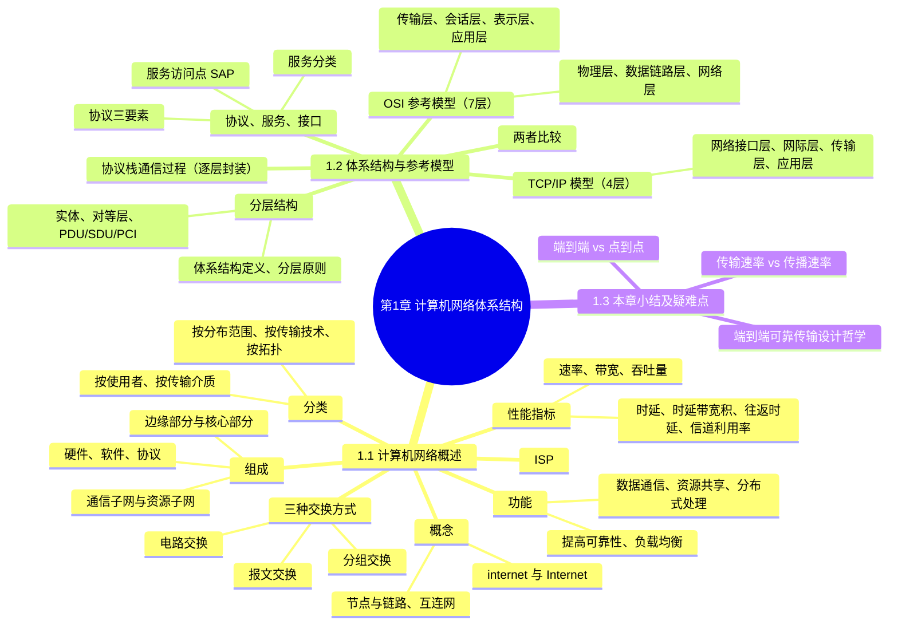

# 第 1 章 计算机网络体系结构 · 学习笔记

> **来源**：《王道 2027 计算机网络考研复习指导》第1章（原书第 1–29 页；第 9–14、22–27 页的习题与答案解析已略去，其中第 9、22 页页首正文「信道利用率」「协议栈通信过程」已保留）。
> **体例**：本笔记为考点笔记，原文单独存放于《第1章计算机网络体系结构原文.md》。每个知识点的出处链接可精确跳转到原文存档中对应的小节标题锚点。
> **反例核查**：对有争议、有条件、可能被推翻的结论标注反例、例外、适用条件；原文未出现的标注「原文未见反例」。
> **说明**：已去除习题内容；由视觉模型识别（扫描版）+ 结构化整理两阶段生成。页码以原书印刷页为准，建议结合原书核验。

## 知识导图

## 本章备考概览

- **考纲内容**：（一）计算机网络概述——概念、组成与功能，分类，性能指标；（二）计算机网络体系结构与参考模型——分层结构，协议、接口、服务的概念，ISO/OSI 参考模型和 TCP/IP 模型。[第1页](<第1章计算机网络体系结构原文.md#1.1 计算机网络概述>)
- **复习提示**：本章是全书导引章节，以选择题为主。重点掌握三种数据交换方式的特点及相关计算，协议/接口/服务概念，ISO/OSI 参考模型和 TCP/IP 模型各层功能；熟悉时延、带宽、速率等性能指标的计算。[第1页](<第1章计算机网络体系结构原文.md#1.1 计算机网络概述>)

## 1.1 计算机网络概述

### 1.1.1 计算机网络的概念

**定义**：一般认为，计算机网络是将众多分散的、自治的计算机系统，通过通信设备与线路连接起来，并由功能完善的软件实现资源共享和信息传递的系统。[第1页](<第1章计算机网络体系结构原文.md#1.1.1 计算机网络的概念>)

- 计算机网络（简称网络）由若干**节点**（Node，或译为结点）和连接这些节点的**链路**（Link）组成。节点可以是计算机、集线器、交换机或路由器等。[第1页](<第1章计算机网络体系结构原文.md#1.1.1 计算机网络的概念>)
- 多个网络通过路由器互连，构成覆盖范围更广的计算机网络，称为**互连网**（internet）。可理解为：网络将多台计算机连接在一起，而互连网将多个网络通过路由器连接在一起。[第1页](<第1章计算机网络体系结构原文.md#1.1.1 计算机网络的概念>)

**internet 与 Internet 的区别**（两个含义相差很大的名词）：[第1页](<第1章计算机网络体系结构原文.md#1.1.1 计算机网络的概念>)

| 术语 | 性质 | 含义 | 通信协议要求 |
| --- | --- | --- | --- |
| internet（互连网） | 通用名词 | 泛指由多个计算机网络互连而成的网络 | 可用任意通信协议，不要求采用 TCP/IP |
| Internet（互联网/因特网） | 专用名词 | 特指当前全球最大的、开放的、由众多网络和路由器互连而成的特定计算机网络 | 必须采用 TCP/IP 协议族 |

**ISP 接入**：最终用户通过互联网服务提供商（Internet Service Provider，ISP）接入互联网（如中国电信、中国移动）。所谓上网，是指通过某 ISP 分配的 IP 地址接入互联网。ISP 可从互联网管理机构申请大量 IP 地址，并拥有通信线路及路由器等联网设备；任何机构或个人只要向 ISP 缴费，即可获得 IP 地址使用权并通过该 ISP 接入互联网。[第1页](<第1章计算机网络体系结构原文.md#1.1.1 计算机网络的概念>)

> 反例核查：原文未见反例。

### 1.1.2 计算机网络的组成

从不同角度看，计算机网络的组成可分为三类：[第2页](<第1章计算机网络体系结构原文.md#1.1.2 计算机网络的组成>)

| 视角 | 组成部分 | 说明 |
| --- | --- | --- |
| 组成部分 | 硬件、软件、协议 | 硬件含主机、通信链路、交换设备；软件含系统软件与应用工具；协议是网络的核心 |
| 工作方式 | 边缘部分、核心部分 | 边缘部分由供用户直接使用的主机组成；核心部分由大量网络及互连这些网络的路由器组成 |
| 功能组成 | 通信子网、资源子网 | 通信子网负责数据传输、交换、控制与存储；资源子网实现资源共享 |

- **从组成部分看**：硬件包括主机（台式机、笔记本、平板、智能手机等）、通信链路（双绞线、光纤）及交换设备（路由器、交换机等）；软件包括实现资源共享的系统软件和应用工具（E-mail、FTP、聊天程序等）；**协议**是计算机网络的核心，如同交通规则，规定了数据在网络中传输时必须遵循的规则。[第2页](<第1章计算机网络体系结构原文.md#1.1.2 计算机网络的组成>)
- **从工作方式看**：边缘部分用于通信和资源共享；核心部分为边缘部分提供连通性和交换服务。[第2页](<第1章计算机网络体系结构原文.md#1.1.2 计算机网络的组成>)

![[2027计算机网络_高清带书签版.pdf#page=14&rect=134,369,412,507|2027计算机网络_高清带书签版, p.14]]
- **从功能组成看**：通信子网由传输介质、通信设备及相关网络协议组成；资源子网向用户提供共享硬件、软件、数据资源的服务。[第2页](<第1章计算机网络体系结构原文.md#1.1.2 计算机网络的组成>)

> 反例核查：原文未见反例。

### 1.1.3 计算机网络的功能

计算机网络主要有五大功能：[第2页](<第1章计算机网络体系结构原文.md#1.1.3 计算机网络的功能>)

| 功能 | 要点 |
| --- | --- |
| 数据通信 | 最基本、最重要的功能，实现联网计算机之间各种信息的传输（如文件传输、电子邮件） |
| 资源共享 | 软件、数据或硬件的共享，使资源互通有无、分工协作，显著提高资源利用率 |
| 分布式处理 | 某计算机负荷过重时，将复杂任务分配给其他计算机，利用空闲资源提高整个系统利用率 |
| 提高可靠性 | 各台计算机通过网络互为备份 |
| 负载均衡 | 将工作任务均衡分配给各台计算机，避免过载或闲置 |

除上述功能外，还支持电子化办公与服务、远程教育、娱乐等。[第3页](<第1章计算机网络体系结构原文.md#1.1.3 计算机网络的功能>)

> 反例核查：原文未见反例。

### 1.1.4 电路交换、报文交换与分组交换

网络核心部分起关键作用的是**路由器**（Router），它通过对接收到的分组进行**存储转发**来实现分组交换。[第3页](<第1章计算机网络体系结构原文.md#1.1.4 电路交换、报文交换与分组交换>)

#### 1. 电路交换

🎯 高频考点：电路交换的时延分析（2025）

- 最典型的电路交换网络是传统电话网。电路交换分为三个阶段：**建立连接**（占用通信资源）、**传输数据**（持续占用通信资源）、**释放连接**（归还通信资源）。[第3页](<第1章计算机网络体系结构原文.md#1. 电路交换>)
- 数据传输前，双方必须先建立一条专用的端到端物理通路；通信过程中该通路被双方独占，直至通信结束才释放。电路建立后，除源、目的节点外，中间节点仅提供物理通路，比特流连续地从源端直达目的端，如同管道传输。[第3页](<第1章计算机网络体系结构原文.md#1. 电路交换>)

![[2027计算机网络_高清带书签版.pdf#page=15&rect=129,348,412,439|2027计算机网络_高清带书签版, p.15]]
- 适用条件：**低频次、连续且大量**的数据传输。[第3页](<第1章计算机网络体系结构原文.md#1. 电路交换>)

- 计算机通信通常是**突发式（高频、少量）**的，若采用电路交换，线路大部分时间空闲，利用率往往不足 10%，甚至低于 1%。[第3页](<第1章计算机网络体系结构原文.md#1. 电路交换>)

**优点**

| 要点 | 补充 |
| --- | --- |
| 通信时延小 | 通信线路为双方专用，数据直达，传输效率高 |
| 有序传输 | 数据按发送顺序传送，不存在失序问题 |
| 没有冲突 | 不同通信对使用独立信道，不会争用物理信道 |
| 实时性强 | 物理通路一旦建立，双方即可随时通信 |

**缺点**

| 要点 | 补充 |
| --- | --- |
| 建立连接时间长 | 平均建立连接时间对计算机通信而言过长 |
| 线路利用率低 | 通路被双方独占，即使空闲也无法供其他用户使用 |
| 灵活性差 | 通路中任一节点或链路故障，都需重新建立连接 |
| 难以实现差错控制 | 中间节点不具备存储和检错能力，无法发现或纠正传输错误 |

#### 2. 报文交换

🎯 高频考点：报文交换的时延分析（2013、2025）

- 用户数据附加源地址、目的地址等控制信息后，被封装成**报文**（Message）。报文交换采用**存储转发**技术：整个报文先传送到相邻节点，被完整接收并存储后，节点根据转发表转发至下一跳，逐跳转发直至目的端；每个报文可独立选择路径。[第4页](<第1章计算机网络体系结构原文.md#2. 报文交换>)

**优点**

| 要点 | 补充 |
| --- | --- |
| 无建立和释放连接的时延 | 通信前无须建立连接，用户可随时发送报文 |
| 线路分配灵活 | 存储完整报文后可选当前最优空闲链路；故障可动态切换 |
| 线路利用率高 | 报文仅在一段链路上传输时才占用该段链路资源 |
| 支持差错控制 | 交换节点可对缓存中的报文进行差错检验 |

**缺点**

| 要点 | 补充 |
| --- | --- |
| 存储转发时延高 | 节点必须完整接收整个报文后才能开始转发 |
| 缓存开销大 | 报文大小没有限制，要求交换节点配备大容量缓存 |
| 错误处理低效 | 报文越长出错概率越大，重传整个报文的代价较大 |

#### 3. 分组交换

🎯 高频考点：分组交换的时延分析（2010、2013、2023、2025）

- 分组交换同样采用存储转发，但解决了报文过长的问题：源主机先将较长报文划分为若干较小的**等长数据段**，在每个数据段前添加由控制信息（源地址、目的地址、分组编号等）组成的**首部**，构成**分组**（Packet）。[第4页](<第1章计算机网络体系结构原文.md#3. 分组交换>)

![[2027计算机网络_高清带书签版.pdf#page=16&rect=147,290,419,413|2027计算机网络_高清带书签版, p.16]]
- 分组交换机（如路由器）收到分组后先缓存，从首部提取目的地址、查找转发表，转发至下一交换机；经多个交换机存储转发后到达目的主机。[第4页](<第1章计算机网络体系结构原文.md#3. 分组交换>)

- **失序问题**：采用**数据报服务**时，分组可能经不同路径到达，需在目的主机按编号重排序；采用**虚电路服务**虽可避免失序，但需经历建立连接、数据传输、释放连接三个阶段。[第5页](<第1章计算机网络体系结构原文.md#3. 分组交换>)

**优点**

| 要点 | 补充 |
| --- | --- |
| 便于存储管理、转发开销小 | 分组长度固定，缓冲区大小可预设，管理更高效 |
| 传输效率高 | 流水线操作：后一分组的接收可与前一分组的转发并行 |
| 降低出错概率与重传代价 | 分组较短，出错概率减小，重传数据量大为减少 |

**缺点**

| 要点 | 补充 |
| --- | --- |
| 存在存储转发时延 | 比电路交换大，且要求节点交换机具备更强处理能力 |
| 需传输额外的信息量 | 每个数据段附加控制信息，信息量增大约 5%～10% |
| 分组可能失序、丢失或重复 | 数据报服务下分组可能经不同路径到达，需按编号重排序 |

#### 三种交换方式对比

- 当需连续传输大量数据、且传输时间远大于连接建立时间时，采用电路交换更合适；从提升网络整体信道利用率看，报文交换和分组交换优于电路交换；其中分组交换时延更小、更灵活，尤其适合突发式数据通信。[第5页](<第1章计算机网络体系结构原文.md#1.1.4 电路交换、报文交换与分组交换>)

![[2027计算机网络_高清带书签版.pdf#page=17&rect=118,359,422,578|2027计算机网络_高清带书签版, p.17]]

表 1.1 三种交换方式的特性对比：[第5页](<第1章计算机网络体系结构原文.md#1.1.4 电路交换、报文交换与分组交换>)

| 特性 | 电路交换 | 报文交换 | 分组交换 |
| --- | --- | --- | --- |
| 完成传输所需的时间 | 最少 | 最多 | 较少 |
| 存储转发时延 | 无 | 高 | 较低 |
| 通信前是否需要建立连接 | 是 | 否 | 否 |
| 节点的缓存开销 | 无 | 高 | 低 |
| 是否支持差错控制 | 不支持 | 支持 | 支持 |
| 数据是否有序到达 | 是 | 是 | 否 |
| 是否需要额外的控制信息 | 否 | 是 | 是（且占比较大） |
| 线路分配的灵活性 | 不灵活 | 灵活 | 非常灵活 |
| 线路利用率 | 低 | 高 | 非常高 |

> 反例/例外：表中「分组交换：数据是否有序到达＝否」主要针对数据报服务；虚电路服务可避免失序。[第5页](<第1章计算机网络体系结构原文.md#1.1.4 电路交换、报文交换与分组交换>)

> 📌 **拓展**：三种交换方式的总时延公式与「电路交换 vs 分组交换」的取舍条件。[详见：三种交换方式的时延定量比较](<第1章计算机网络体系结构拓展.md#拓展1 三种交换方式的时延定量比较>)　｜　分组交换的两种服务方式完整对比。[详见：数据报与虚电路](<第1章计算机网络体系结构拓展.md#拓展2 数据报与虚电路>)

### 1.1.5 计算机网络的分类

#### 1. 按分布范围分类

| 类型 | 覆盖范围 | 要点 |
| --- | --- | --- |
| 广域网（WAN） | 几十至数千千米 | 长距离通信，常用于构建互联网骨干，节点交换机间通过高速链路互联，通信容量大 |
| 城域网（MAN） | 直径约 5～50km | 可跨越几个城区乃至整个城市；目前大多采用以太网技术，有时归入局域网范畴 |
| 局域网（LAN） | 几十米到几千米 | 主机通过高速线路互连；传统上局域网采用广播技术，广域网采用交换技术 |
| 个人区域网（PAN） | 个人工作/活动区域 | 利用无线技术互联消费电子设备，也称无线个人区域网（WPAN） |

[第5-6页](<第1章计算机网络体系结构原文.md#1.1.5 计算机网络的分类>)

#### 2. 按传输技术分类

| 类型 | 要点 |
| --- | --- |
| 广播式网络 | 所有联网计算机共享一个公共通信信道；一台计算机发送分组时，所有计算机都能「收听」，通过检查目的地址决定是否接收。局域网普遍采用；广域网中的无线和卫星通信也属此类 |
| 点对点网络 | 每条物理线路连接一对计算机；无直接连接时，分组需经中间节点存储转发 |

[第6页](<第1章计算机网络体系结构原文.md#1.1.5 计算机网络的分类>)

#### 3. 按拓扑结构分类

网络拓扑结构指网络中节点（路由器、主机等）与通信线路之间的几何排列关系，主要描述通信子网的结构。常见拓扑有总线形、星形、环形和网状。[第6页](<第1章计算机网络体系结构原文.md#1.1.5 计算机网络的分类>)

![[2027计算机网络_高清带书签版.pdf#page=18&rect=100,330,449,425|2027计算机网络_高清带书签版, p.18]]

| 拓扑 | 结构 | 优点 | 缺点 |
| --- | --- | --- | --- |
| 总线形 | 单根传输线连接所有计算机 | 建网容易、增减节点方便、节省线路 | 重负载下通信效率低；总线任一故障影响全网 |
| 星形 | 各终端通过独立线路连到中央设备（交换机/路由器） | 便于集中控制与管理 | 成本较高；中央设备对故障敏感 |
| 环形 | 所有接口设备连成闭合环路，信号沿环单向传输 | 令牌环局域网典型；可单环或双环提高可靠性 | — |
| 网状 | 每个节点至少有两条路径与其他节点相连 | 可靠性高、容错能力强（多用于广域网） | 控制复杂、线路成本高 |

[第6页](<第1章计算机网络体系结构原文.md#1.1.5 计算机网络的分类>)

> 总线形、星形、环形多用于局域网，网状多用于广域网；四种基本拓扑可组合成混合网络。

#### 4. 按使用者分类

| 类型 | 要点 |
| --- | --- |
| 公用网（Public Network） | 电信运营商出资建设，面向公众开放，缴纳费用即可接入 |
| 专用网（Private Network） | 特定单位为自身业务建设，仅限内部使用，如铁路、电力、军队等部门 |

[第6页](<第1章计算机网络体系结构原文.md#1.1.5 计算机网络的分类>)

#### 5. 按传输介质分类

传输介质分为有线和无线两大类，相应地分为有线网络（双绞线网络、同轴电缆网络、光纤网络等）和无线网络（蓝牙、Wi-Fi、微波、无线电等）。[第6页](<第1章计算机网络体系结构原文.md#1.1.5 计算机网络的分类>)

> 反例核查：原文未见反例。

### 1.1.6 计算机网络的性能指标

#### 1. 速率

速率（Speed），也称数据传输速率、数据率或比特率，指连接到网络上的节点在数字信道上传送数据的速率，单位为 bit/s（比特/秒）或 b/s（有时写作 bps）。较高数据率常用 kb/s（$k=10^3$）、Mb/s（$M=10^6$）、Gb/s（$G=10^9$）。[第7页](<第1章计算机网络体系结构原文.md#1.1.6 计算机网络性能指标>)

> **注意**：描述**数据量**时，K、M、G 常用 2 的幂次（如 $1\text{Kb}=2^{10}\text{b}$）；描述**速率**时，k、M、G 常用 10 的幂次（如 $1\text{kb/s}=10^3\text{b/s}$）。通常前者用大写 K，后者用小写 k，其余前缀均大写。[第7页](<第1章计算机网络体系结构原文.md#1.1.6 计算机网络性能指标>)

#### 2. 带宽

- 通信领域：带宽指通信线路允许通过的信号频率范围，单位为赫兹（Hz）。[第7页](<第1章计算机网络体系结构原文.md#1.1.6 计算机网络性能指标>)
- 计算机网络中：带宽表示网络通信线路所能传送数据的能力，即数字信道所能支持的**最高数据传输速率**，单位为 b/s。[第7页](<第1章计算机网络体系结构原文.md#1.1.6 计算机网络性能指标>)
- 节点间的**实际可用带宽**由双方网卡性能、各段链路带宽以及交换设备速率中的**最小值**决定。[第7页](<第1章计算机网络体系结构原文.md#1.1.6 计算机网络性能指标>)

#### 3. 吞吐量

🎯 高频考点：分组交换的吞吐量分析（2024）

吞吐量（Throughput）指单位时间内通过某个网络（或信道、接口）的实际数据量，常用于测量实际网络、评估真实可达的数据传输能力。[第7页](<第1章计算机网络体系结构原文.md#1.1.6 计算机网络性能指标>)

> 📌 **拓展**：速率、带宽、吞吐量三者的「标称/上限/实际」辨析与瓶颈效应。[详见：速率、带宽、吞吐量辨析](<第1章计算机网络体系结构拓展.md#拓展6 速率、带宽、吞吐量辨析>)

#### 4. 时延

🎯 高频考点：网络时延的分析（2010、2013、2023、2025）

时延（Delay）指数据（一个报文或分组）从网络（或链路）的一端传到另一端所需的总时间，由四部分组成：[第7页](<第1章计算机网络体系结构原文.md#1.1.6 计算机网络性能指标>)

| 组成部分 | 定义 | 公式/决定因素 |
| --- | --- | --- |
| 发送时延（传输时延） | 节点将分组的所有比特推入链路所需的时间（第一个比特发送到最后一个比特发送完毕） | $\text{发送时延}=\text{分组长度}/\text{发送速率}$ |
| 传播时延 | 电磁波在信道中传播一定距离所需的时间 | $\text{传播时延}=\text{信道长度}/\text{电磁波在信道上的传播速率}$ |
| 处理时延 | 分组在交换节点为存储转发进行必要处理（解析首部、差错检验、查找路由等）的时间 | 取决于节点处理能力 |
| 排队时延 | 分组在路由器输入/输出队列中等待处理或转发的时间 | 取决于网络拥塞状况 |

$$
\text{总时延}=\text{发送时延}+\text{传播时延}+\text{处理时延}+\text{排队时延}
$$

> **区分**：发送时延取决于分组长度和发送速率；传播时延取决于链路距离和传播介质。[第7页](<第1章计算机网络体系结构原文.md#1.1.6 计算机网络性能指标>)
> **考试条件**：通常无须考虑处理时延和排队时延（除非题目另有说明）。[第8页](<第1章计算机网络体系结构原文.md#1.1.6 计算机网络性能指标>)

![[2027计算机网络_高清带书签版.pdf#page=19&rect=148,51,385,123|2027计算机网络_高清带书签版, p.19]]

![[2027计算机网络_高清带书签版.pdf#page=20&rect=0,412,541,558]]

#### 5. 时延带宽积

时延带宽积指发送端发送的第一个比特即将到达接收端时，发送端已发出的比特总数，即已发出但尚未到达接收端的最大比特数，也称以比特为单位的链路长度。[第8页](<第1章计算机网络体系结构原文.md#1.1.6 计算机网络性能指标>)

$$
\text{时延带宽积}=\text{传播时延}\times\text{信道带宽}
$$

类比：把链路想象为圆柱形管道，长度表示传播时延，横截面积表示链路带宽，则时延带宽积表示该管道可容纳的比特数量。[第8页](<第1章计算机网络体系结构原文.md#1.1.6 计算机网络性能指标>)

![[2027计算机网络_高清带书签版.pdf#page=20&rect=156,248,392,320|2027计算机网络_高清带书签版, p.20]]

#### 6. 往返时延

往返时延（Round-Trip Time，RTT）指从发送端发出一个短分组，到收到接收端返回的确认信号所经历的总时间。[第8页](<第1章计算机网络体系结构原文.md#1.1.6 计算机网络性能指标>)

- **包括**：往返传播时延、接收端的处理时延、互联网环境中各中间节点的处理时延和排队时延。[第8页](<第1章计算机网络体系结构原文.md#1.1.6 计算机网络性能指标>)
- **不包括**：数据分组本身的发送时延（通常也忽略确认分组的发送时延）。[第8页](<第1章计算机网络体系结构原文.md#1.1.6 计算机网络性能指标>)

![[2027计算机网络_高清带书签版.pdf#page=20&rect=143,59,410,184|2027计算机网络_高清带书签版, p.20]]

#### 7. 信道利用率

信道利用率指信道有数据通过的时间占总时间的百分比。[第9页](<第1章计算机网络体系结构原文.md#1.1.6 计算机网络性能指标>)

$$
\text{信道利用率}=\frac{\text{有数据通过的时间}}{\text{有数据通过的时间}+\text{无数据通过的时间}}
$$

- **并非越高越好**：利用率过低会浪费网络资源；过高则会使排队时延显著增加，引发网络拥塞（如同车流量很大时公路易拥堵）。[第9页](<第1章计算机网络体系结构原文.md#1.1.6 计算机网络性能指标>)

> 反例核查：原文未见反例。

## 1.2 计算机网络体系结构与参考模型

### 1.2.1 计算机网络分层结构

#### 1. 分层思想与体系结构

计算机网络非常复杂，早期即采用**分层**设计思想，将庞大而复杂的问题转化为若干较小的局部问题，便于研究和处理。[第15页](<第1章计算机网络体系结构原文.md#1.2.1 计算机网络分层结构>)

- **网络体系结构（Architecture）**：计算机网络的各层及其协议的集合，是对该网络及其所应完成功能的精确定义。[第15页](<第1章计算机网络体系结构原文.md#1.2.1 计算机网络分层结构>)
  - 🎯 高频考点：网络体系结构的概念（2010）
- **体系结构是抽象的，实现是具体的**：功能由何种硬件或软件实现属于实现（Implementation）问题，体现在实际运行的软硬件中；体系结构通常具有可分层的特性。[第15页](<第1章计算机网络体系结构原文.md#1.2.1 计算机网络分层结构>)

**分层的基本原则**（5 条）：[第15页](<第1章计算机网络体系结构原文.md#1.2.1 计算机网络分层结构>)

1. 每层实现一种相对独立的功能，降低整个系统的复杂程度。
2. 各层之间的接口清晰、简洁，相互依赖尽可能少。
3. 各层功能的定义独立于具体实现方法，可采用最合适的技术实现。
4. 保持下层对上层的独立性，上层单向使用下层提供的服务。
5. 整个分层结构应有利于标准化工作。

#### 2. 实体、对等层与服务

- 第 $n$ 层的活动元素称为第 $n$ 层**实体**：任何可发送或接收信息的硬件或软件进程，通常是某个特定软件模块。[第15页](<第1章计算机网络体系结构原文.md#1.2.1 计算机网络分层结构>)
- 不同机器上的同一层称为**对等层**，同一层的实体互为**对等实体**。[第15页](<第1章计算机网络体系结构原文.md#1.2.1 计算机网络分层结构>)
- 第 $n$ 层向第 $n+1$ 层提供的服务，是其自身及以下所有层所提供服务的总和；第 $n$ 层实体称为**服务提供者**，第 $n+1$ 层实体称为**服务用户**。[第15页](<第1章计算机网络体系结构原文.md#1.2.1 计算机网络分层结构>)

#### 3. PDU、SDU、PCI

| 名称 | 定义 | 记法 |
| --- | --- | --- |
| 协议数据单元（PDU） | 对等层之间传送的数据单位，由服务数据单元和控制信息两部分组成 | $n$-PDU |
| 服务数据单元（SDU） | 相邻层之间交换的数据单位 | $n$-SDU |
| 协议控制信息（PCI） | 用于控制协议操作的信息 | $n$-PCI |

![[2027计算机网络_高清带书签版.pdf#page=28&rect=96,467,454,618|2027计算机网络_高清带书签版, p.28]]

[第16页](<第1章计算机网络体系结构原文.md#1.2.1 计算机网络分层结构>)

各层 PDU 的通俗名称：[第16页](<第1章计算机网络体系结构原文.md#1.2.1 计算机网络分层结构>)

| 层 | PDU 通俗名称 |
| --- | --- |
| 物理层 | 比特流 |
| 数据链路层 | 帧 |
| 网络层 | IP 分组 |
| 传输层 | TCP 报文段或 UDP 数据报 |

**封装与解封装**：数据从第 $n+1$ 层传到第 $n$ 层时，将第 $n+1$ 层的 PDU 作为第 $n$ 层的 SDU，加上第 $n$ 层的 PCI 封装成第 $n$ 层的 PDU，再交由第 $n-1$ 层作为其 SDU 发送；接收方做相反处理。三者关系为：[第16页](<第1章计算机网络体系结构原文.md#1.2.1 计算机网络分层结构>)

$$
n\text{-SDU} + n\text{-PCI} = n\text{-PDU} = (n-1)\text{-SDU}
$$

#### 4. 分层结构的含义

1. 第 $n$ 层实体不仅利用第 $n-1$ 层的服务实现自身功能，还向第 $n+1$ 层提供本层服务，该服务是第 $n$ 层及其下面各层服务的总和。[第16页](<第1章计算机网络体系结构原文.md#1.2.1 计算机网络分层结构>)
2. 最低层只提供服务，是整个层次结构的基础；最高层面向用户提供服务。[第16页](<第1章计算机网络体系结构原文.md#1.2.1 计算机网络分层结构>)
3. 上层只能通过相邻层的接口使用下层的服务，**不能跨层调用**。[第16页](<第1章计算机网络体系结构原文.md#1.2.1 计算机网络分层结构>)
4. 通信时，对等层在逻辑上如同存在一条直接信道，能够直接交换信息。[第16页](<第1章计算机网络体系结构原文.md#1.2.1 计算机网络分层结构>)

> 📌 **拓展**：协议设计为何要「分层」——分而治之、接口隔离、可替换，及其代价（层间开销、功能冗余）。[详见：协议设计为何要「分层」](<第1章计算机网络体系结构拓展.md#拓展7 协议设计为何要「分层」>)

> 反例核查：原文未见反例。

### 1.2.2 计算机网络协议、服务、接口的概念

#### 1. 协议

**网络协议（Network Protocol）**：为在网络中进行数据交换而建立的规则、标准或约定。协议是控制**对等实体**之间通信的规则集合，是**水平的**；不对等实体之间不存在协议。[第16页](<第1章计算机网络体系结构原文.md#1.2.2 计算机网络协议、服务、接口的概念>)

协议由**语法、语义、同步（时序）**三部分组成：[第16页](<第1章计算机网络体系结构原文.md#1.2.2 计算机网络协议、服务、接口的概念>)

| 要素 | 作用 | 示例 |
| --- | --- | --- |
| 语法 | 规定数据与控制信息的格式 | TCP 报文段的结构 |
| 语义 | 规定需要发出何种控制信息、完成何种动作及做出何种应答 | TCP 连接建立中首次握手所执行的操作 |
| 同步（时序） | 规定执行各种操作的条件及事件发生的先后顺序 | TCP 三次握手的时序关系 |

- 🎯 高频考点：同步的概念（2020）

#### 2. 接口

**服务访问点（Service Access Point，SAP）**：同一节点内相邻两层实体交换信息的逻辑接口。每层只能与紧邻的上下层定义接口，不允许跨层定义接口；服务通过 SAP 提供给上层，第 $n$ 层的 SAP 即第 $n+1$ 层访问第 $n$ 层服务的入口。[第16页](<第1章计算机网络体系结构原文.md#1.2.2 计算机网络协议、服务、接口的概念>)

![[2027计算机网络_高清带书签版.pdf#page=29&rect=125,421,410,535|2027计算机网络_高清带书签版, p.29]]

#### 3. 服务

**服务**：下层为紧邻的上层提供的功能调用，是**垂直**的。对等实体在协议控制下协同工作，使本层能向上层提供服务；但要实现本层协议，又必须依赖下层提供的服务。[第17页](<第1章计算机网络体系结构原文.md#1.2.2 计算机网络协议、服务、接口的概念>)

**协议与服务的本质区别**：[第17页](<第1章计算机网络体系结构原文.md#1.2.2 计算机网络协议、服务、接口的概念>)

- 只有本层协议正确实现，才能保证向上层提供服务；上层只能感知服务本身，看不到底层协议细节，即**下层协议对上层透明**。
- 协议是**水平的**（规范对等实体间通信）；服务是**垂直的**（下层通过层间接口向上层提供）。
- 并非某一层完成的全部功能都称为服务，只有能被上层实体感知并调用的功能才构成服务。

**服务的分类**（三种方式）：[第17页](<第1章计算机网络体系结构原文.md#1.2.2 计算机网络协议、服务、接口的概念>)

**按连接分类**：

| 类型 | 特点 |
| --- | --- |
| 面向连接服务 | 传输前建立连接并分配资源，传输后释放；包括建立连接、数据传输、连接释放三阶段，保障通信可靠性 |
| 无连接服务 | 无须预先建立连接，各分组独立传输、网络动态选路；通常称「尽最大努力交付」，属不可靠服务 |

**按可靠性分类**：

| 类型 | 特点 |
| --- | --- |
| 可靠服务 | 具备检错、纠错和应答机制，确保数据正确、完整、有序送达 |
| 不可靠服务 | 仅「尽最大努力交付」，不保证可靠性；可靠性需由高层保障（如接收方校验、通知重传） |

**按应答分类**：

| 类型 | 特点 |
| --- | --- |
| 有应答服务 | 接收方收到数据后自动返回肯定/否定应答（如文件传输） |
| 无应答服务 | 接收方不自动应答；需确认时由高层协议或应用实现（如 WWW 服务） |

> 反例核查：原文未见反例。

### 1.2.3 OSI参考模型和TCP/IP模型

#### 1. OSI 参考模型

国际标准化组织（ISO）提出的网络体系结构模型称为开放系统互连参考模型（OSI/RM），简称 OSI 参考模型，包含 **7 层**，自下而上依次为：物理层、数据链路层、网络层、传输层、会话层、表示层、应用层。[第17页](<第1章计算机网络体系结构原文.md#1.2.3 OSI参考模型和TCP/IP模型>)

![[2027计算机网络_高清带书签版.pdf#page=30&rect=70,510,483,686|2027计算机网络_高清带书签版, p.30]]

- 🎯 高频考点：OSI 参考模型的层次结构（2013、2014、2017、2019）
- 🎯 名师论点：OSI 低三层的网络设备及其功能（2016）

> 📌 **拓展**：常见网络设备（中继器/集线器/网桥/交换机/路由器/网关）的工作层次速查。[详见：常见网络设备的工作层次](<第1章计算机网络体系结构拓展.md#拓展5 常见网络设备的工作层次>)

各层功能：[第18-19页](<第1章计算机网络体系结构原文.md#1.2.3 OSI参考模型和TCP/IP模型>)

| 层     | 传输单位      | 主要功能                                                |
| ----- | --------- | --------------------------------------------------- |
| 物理层   | 比特        | 在物理介质上透明传输原始比特流；规定接口的机械/电气特性、编码意义                   |
| 数据链路层 | 帧         | 将可能出错的物理连接改造为逻辑上无差错的数据链路；将分组封装成帧、差错控制、流量控制、共享信道访问控制 |
| 网络层   | 数据报（分组）   | 将分组从源主机传送到目的主机；路由选择、拥塞控制、差错控制、流量控制、网际互联             |
| 传输层   | 报文段/用户数据报 | 不同主机中进程之间的端到端通信；连接管理、可靠传输、流量控制、差错控制、复用与分用           |
| 会话层   | —         | 管理进程间会话的建立、维护与终止；同步机制（SYN）、检查点（断点续传）                |
| 表示层   | —         | 解决异构系统信息表示不一致；数据格式转换、压缩、加密与解密（如 ASN.1）              |
| 应用层   | —         | 最高层，作为用户与网络的接口，为各类网络应用提供访问网络环境的手段                   |

要点补充：

- **物理层**：物理介质（双绞线、光缆、无线信道等）不属于物理层协议范畴，位于其下方，有人将其视为「第 0 层」。[第18页](<第1章计算机网络体系结构原文.md#1.2.3 OSI参考模型和TCP/IP模型>)

![[2027计算机网络_高清带书签版.pdf#page=30&rect=162,378,380,424|2027计算机网络_高清带书签版, p.30]]
- **数据链路层**：🎯 高频考点（2022）。差错控制可检测差错并丢弃错误帧；流量控制协调双方速率。[第18页](<第1章计算机网络体系结构原文.md#1.2.3 OSI参考模型和TCP/IP模型>)
- **网络层**：既提供有连接的虚电路服务，又提供无连接的数据报服务。注意：无论哪一层的协议数据单元，均可笼统称为「分组」。[第19页](<第1章计算机网络体系结构原文.md#1.2.3 OSI参考模型和TCP/IP模型>)

![[2027计算机网络_高清带书签版.pdf#page=31&rect=184,489,350,594|2027计算机网络_高清带书签版, p.31]]
- **传输层**：🎯 高频考点（2009）。数据链路层实现**节点到节点**通信（基于 MAC 地址），网络层实现**主机到主机**通信（基于 IP 地址），传输层实现**端到端**通信（基于端口号）。传输层需具备复用与分用的功能：复用指多个应用进程可同时使用传输层服务，分用指传输层将数据准确交付给对应上层进程。OSI 传输层仅提供面向连接的可靠服务。[第19页](<第1章计算机网络体系结构原文.md#1.2.3 OSI参考模型和TCP/IP模型>)
- **会话层**：🎯 高频考点（2019）。引入检查点，通信中断时从最近的检查点恢复，实现「断点续传」。[第19页](<第1章计算机网络体系结构原文.md#1.2.3 OSI参考模型和TCP/IP模型>)
- **表示层**：🎯 高频考点（2013）。用标准抽象语法定义数据结构，通过标准编码实现跨平台数据交换；数据压缩、加密解密也由该层处理。[第19页](<第1章计算机网络体系结构原文.md#1.2.3 OSI参考模型和TCP/IP模型>)

表 1.2 OSI 参考模型各层的任务和功能对比：[第20页](<第1章计算机网络体系结构原文.md#1.2.3 OSI参考模型和TCP/IP模型>)

| 层 | 功能 |
| --- | --- |
| 应用层 | 提供应用与网络的接口 |
| 表示层 | 数据格式转换 |
| 会话层 | 会话管理 |
| 传输层 | 复用和分用、差错控制、流量控制、连接管理、可靠传输管理 |
| 网络层 | 路由选择、拥塞控制、网际互联、差错控制、流量控制、连接管理、可靠传输管理 |
| 数据链路层 | 差错控制、流量控制 |
| 物理层 | 定义电路接口参数、信号的含义/电气特性等 |

#### 2. TCP/IP 模型

🎯 高频考点：TCP/IP 模型的层次结构（2021）

TCP/IP 模型从低到高依次为：**网络接口层**（对应 OSI 物理层和数据链路层）、**网际层**、**传输层**、**应用层**（对应 OSI 会话层、表示层和应用层）。因其广泛应用，已成为事实上的国际标准。[第20页](<第1章计算机网络体系结构原文.md#1.2.3 OSI参考模型和TCP/IP模型>)

![[2027计算机网络_高清带书签版.pdf#page=32&rect=58,319,290,482|2027计算机网络_高清带书签版, p.32]]

| 层 | 主要协议 | 功能 |
| --- | --- | --- |
| 应用层 | HTTP、SMTP、DNS、RTP、FTP | 集成 OSI 会话层、表示层、应用层功能，包含所有高层协议 |
| 传输层 | TCP、UDP | 实现发送端与接收端主机上对等进程之间的逻辑通信 |
| 网际层 | IP（核心）、ARP、ICMP、IGMP | 为每个分组独立选择路由；不保证分组有序到达 |
| 网络接口层 | — | 从主机/节点接收 IP 分组并发送到指定物理网络；未规定具体功能或协议细节 |

- **网络接口层**：功能类似 OSI 物理层和数据链路层，但 TCP/IP 未规定该层具体功能或协议细节，只要求主机能通过某种底层协议接入网络传送 IP 分组（可为以太网、无线局域网、电话网、广域网等）。[第20页](<第1章计算机网络体系结构原文.md#1.2.3 OSI参考模型和TCP/IP模型>)
- **网际层**：🎯 高频考点（2011、2021）。核心协议是网际协议（IP），提供**无连接、不可靠**服务，传输单位为 IP 数据报；当前广泛使用 IPv4，下一版本 IPv6；分组的有序性和可靠性由高层（如传输层）负责。[第20页](<第1章计算机网络体系结构原文.md#1.2.3 OSI参考模型和TCP/IP模型>)
- **传输层**：TCP 是面向连接的，传输前建立连接，提供可靠交付，传输单位为报文段；UDP 是无连接的，不保证可靠性，仅「尽最大努力交付」，传输单位为用户数据报。[第20页](<第1章计算机网络体系结构原文.md#1.2.3 OSI参考模型和TCP/IP模型>)
- **应用层**：包含 FTP、DNS、HTTP 等高层协议。[第20页](<第1章计算机网络体系结构原文.md#1.2.3 OSI参考模型和TCP/IP模型>)

TCP/IP 体系体现两个设计哲学：[第21页](<第1章计算机网络体系结构原文.md#1.2.3 OSI参考模型和TCP/IP模型>)

- **Everything over IP**：各种应用均可构建于 IP 之上。
- **IP over Everything**：IP 可运行于任意底层网络之上。

正是这种通用性与灵活性推动了互联网发展至今日规模。

> 📌 **拓展**：TCP/IP 沙漏模型（IP 窄腰）如何体现 Everything over IP / IP over Everything。[详见：TCP/IP 的「沙漏模型」](<第1章计算机网络体系结构拓展.md#拓展3 TCP/IP 的「沙漏模型」>)

#### 3. TCP/IP 模型与 OSI 参考模型的比较

![[2027计算机网络_高清带书签版.pdf#page=33&rect=125,401,414,548|2027计算机网络_高清带书签版, p.33]]

**相似之处**：[第21页](<第1章计算机网络体系结构原文.md#1.2.3 OSI参考模型和TCP/IP模型>)

1. 均采用分层体系结构，各层功能大体相似。
2. 均基于独立协议栈的概念。
3. 均可解决异构网络互联问题，实现不同厂商计算机之间的通信。

**主要差异**：[第21页](<第1章计算机网络体系结构原文.md#1.2.3 OSI参考模型和TCP/IP模型>)

| 比较维度 | OSI 参考模型 | TCP/IP 模型 |
| --- | --- | --- |
| 核心概念 | 精确定义「服务」「协议」「接口」三概念 | 对三者未做明确区分 |
| 层次 | 7 层 | 4 层（表示层+会话层并入应用层，物理层+数据链路层并入网络接口层） |
| 模型与协议先后 | 先有模型后定协议，通用性好 | 先有协议后归纳模型，不适用于非 TCP/IP 网络 |
| 网络层/传输层服务 | 网络层同时支持无连接和面向连接，传输层仅面向连接 | 网络层仅无连接，传输层同时支持无连接（UDP）和面向连接（TCP） |

- OSI 追求理想化全球统一标准，导致软件实现复杂、运行效率低，缺乏市场与商业驱动力，最终未实现预期；TCP/IP 凭借简洁高效在实际应用中占据主导地位。[第21页](<第1章计算机网络体系结构原文.md#1.2.3 OSI参考模型和TCP/IP模型>)
- 学习计算机网络时通常采用 **5 层协议体系结构**（应用层、传输层、网络层、数据链路层、物理层），融合两模型优点。[第21页](<第1章计算机网络体系结构原文.md#1.2.3 OSI参考模型和TCP/IP模型>)

![[2027计算机网络_高清带书签版.pdf#page=33&rect=256,62,477,207|2027计算机网络_高清带书签版, p.33]]

#### 4. 使用协议栈进行通信的过程（逐层封装）

🎯 高频考点：应用层数据的逐层封装过程（2021）

每个协议栈的顶端是面向用户的接口。数据从应用层开始逐层下放、层层封装：第 $n$ 层把第 $n+1$ 层的 PDU 作为自己的 SDU，加上本层 PCI 封装成本层 PDU，再交给下一层；最终形成数据帧（或数据包）经物理链路传输，接收方再按相反方向逐层拆包，最终把数据递交给用户。[第22页](<第1章计算机网络体系结构原文.md#1.2.3 OSI参考模型和TCP/IP模型>)

![[2027计算机网络_高清带书签版.pdf#page=34&rect=64,403,482,572|2027计算机网络_高清带书签版, p.34]]

以发送方为例的封装链条：[第22页](<第1章计算机网络体系结构原文.md#1.2.3 OSI参考模型和TCP/IP模型>)

| 步骤 | 动作 | 产物 |
| --- | --- | --- |
| 应用层 | 用户数据 + 应用层控制信息 | 应用层 PDU |
| 传输层 | 应用层 PDU 作为 SDU + 传输层 PCI | 传输层 PDU |
| 网络层 | 传输层 PDU 作为 SDU + 网络层 PCI | 网络层 PDU |
| 数据链路层 | 网络层 PDU 作为 SDU + 数据链路层 PCI | 数据帧（或数据包） |

- 数据帧经物理链路传输到接收方后，协议栈按相反方向逐层拆包，最终将数据递交给用户。[第22页](<第1章计算机网络体系结构原文.md#1.2.3 OSI参考模型和TCP/IP模型>)
- 这一过程即 1.2.1 中「封装与解封装」的完整实例，对应 $n\text{-SDU}+n\text{-PCI}=n\text{-PDU}=(n-1)\text{-SDU}$。[第16页](<第1章计算机网络体系结构原文.md#1.2.1 计算机网络分层结构>)

> 反例核查：原文未见反例。

## 1.3 本章小结及疑难点

### 1. 为什么 IP 无连接、不可靠，互联网仍能可靠传输？

互联网使用的 IP 是无连接的，因此其传输是不可靠的；但互联网整体仍能保证应用所需的可靠通信，原因在于采纳了**端到端可靠传输**设计哲学。[第28页](<第1章计算机网络体系结构原文.md#1.3 本章小结及疑难点>)

- **传统电信网**：主要用于电话通信，普通电话机是「哑终端」（无智能处理能力），因此电信公司必须把网络本身设计得高度可靠。[第29页](<第1章计算机网络体系结构原文.md#1.3 本章小结及疑难点>)
- **ARPAnet 设计争论**：「谁应该负责保证传输的可靠性？」一种观点认为应由通信网络本身确保；另一种观点主张由用户主机（端系统）负责，这样网络结构更简单、成本更低、扩展性更强。[第29页](<第1章计算机网络体系结构原文.md#1.3 本章小结及疑难点>)
- **最终选择**：计算机是智能终端，具备强大处理能力，故采纳端到端可靠传输——网络层使用简单、无连接、不可靠的 IP 协议，传输层通过面向连接的 TCP 协议实现端到端可靠性；既降低了网络基础设施的复杂性和成本，又确保了应用所需的可靠通信。[第29页](<第1章计算机网络体系结构原文.md#1.3 本章小结及疑难点>)

> 📌 **拓展**：端到端原则（Saltzer/Reed/Clark 1984）——为什么正确性必须由端系统保证。[详见：端到端原则](<第1章计算机网络体系结构拓展.md#拓展4 端到端原则>)

> 反例核查：原文未见反例。

### 2. 端到端通信和点到点通信有什么区别？

- 物理层、数据链路层和网络层构成的通信子网负责提供**主机到主机**的通信服务；传输层负责为主机上的应用进程提供**端到端**的通信服务。[第29页](<第1章计算机网络体系结构原文.md#1.3 本章小结及疑难点>)

| 对比项 | 点到点通信 | 端到端通信 |
| --- | --- | --- |
| 通信对象 | 主机到主机 | 不同主机上的应用进程之间 |
| 是否识别进程 | 不识别（由更高层完成） | 通过端口号识别应用层中的不同进程 |
| 实现基础 | 主机间的数据传递 | 建立在多段点到点链路串联的基础上 |
| 面向 | 机器之间的连接 | 用户程序之间的交互 |

- 「端」指应用进程的端口，端口号用于标识应用层中的不同进程。[第29页](<第1章计算机网络体系结构原文.md#1.3 本章小结及疑难点>)

> 反例核查：原文未见反例。

### 3. 如何理解传输速率和传播速率？

| 概念 | 定义 | 单位 |
| --- | --- | --- |
| 传输速率 | 主机或路由器在数字信道上发送数据的速率 | 比特/秒（b/s） |
| 传播速率 | 电磁波在物理介质中向前传播的速度 | 米/秒（m/s） |

- 示例：链路传播速率为 $2\times10^8\ \text{m/s}$ 时，电磁波 $1\mu\text{s}$ 可向前传播 200m；若链路带宽为 $1\text{Mb/s}$，则主机 $1\mu\text{s}$ 可向链路发送 1 比特数据。[第29页](<第1章计算机网络体系结构原文.md#1.3 本章小结及疑难点>)

**结论**：[第29页](<第1章计算机网络体系结构原文.md#1.3 本章小结及疑难点>)

- 链路上同时存在多少比特，取决于**传输速率（带宽）**。
- 每个比特在某一时刻位于何处，取决于**传播速率**。

![[2027计算机网络_高清带书签版.pdf#page=41&rect=95,150,440,302|2027计算机网络_高清带书签版, p.41]]

> 反例核查：原文未见反例。
