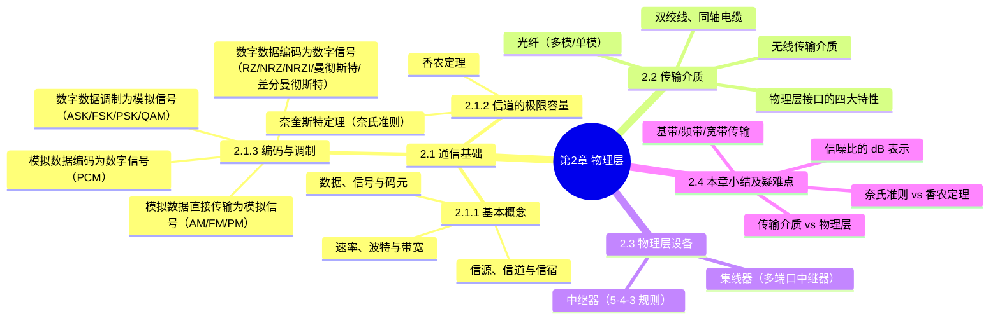

# 第 2 章 物理层 · 学习笔记

> **来源**：《王道 2027 计算机网络考研复习指导》第2章（原书第 30–49 页；第 36–41、45、47 页的习题与答案解析已整页略去；第 35、44、48 页为正文与习题的混合页，已保留其中正文：35 页 DPSK/QAM 与「模拟数据直接传输为模拟信号」、44 页卫星与红外激光通信和「物理层接口的特性」、48 页「本章小结及疑难点」）。
> **体例**：本笔记为考点笔记，原文单独存放于《第2章物理层原文.md》。每个知识点的出处链接可精确跳转到原文存档中对应的小节标题锚点。
> **反例核查**：对有争议、有条件、可能被推翻的结论标注反例、例外、适用条件；原文未出现的标注「原文未见反例」。
> **说明**：已去除习题内容；由视觉模型识别（扫描版）+ 结构化整理两阶段生成。页码以原书印刷页为准，建议结合原书核验。

## 知识导图

## 本章备考概览

- **考纲内容**：（一）通信基础——信道、信号、带宽、码元、波特、速率、信源与信宿等基本概念；奈奎斯特定理与香农定理；编码与调制；电路交换、报文交换与分组交换；数据报与虚电路。（二）传输介质——双绞线、同轴电缆、光纤与无线传输介质；物理层接口的特性。（三）物理层设备——中继器；集线器。[第30页](<第2章物理层原文.md#2.1 通信基础>)
- **复习提示**：物理层考虑的是怎样才能在连接各台计算机的传输介质上传输数据比特流，而不是具体的传输介质。本章概念较多，易出选择题，复习时应抓住重点，如奈奎斯特定理和香农定理的应用、编码与调制技术、物理层接口的特性、物理层设备的功能和特点等。[第30页](<第2章物理层原文.md#2.1 通信基础>)

## 2.1 通信基础

### 2.1.1 基本概念

#### 1. 数据、信号与码元

- 通信的目的是传输信息，如文字、图像和视频等。[第30页](<第2章物理层原文.md#1. 数据、信号与码元>)
- **数据**：信息的载体，即用于传送信息的实体。[第30页](<第2章物理层原文.md#1. 数据、信号与码元>)
- **信号**：数据的电气或电磁表现，是数据在传输过程中的存在形式。[第30页](<第2章物理层原文.md#1. 数据、信号与码元>)
- 数据与信号均可分为模拟与数字两类：[第30页](<第2章物理层原文.md#1. 数据、信号与码元>)

| 类型 | 取值特征 |
| --- | --- |
| 模拟信号 | 取值是连续的 |
| 数字信号 | 取值是离散的 |

- **码元**：用一个固定时长的信号波形表示一个 $k$ 进制符号，该波形称为码元（也称 $k$ 进制码元），该时长称为码元宽度（或信号周期）。[第30页](<第2章物理层原文.md#1. 数据、信号与码元>)
- 每个码元能承载的信息量与其所表示的信号状态数量直接相关，1 码元可携带若干比特的信息量：[第30页](<第2章物理层原文.md#1. 数据、信号与码元>)
  - 一个信号周期内可能出现 2 种信号 → 每种信号可表示 1 位二进制数 → 1 码元携带 1 比特信息。
  - 一个信号周期内可能出现 4 种信号 → 每种信号可表示 2 位二进制数 → 1 码元携带 2 比特信息。

> 反例核查：原文未见反例。

#### 2. 信源、信道与信宿

- 数据通信系统主要划分为**信源、信道、信宿**三部分。[第30页](<第2章物理层原文.md#2. 信源、信道与信宿>)
- **信源**：产生和发送数据的源头。[第30页](<第2章物理层原文.md#2. 信源、信道与信宿>)
- **信宿**：接收数据的终点，通常都是计算机或其他数字终端装置。[第31页](<第2章物理层原文.md#2. 信源、信道与信宿>)
- **信道**：信号的传输介质。一条双向通信的线路包含一个发送信道和一个接收信道。[第31页](<第2章物理层原文.md#2. 信源、信道与信宿>)
- **噪声源**：信道上的噪声及分散在通信系统其他各处的噪声的集中表示。[第31页](<第2章物理层原文.md#2. 信源、信道与信宿>)
- 传输过程：信源发出信息 → 发送变换器转换为适合信道传输的信号 → 信号经信道传至接收端 → 接收变换器还原为原始信息 → 交付信宿。[第31页](<第2章物理层原文.md#2. 信源、信道与信宿>)

![[2027计算机网络_高清带书签版.pdf#page=43&rect=124,532,407,618]]
图 2.1 一个单向通信系统的模型

**信道的分类**：[第31页](<第2章物理层原文.md#2. 信源、信道与信宿>)

| 分类依据 | 类型 |
| --- | --- |
| 按传输信号形式 | 模拟信道（传模拟信号）、数字信道（传数字信号） |
| 按传输介质 | 无线信道、有线信道 |

**基带信号与宽带信号**：[第31页](<第2章物理层原文.md#2. 信源、信道与信宿>)

| 信号 | 定义 | 对应传输方式 |
| --- | --- | --- |
| 基带信号 | 信源发出的未经调制的原始电信号 | 在信道中直接传送 → 基带传输 |
| 宽带信号 | 将基带信号调制到高频载波上形成的信号 | 在信道上传输 → 宽带传输 |

**串行传输与并行传输**：[第31页](<第2章物理层原文.md#2. 信源、信道与信宿>)

| 传输方式 | 定义 | 适用场景 |
| --- | --- | --- |
| 串行传输 | 按比特位按序依次传输 | 长距离通信，如计算机网络 |
| 并行传输 | 若干比特通过多个通信信道同时传输 | 短距离通信，常用于计算机内部，如 CPU 与主存之间 |

**通信双方信息交互的三种基本方式**：[第31页](<第2章物理层原文.md#2. 信源、信道与信宿>)

| 方式 | 通信方向 | 信道要求 | 示例 |
| --- | --- | --- | --- |
| 单向通信 | 只有一个方向的通信，无反方向交互 | 只需一个信道 | 无线电广播、电视广播 |
| 半双工通信 | 双方都可发送或接收，但任一方都不能同时发送和接收 | 可在同一信道上分时双向传输，无须两个物理信道 | — |
| 全双工通信 | 双方可同时发送和接收 | 需要两个独立信道（每个方向一个） | — |

> 反例核查：原文未见反例。

#### 3. 速率、波特与带宽

🎯 高频考点：比特率与波特率的关系（2011、2014、2022）

- **速率**：数据传输速率，表示单位时间内传输的数据量，有两种描述形式。[第31页](<第2章物理层原文.md#3. 速率、波特与带宽>)

| 速率类型 | 别称 | 定义 | 单位 |
| --- | --- | --- | --- |
| 码元传输速率 | 波特率、调制速率 | 数字通信系统每秒传输的码元数 | 波特（Baud） |
| 信息传输速率 | 比特率 | 数字通信系统每秒传输的比特数 | b/s |

- 码元既可以是多进制的，也可以是二进制的，**码元速率与进制无关**。[第31页](<第2章物理层原文.md#3. 速率、波特与带宽>)
- **波特率与比特率的关系**：若一个码元携带 $n$ 比特的信息量，则波特率 $M$ Baud 对应的比特率为 $M\times n$ b/s。[第31页](<第2章物理层原文.md#3. 速率、波特与带宽>)
- 波特和比特是两个不同的概念，但波特率与比特率在数量上又有一定关系。[第31页](<第2章物理层原文.md#3. 速率、波特与带宽>)

**带宽的两种含义**：[第31页](<第2章物理层原文.md#3. 速率、波特与带宽>)

| 含义 | 定义 | 单位 |
| --- | --- | --- |
| 模拟通信中的带宽（频率带宽） | 信道所能传输信号的频率范围，即最高频率与最低频率之差 | 赫兹（Hz） |
| 数字通信/计算机网络中的带宽 | 通信线路所能传输数据的能力，即最大数据传输速率 | b/s |

> 📌 **拓展**：带宽的三种面孔（频率/数据/数字带宽）与基带、频带、宽带传输的辨析；波特率与比特率换算的三个易错点。[详见：带宽辨析](<第2章物理层拓展.md#拓展3 带宽的三种面孔：频率带宽、数据带宽与基带/频带/宽带>)、[详见：波特率换算](<第2章物理层拓展.md#拓展6 波特率与比特率换算的三个易错点>)

> 反例核查：原文未见反例。

### 2.1.2 信道的极限容量

- 任何实际的信道都不是理想的，信号在信道上传输时会不可避免地产生失真。只要接收端能够从失真的信号波形中识别出原始信号（原文此处识别不清，标注「【此处不清】」），这种失真对通信质量就没有影响；若信号失真严重，接收端就无法正确识别每个码元。[第31页](<第2章物理层原文.md#2.1.2 信道的极限容量>)
- 码元传输速率越高、传输距离越远、噪声干扰越大或传输介质质量越差，接收端波形的失真就越严重。[第31页](<第2章物理层原文.md#2.1.2 信道的极限容量>)

#### 1. 奈奎斯特定理（奈氏准则）

🎯 高频考点：奈氏准则的应用（2009、2014、2022、2023）

- 实际信道所能通过的频率范围总是有限的，信号中的许多高频分量无法通过信道而在传输中衰减，导致接收端波形失去码元之间的清晰界限，这种现象称为**码间串扰**。[第32页](<第2章物理层原文.md#1. 奈奎斯特定理 (奈氏准则)>)
- **奈奎斯特定理**：在理想低通信道（无噪声、带宽有限）中，为避免码间串扰，极限码元传输速率为 $2W$ 波特，其中 $W$ 是信道的频带宽度（单位为 Hz）。[第32页](<第2章物理层原文.md#1. 奈奎斯特定理 (奈氏准则)>)
- 若用 $V$ 表示每个码元的离散电平数量（不同码元的种类数；如 16 种码元需用 4 个二进制位表示，此时数据传输速率是码元传输速率的 4 倍），则理想低通信道的极限数据传输速率为：[第32页](<第2章物理层原文.md#1. 奈奎斯特定理 (奈氏准则)>)

$$\text{理想低通信道的极限数据传输速率} = 2W \log_2 V \quad (\text{单位为 b/s})$$

**奈氏准则的结论**：[第32页](<第2章物理层原文.md#1. 奈奎斯特定理 (奈氏准则)>)

1. 在任何信道中，码元传输速率存在上限，超过该上限会产生严重码间串扰，接收端无法正确识别码元。
2. 信道带宽越大，其传输码元的能力越强。
3. 奈氏准则仅限制码元传输速率，并未限制每个码元所能承载的信息量（比特数），因此信息传输速率仍可采用多元调制（如 QAM-16、QAM-64）来提升。

> 反例核查：奈氏准则适用于无噪声的理想信道，对存在噪声的实际信道不直接适用（需结合香农定理），此为适用条件而非反例。

#### 2. 香农定理

🎯 高频考点：香农定理的应用（2014、2016）

- 实际信道存在高斯白噪声。**香农定理**给出了带宽受限且有高斯噪声干扰的信道的极限数据传输速率；当速率不超过该极限值时，理论上可实现任意低的误码率。[第32页](<第2章物理层原文.md#2. 香农定理>)

$$\text{信道的极限数据传输速率} = W \log_2 (1 + S/N) \quad (\text{单位为 b/s})$$

- 式中 $W$ 为信道频带宽度（Hz），$S$ 为信号平均功率，$N$ 为噪声功率；$S/N$ 为**信噪比**（信号平均功率与噪声平均功率之比）。[第32页](<第2章物理层原文.md#2. 香农定理>)
- **信噪比的两种表示**：[第32页](<第2章物理层原文.md#2. 香农定理>)

| 表示形式 | 记法 | 示例（$S/N=1000$） |
| --- | --- | --- |
| 无单位记法 | 信噪比 $= S/N$ | 1000 |
| 分贝（dB）记法 | 信噪比 $= 10\log_{10}(S/N)$ | 30 dB |

- **注意**：使用香农定理计算极限数据传输速率时，信噪比应采用**无单位记法**。[第32页](<第2章物理层原文.md#2. 香农定理>)

🎯 高频考点：信道带宽的影响因素（2014）

**香农定理的结论**：[第32页](<第2章物理层原文.md#2. 香农定理>)

1. 信道带宽或信噪比越大，信息的极限传输速率越高。
2. 对于给定的带宽和信噪比，信息传输速率的上限是确定的。
3. 只要实际信息传输速率低于该极限值，就能找到某种方法实现近似无差错传输。
4. 香农定理得出的是理论极限，实际信道能达到的传输速率要比它低不少。

🎯 高频考点：奈氏准则与香农定理的区别（2017）

| 对比维度 | 奈氏准则 | 香农定理 |
| --- | --- | --- |
| 考虑因素 | 仅考虑带宽对码元速率的限制 | 同时考虑带宽和信噪比 |
| 适用信道 | 无噪声的理想信道 | 有噪声的实际信道 |
| 限制对象 | 码元传输速率（可借多元调制提升信息速率） | 信息传输速率（存在不可逾越的上限） |

> 📌 **拓展**：奈氏 + 香农联合计算套路（分别算、取最小）与 dB 换算、$V$ 与 $n$ 混淆等经典陷阱。[详见：联合计算套路](<第2章物理层拓展.md#拓展2 奈氏准则 + 香农定理的联合计算套路>)

> 反例核查：香农定理给出的是理论极限，实际信道能达到的传输速率远低于该值；两定理适用条件不同，计算时不可混用（奈氏准则对应理想信道，香农定理对应有噪声信道）。
### 2.1.3 编码与调制

**核心概念**：数据无论数字还是模拟，为传输都要转换成**信号**（信号是数据的具体表示形式）。将数据转换为数字信号的过程称**编码**，将数据转换为模拟信号的过程称**调制**。[第33页](<第2章物理层原文.md#2.1.3 编码与调制>)

- 数字数据既可通过数字发送器转换为数字信号传输，也可通过调制器转换为模拟信号传输；模拟数据既可通过 PCM 编码器转换为数字信号传输，也可直接以模拟信号形式传输（如传统电话中的语音信号）。由此形成四种编码与调制方式：[第33页](<第2章物理层原文.md#2.1.3 编码与调制>)

| 编号 | 方式 | 数据→信号 |
| --- | --- | --- |
| 1 | 数字数据编码为数字信号 | 数字 → 数字 |
| 2 | 模拟数据编码为数字信号 | 模拟 → 数字 |
| 3 | 数字数据调制为模拟信号 | 数字 → 模拟 |
| 4 | 模拟数据直接传输为模拟信号 | 模拟 → 模拟 |

> 反例核查：原文未见反例。

#### 1. 数字数据编码为数字信号

数字数据编码用于**基带传输**，即在基本不改变信号频率的情况下直接传输数字信号。编码核心在于如何用电平或跳变表示二进制 0 和 1。[第33页](<第2章物理层原文.md#1. 数字数据编码为数字信号>)

![[2027计算机网络_高清带书签版.pdf#page=45&rect=120,292,419,530]]
图 2.2 常用的数字数据编码（五种编码波形）

> ⚠️ **勘误**：图 2.2 中「归零编码」与「非归零编码」的波形标注反了——每码元中间跳回零电平（"归零"）的才是归零编码（RZ）。

**（1）归零编码（RZ）**：用高电平表示 1、低电平表示 0（或相反），每个码元中间都跳变回零电平（"归零"）。接收方可利用这一跳变调整自身时钟基准，实现收发双方**自同步**；但归零过程占用一部分带宽，传输效率受影响。[第33页](<第2章物理层原文.md#1. 数字数据编码为数字信号>)

**（2）非归零编码（NRZ）**：与 RZ 的区别是不归零，整个周期都可用于传输数据，**编码效率最高**；但缺乏内在时钟信息，收发双方需额外时钟线实现同步。[第33页](<第2章物理层原文.md#1. 数字数据编码为数字信号>)

🎯 高频考点：NRZ 与 NRZI 编码的波形特性（2015）[第33页](<第2章物理层原文.md#1. 数字数据编码为数字信号>)

**（3）反向非归零编码（NRZI）**：以码元起始处是否有跳变表示数据——无跳变表示 1（或依协议约定）、有跳变表示 0。跳变本身可辅助时钟恢复，兼顾 NRZ 的高效率与一定自同步能力，并避免 RZ 的带宽浪费。USB 2.0 等标准采用此编码。[第33页](<第2章物理层原文.md#1. 数字数据编码为数字信号>)

**（4）曼彻斯特编码**：每个码元中间都有一次电平跳变，该跳变**同时承担时钟同步与数据表示**功能。常用下降沿（高→低）表示 1、上升沿（低→高）表示 0（或采用相反约定）。传统以太网采用曼彻斯特编码。[第33页](<第2章物理层原文.md#1. 数字数据编码为数字信号>) [第34页](<第2章物理层原文.md#1. 数字数据编码为数字信号>)

🎯 高频考点：曼彻斯特编码的波形特性（2013、2015）[第33页](<第2章物理层原文.md#1. 数字数据编码为数字信号>)

**（5）差分曼彻斯特编码**：每个码元中间同样有电平跳变，但该跳变**仅用于时钟同步、不表示数据**；数据由码元起始处是否有跳变决定（无跳变表示 1、有跳变表示 0）。这种方式具有更强的抗干扰能力，常用于令牌环网等高速网络。[第33页](<第2章物理层原文.md#1. 数字数据编码为数字信号>) [第34页](<第2章物理层原文.md#1. 数字数据编码为数字信号>)

🎯 高频考点：差分曼彻斯特编码的波形特性（2021）[第33页](<第2章物理层原文.md#1. 数字数据编码为数字信号>)

**五种数字编码方式特性对比**（表 2.1）[第34页](<第2章物理层原文.md#1. 数字数据编码为数字信号>)：

| 特性 | 归零编码 | 非归零编码 | 反向非归零编码 | 曼彻斯特编码 | 差分曼彻斯特编码 |
| --- | --- | --- | --- | --- | --- |
| 自同步能力 | 有 | 无 | 需增加冗余位 | 有 | 有 |
| 浪费带宽 | 浪费 | 无 | 不太浪费 | 浪费 | 浪费 |
| 抗干扰能力 | 弱 | 弱 | 弱 | 强 | 强 |

> 📌 **拓展**：五种数字编码的波形速记、波形判读四步法与画波形技巧。[详见：编码波形速记](<第2章物理层拓展.md#拓展1 五种数字编码的波形速记与判读>)

> 反例/表述差异核查：正文称 NRZI 的跳变"可辅助时钟恢复""兼顾一定的自同步能力"，但表 2.1 中 NRZI 的自同步能力写作"需增加冗余位"。二者在原文中并存（前者针对 NRZI 编码本身的跳变机制，后者是表中相对归纳的表述），阅读时需注意上下文。此外，图 2.2 中「归零编码」与「非归零编码」的波形标注互换（勘误）：每码元中间跳回零电平的才是归零编码。[第33页](<第2章物理层原文.md#1. 数字数据编码为数字信号>) [第34页](<第2章物理层原文.md#1. 数字数据编码为数字信号>)

#### 2. 模拟数据编码为数字信号

该过程通常采用 **PCM（脉冲编码调制）**，包含三个步骤：[第34页](<第2章物理层原文.md#2. 模拟数据编码为数字信号>)

1. **采样**：对模拟信号周期性采样，将其从时间连续变为时间离散。根据奈奎斯特定理，采样频率不得低于信号最高频率的两倍。[第34页](<第2章物理层原文.md#2. 模拟数据编码为数字信号>)
2. **量化**：将采样所得幅值按预设分段级取整，把连续的模拟电平转换为离散数值。[第34页](<第2章物理层原文.md#2. 模拟数据编码为数字信号>)
3. **编码**：将量化后的整数转换为对应二进制数码。[第34页](<第2章物理层原文.md#2. 模拟数据编码为数字信号>)

> 反例核查：奈奎斯特定理给出的是理论最低采样频率要求，原文未展开工程中更严格的条件，原文未见反例。

#### 3. 数字数据调制为模拟信号

数字数据调制技术在发送端将数字信号转换为模拟信号，接收端再将模拟信号还原为数字信号，分别对应调制解调器的**调制**和**解调**过程。[第34页](<第2章物理层原文.md#3. 数字数据调制为模拟信号>)

![[2027计算机网络_高清带书签版.pdf#page=46&rect=117,180,430,410]]
图 2.3 数字调制的三种方式（ASK/FSK/PSK 波形）

**（1）幅移键控（ASK）**：通过改变载波的**振幅**表示 1 和 0（如用有载波/无载波输出分别表示 1 和 0）。[第34页](<第2章物理层原文.md#3. 数字数据调制为模拟信号>)

**（2）频移键控（FSK）**：通过改变载波的**频率**表示 1 和 0（如用频率 $f_1$ 和 $f_2$ 分别表示 1 和 0）。[第34页](<第2章物理层原文.md#3. 数字数据调制为模拟信号>)

**（3）相移键控（PSK）**：通过改变载波的**相位**表示 1 和 0（如用相位 0 和 $\pi$ 分别表示 1 和 0），是一种**绝对调相**方式。[第34页](<第2章物理层原文.md#3. 数字数据调制为模拟信号>)

> **DPSK 与 PSK 的区别**：DPSK（差分相移键控）是一种**相对调相**方式，通过检测当前码元与前一个码元的载波相位差来传输数字信息（如用相位是否变化分别表示 1 和 0），而非像 PSK 那样用绝对相位表示。[第35页](<第2章物理层原文.md#3. 数字数据调制为模拟信号>)

**三种数字调制方式特点对比**：[第34页](<第2章物理层原文.md#3. 数字数据调制为模拟信号>)

| 调制方式 | 改变的载波参数 | 抗干扰能力 |
| --- | --- | --- |
| ASK | 振幅 | 差 |
| FSK | 频率 | 强 |
| PSK | 相位 | —（原文未直接比较） |

🎯 高频考点：数字调制技术的分类与特点（2024）；调制阶数与码元比特数的关系（2011、2022）[第34页](<第2章物理层原文.md#3. 数字数据调制为模拟信号>)

**（4）正交幅度调制（QAM）**：在载波频率相同的前提下，**同时调制振幅和相位**形成复合信号，从而在有限带宽内实现更高数据传输速率。[第35页](<第2章物理层原文.md#3. 数字数据调制为模拟信号>)

- **正交载波**：QAM 基于正交载波，通常使用两路载波（正弦波、余弦波），两路频率相同、相位相差 90°，可在同一频带上独立传输而不相互干扰。[第35页](<第2章物理层原文.md#3. 数字数据调制为模拟信号>)
- **QAM-16**：每路载波 4 种振幅，横轴表示余弦波幅度、纵轴表示正弦波幅度，两路组合形成 16 种信号状态，每个状态对应星座图一个点、代表一个 4 位二进制数。接收端判断信号最接近哪个星座点即可恢复原始数据。[第35页](<第2章物理层原文.md#3. 数字数据调制为模拟信号>)
- **QAM-64**：每路载波振幅调制为 8 种，组合成 64 种信号状态，每个状态对应一个 6 位二进制数。[第35页](<第2章物理层原文.md#3. 数字数据调制为模拟信号>)

![[2027计算机网络_高清带书签版.pdf#page=47&rect=106,303,429,464]]
图 2.4 QAM-16 和 QAM-64 的星座图
- **速率公式**：设波特率为 $B$、采用 $m$ 个相位、每个相位 $n$ 种振幅，则 QAM 的数据传输速率为 [第35页](<第2章物理层原文.md#3. 数字数据调制为模拟信号>)：

$$
R = B\log_2(m \cdot n) \quad (\text{单位为 b/s})
$$

🎯 高频考点：QAM 调制阶数与码元比特数的关系（2009、2023）[第35页](<第2章物理层原文.md#3. 数字数据调制为模拟信号>)

> 反例核查：速率公式按原文"$m$ 个相位、每个相位 $n$ 种振幅"表述给出；若记总信号状态数 $M=m\cdot n$，等价于 $R=B\log_2 M$。原文未给出其他适用限制，原文未见反例。

#### 4. 模拟数据直接传输为模拟信号

某些场景下模拟数据直接以模拟信号形式传输、无须数字化。例如传统电话系统中语音信号通过双绞线直接传送到本地交换机。[第35页](<第2章物理层原文.md#4. 模拟数据直接传输为模拟信号>)

若需通过高频信道（如无线电波）传输，可采用**调幅（AM）、调频（FM）、调相（PM）**等模拟调制技术，将信号加载到高频载波上。[第35页](<第2章物理层原文.md#4. 模拟数据直接传输为模拟信号>)

> 反例核查：原文仅给出传统电话语音信号与无线电波场景，未展开其他例外或限制，原文未见反例。
## 2.2 传输介质

### 2.2.1 双绞线、同轴电缆、光纤与无线传输介质

**传输介质**也称传输媒体，是数据传输系统中发送器和接收器之间的物理通路。按电磁波是否被约束沿固体介质传播，可分为两类：[第42页](<第2章物理层原文.md#2.2.1 双绞线、同轴电缆、光纤与无线传输介质>)

| 类型 | 常见介质 | 传播特点 |
| --- | --- | --- |
| 导向传输介质 | 铜线、光纤 | 电磁波被约束沿固体介质传播 |
| 非导向传输介质 | 自由空间（空气、真空、海水） | 电磁波在空间中传播，称为无线传输 |

> 反例核查：原文未见反例。

#### 1. 双绞线

- **组成**：由两根相互绝缘、按一定规则绞合在一起的铜导线组成，是最常用的传输介质，广泛用于局域网和传统电话网。[第42页](<第2章物理层原文.md#1. 双绞线>)
- **绞合作用**：有效减少相邻导线间的电磁干扰。[第42页](<第2章物理层原文.md#1. 双绞线>)
- **屏蔽类型**：外加金属丝编织屏蔽层的称为**屏蔽双绞线（STP）**，无屏蔽层的称为**非屏蔽双绞线（UTP）**，屏蔽层可进一步提升抗干扰能力。[第42页](<第2章物理层原文.md#1. 双绞线>)

![[2027计算机网络_高清带书签版.pdf#page=54&rect=141,260,404,353]]
图 2.5 双绞线的结构（左：非屏蔽双绞线；右：屏蔽双绞线）

**优点**：[第42页](<第2章物理层原文.md#1. 双绞线>)

| 要点 | 补充 |
| --- | --- |
| 价格低廉 | 成本低，应用最广泛 |
| 模拟、数字传输均可用 | 既可用于模拟传输，也可用于数字传输 |
| 通信距离较远 | 通常为几千米至数十千米 |

**局限/使用条件**：[第42页](<第2章物理层原文.md#1. 双绞线>)

| 要点 | 补充 |
| --- | --- |
| 带宽受物理条件限制 | 带宽取决于铜线的粗细和传输距离 |
| 距离过远需中继 | 模拟传输用放大器放大衰减信号；数字传输用中继器整形失真信号 |

> 反例核查：距离太远时需放大器（模拟）或中继器（数字）补偿，带宽受铜线粗细与距离限制；原文未见其他反例。

#### 2. 同轴电缆

- **结构**：由内导体、绝缘层、外导体屏蔽层和绝缘保护套层构成。[第42页](<第2章物理层原文.md#2. 同轴电缆>)

![[2027计算机网络_高清带书签版.pdf#page=54&rect=175,91,376,162]]
图 2.6 同轴电缆的结构
- **分类**：[第42页](<第2章物理层原文.md#2. 同轴电缆>)

| 类型 | 主要用途 | 信号类型 |
| --- | --- | --- |
| 50Ω 同轴电缆 | 早期局域网（基带传输） | 基带数字信号 |
| 75Ω 同轴电缆 | 有线电视系统（宽带传输） | 宽带信号 |

**优点**：[第42页](<第2章物理层原文.md#2. 同轴电缆>)

| 要点 | 补充 |
| --- | --- |
| 抗干扰性能良好 | 得益于外导体的屏蔽作用 |
| 适合较高速率传输 | 适用于较高速率的数据传输 |

> 反例核查：随着交换技术和集线器的普及，局域网已基本改用双绞线作为主流传输介质，早期同轴电缆局域网应用逐步退出；原文未见其他反例。

#### 3. 光纤

- **基本通信原理**：利用光导纤维（光纤）传输光脉冲——有光脉冲表示 1，无光脉冲表示 0。可见光频率约 $10^{14}\text{ MHz}$，因此光纤系统具有极大的带宽潜力。[第43页](<第2章物理层原文.md#3. 光纤>)
- **结构与传播原理**：主要由纤芯和包层构成，纤芯直径极细（约 $8\sim100\mu\text{m}$）；包层折射率略低于纤芯，光波通过纤芯传导。当光从高折射率介质射向低折射率介质、入射角大于临界角时发生**全反射**，使光线在纤芯与包层界面反复反射向前传播。[第43页](<第2章物理层原文.md#3. 光纤>)

![[2027计算机网络_高清带书签版.pdf#page=55&rect=128,530,395,616]]
图 2.7 光波在纤芯中的传播（全反射）

**单模光纤 vs 多模光纤**：[第43页](<第2章物理层原文.md#3. 光纤>)

| 对比维度 | 多模光纤 | 单模光纤 |
| --- | --- | --- |
| 传播模式 | 允许多条不同角度入射的光线同时传输 | 仅允许单一模式传播，几乎无反射 |
| 纤芯直径 | 较粗 | 极细（接近光波波长） |
| 光源要求 | 原文未特别要求 | 需定向性优良的半导体激光器 |
| 损耗/距离 | 光脉冲损耗较大，适合短距离通信 | 衰减小，可实现数十米至数十千米无中继传输 |
| 适用场景 | 短距离通信 | 远距离通信 |

![[2027计算机网络_高清带书签版.pdf#page=55&rect=99,414,433,492]]
图 2.8 多模光纤

![[2027计算机网络_高清带书签版.pdf#page=55&rect=95,293,434,367]]
图 2.9 单模光纤

**光纤的优点**：[第43页](<第2章物理层原文.md#3. 光纤>)

| 要点 | 补充 |
| --- | --- |
| 传输损耗小，中继距离长 | 对远距离传输特别经济 |
| 抗雷电和电磁干扰性能强 | 在有大量电流脉冲干扰的环境下尤为重要 |
| 无串音干扰，保密性好 | 不易被窃听或截取数据 |
| 体积小，重量轻 | 在现有电缆管道拥塞的情况下特别有利 |

> 反例核查：多模光纤损耗较大、仅适合短距离；单模光纤需半导体激光器且纤芯极细、工艺要求高；原文对其他优点未见反例。

#### 4. 无线传输介质

- **应用背景**：无线通信广泛应用于蜂窝移动通信；便携式计算机普及及军事、野外等场景对移动联网的需求增长，使无线局域网（WLAN）迅速发展。[第43页](<第2章物理层原文.md#4. 无线传输介质>)

**（1）无线电波**：[第43页](<第2章物理层原文.md#（1）无线电波>)

| 要点 | 补充 |
| --- | --- |
| 穿透能力强、传播距离远 | 广泛用于移动通信和 WLAN |
| 全方向扩散 | 接收端无须对准发射源即可建立连接，是重要优势 |

**（2）微波、红外线和激光**：[第43页](<第2章物理层原文.md#（2）微波、红外线和激光>)

高带宽无线通信主要采用微波、红外线和激光三种技术，它们**均需视距、具有强指向性**。

- **微波通信**：工作在较高频段，带宽大、通信容量高（如 $2\text{ MHz}$ 带宽可容纳约 500 路语音信号）；但沿直线传播，地面传输距离受限，通常需中继站接力。[第43页](<第2章物理层原文.md#（2）微波、红外线和激光>)
- **卫星通信**：利用地球同步卫星作中继节点，突破地面微波传输的距离限制。[第44页](<第2章物理层原文.md#（2）微波、红外线和激光>)

**优点**：

| 要点 | 补充 |
| --- | --- |
| 通信容量大 | 利用卫星中继 |
| 覆盖范围广 | 突破地面距离限制 |
| 传输距离远 | 地球同步卫星中继 |

**缺点**：

| 要点 | 补充 |
| --- | --- |
| 保密性较差 | 信号易被截收 |
| 端到端传输时延较大 | 信号经卫星往返 |

- **红外线与激光通信**：将电信号转换为相应光信号在自由空间中直接传播，常用于短距离点对点链路（如遥控器）或室内通信；但极易受障碍物阻挡，且无法穿透墙壁。[第44页](<第2章物理层原文.md#（2）微波、红外线和激光>)

> 反例核查：微波、红外线、激光均需视距、有强指向性；红外线/激光无法穿透墙壁；卫星通信有保密性差、时延大之弊。原文未见其他反例。

### 2.2.2 物理层接口的特性

🎯 高频考点：物理层接口的特性（2012、2018）

- **物理层任务**：定义与传输介质接口相关的一些特性，使数据链路层屏蔽底层传输介质的差异、专注本层协议与服务实现。[第44页](<第2章物理层原文.md#2.2.2 物理层接口的特性>)

| 特性 | 规定内容 |
| --- | --- |
| 机械特性 | 接口所用接线的形状和尺寸、引脚数目和排列、固定和锁定装置等 |
| 电气特性 | 接口电缆中各条线路应遵循的电压范围、传输速率和距离限制等 |
| 功能特性 | 定义每条线路上信号代表的意义，并定义各线路的具体功能 |
| 过程特性（规程特性） | 描述各种功能事件发生的顺序和时序关系 |

> 📌 **拓展**：四大特性的记忆口诀与 EIA-232 接口实例对照。[详见：接口特性实例](<第2章物理层拓展.md#拓展4 物理层接口四大特性与 EIA-232 实例>)

> 反例核查：原文未见反例。
## 2.3 物理层设备

### 2.3.1 中继器

- **主要功能**：整形、放大并转发信号，以消除信号经过长电缆后产生的失真和衰减，使信号的波形和强度达到所需的要求，从而扩大网络的传输距离。[第46页](<第2章物理层原文.md#2.3.1 中继器>)
- **工作原理**：信号再生（而非简单放大衰减后的信号）。[第46页](<第2章物理层原文.md#2.3.1 中继器>)
- **端口特点**：中继器有两个端口，数据从一个端口输入，从另一个端口输出。[第46页](<第2章物理层原文.md#2.3.1 中继器>)
- **连接对象**：中继器连接的两端属于**同一局域网中的不同网段**（而非不同子网），因此所连网段仍构成一个局域网。[第46页](<第2章物理层原文.md#2.3.1 中继器>)
- **故障影响**：如果中继器发生故障，将影响相邻两个网段的正常工作。[第46页](<第2章物理层原文.md#2.3.1 中继器>)

**数量限制与「5-4-3 规则」**：[第46页](<第2章物理层原文.md#2.3.1 中继器>)

- 从理论上讲，中继器的使用数量是无限的，网络因而可无限延长；但事实上不可能，因为网络标准对信号的传输延迟范围有明确规定，中继器只能在此范围内有效工作，否则会引起网络故障。[第46页](<第2章物理层原文.md#2.3.1 中继器>)
- 在采用粗同轴电缆的 **10Base-5** 以太网规范中：互相串联的中继器数量不能超过 4 个；由 4 个中继器串联的 5 段电缆中，仅有 3 段可挂接主机，其余 2 段只能用作扩展通信范围的链路段、不能挂接主机。即「**5-4-3 规则**」。[第46页](<第2章物理层原文.md#2.3.1 中继器>)

> 📌 **拓展**：5-4-3 规则的来历（10BASE-5 粗缆以太网与冲突检测窗口）与物理层设备演进脉络。[详见：5-4-3 规则来历](<第2章物理层拓展.md#拓展5 「5-4-3 规则」的来历与物理层设备演进>)

> 反例核查：「中继器数量无限」仅为理论结论，实际受信号传输延迟范围约束；10Base-5 规范下适用「5-4-3 规则」。原文未见其他反例。

### 2.3.2 集线器

- **本质**：集线器（Hub）实质上是一个**多端口的中继器**。[第46页](<第2章物理层原文.md#2.3.2 集线器>)
- **工作过程**：一个端口接收到数据信号后，由于信号在传输过程中已有衰减，集线器便对该信号进行整形和放大，将其再生为接近原始发送时的信号，紧接着转发到其他所有（除输入端口外）处于工作状态的端口。[第46页](<第2章物理层原文.md#2.3.2 集线器>)
- **冲突特性**：若两个或多个端口所连节点同时发送信号，则会发生冲突，导致所有相关帧传输失败。[第46页](<第2章物理层原文.md#2.3.2 集线器>)
- **角色定位**：集线器在网络中只起信号放大和转发作用，目的是扩大网络的传输范围，**不具备信号的定向传送能力**（信息广播至所有端口），是标准的**共享式设备**。[第46页](<第2章物理层原文.md#2.3.2 集线器>)

> ⚠️ **注意**：中继器和集线器**不具备缓存能力**，当其连接两个不同链路层协议的网络时可能会出现问题。若两个网段的速率分别为 10Mb/s 和 100Mb/s，采用集线器连接后，整个网络只能以速率 10Mb/s 工作。[第46页](<第2章物理层原文.md#2.3.2 集线器>)

- **协议转换限制**：集线器仅工作在物理层，无法对帧进行解封与重新封装操作（无法实现链路层协议转换），其功能仅限于对接收到的帧对应的二进制串进行无差别转发；当两端链路层协议不同时，接收端将无法正确解析所接收到的二进制串。[第46页](<第2章物理层原文.md#2.3.2 集线器>)
- **拓扑**：由集线器组成的网络在**物理上是星形网络**，但**逻辑上仍是总线形网络**。[第46页](<第2章物理层原文.md#2.3.2 集线器>)
- **网段关系**：集线器的每个端口连接的是同一网络的不同网段。[第46页](<第2章物理层原文.md#2.3.2 集线器>)
- **双工模式**：集线器只能工作在**半双工模式**，网络的吞吐率因而受到限制。[第46页](<第2章物理层原文.md#2.3.2 集线器>)

> 反例核查：集线器连接不同速率网段时整体只能以 10Mb/s 工作；连接不同链路层协议网段时接收端无法正确解析。原文未见集线器能自适应高速率或实现链路层协议转换的反例。

### 中继器与集线器对比

| 维度 | 中继器 | 集线器 |
| --- | --- | --- |
| 本质 | 信号再生设备 | 多端口中继器（Hub） |
| 功能 | 整形、放大并转发信号 | 整形、放大信号并广播转发 |
| 信号处理方式 | 信号再生 | 信号再生 |
| 端口 | 两个端口，一进一出 | 多端口，广播至除输入端口外的所有工作端口 |
| 定向传送能力 | 原文未见明确说明 | 不具备定向传送能力 |
| 缓存能力 | 无 | 无 |
| 工作层次 | 物理层 | 物理层 |
| 连接对象 | 同一局域网中的不同网段 | 同一网络的不同网段 |
| 冲突/共享特性 | 原文未见明确说明 | 多节点同时发送会冲突，标准共享式设备 |
| 拓扑 | 原文未见明确说明 | 物理星形网络，逻辑总线形网络 |
| 双工模式 | 原文未见明确说明 | 半双工 |
| 速率适配 | 原文未见明确说明 | 连接 10Mb/s 与 100Mb/s 网段时整体以 10Mb/s 工作 |

> 本表整理自[第46页](<第2章物理层原文.md#2.3.1 中继器>)。标「原文未见明确说明」处为原文该页未直接提及，不作臆测补充。
## 2.4 本章小结及疑难点

### 1. 传输介质属于物理层吗？它与物理层有何区别？

**核心结论**：传输介质不属于物理层。尽管与物理层紧密相关，但从网络体系结构看，它位于物理层之下，常被非正式称为"第 0 层"。[第48页](<第2章物理层原文.md#2.4 本章小结及疑难点>)

两者的区别在于：传输介质只承载电信号或光信号，无法区分信号所代表的比特值——即无法判断某一电平对应的是 1 还是 0；物理层则通过定义电气、机械、功能和过程特性（如电压、时序、接口规范等），将原始信号解释为有意义的比特流，供上层使用。[第49页](<第2章物理层原文.md#2.4 本章小结及疑难点>)

| 比较项 | 传输介质 | 物理层 |
| --- | --- | --- |
| 层级位置 | 位于物理层之下，常被非正式称为"第 0 层" | 网络体系结构中的第 1 层（物理层） |
| 能力 | 只承载电/光信号，无法区分信号所代表的比特值 | 通过定义电气、机械、功能、过程特性，把原始信号解释为有意义的比特流 |
| 类比 | 信号的"通道" | 赋予信号语义的"规则制定者" |

图 2.10 直观展示了这一关系：传输介质是信号的"通道"，物理层是赋予其语义的"规则制定者"。[第49页](<第2章物理层原文.md#2.4 本章小结及疑难点>)

![[2027计算机网络_高清带书签版.pdf#page=61&rect=118,517,410,614]]
图 2.10 传输介质与物理层

> 反例核查：原文未见反例。

### 2. 什么是基带传输、频带传输和宽带传输？它们有什么区别？

三种传输方式的对比如下：[第49页](<第2章物理层原文.md#2.4 本章小结及疑难点>)

| 比较项 | 基带传输 | 频带传输 | 宽带传输 |
| --- | --- | --- | --- |
| 机制 | 直接发送原始数字信号（如高、低电平），**不经过调制** | 把数字信号"搭载"到高频载波上（调制），转换后的信号更适合在模拟信道（如电话线）上传输 | 利用频分复用等技术，把一条物理线路划分为多个频带信道，各信道独立进行频带传输、互不干扰 |
| 带宽占用 | 占用整个信道带宽 | 支持多路复用，提高信道利用率 | 多个信号并行传送，显著提升链路容量 |
| 适用场景 | 短距离通信（局域网、计算机内部连接） | 远距离传输（电话线上网、Wi-Fi 等） | 如：有线电视网络一边上网、一边看电视 |
| 编码/示例 | 不归零编码：高电平表示 1、低电平表示 0，传输"1010"时依次送（高、低、高、低）；也可用曼彻斯特编码 | 调制后一个码元可代表多位二进制数据，如码元 A 对应"1010"，模拟信道上只需发送码元 A | 原文未给具体编码示例 |

> 反例核查：原文对"基带传输通常用于短距离通信""宽带传输指传统通信语境"用了限定词，说明是通常情形而非绝对；原文未见反例。

### 3. 奈氏准则和香农定理的主要区别是什么？它们对数据通信的意义是什么？

奈氏准则与香农定理从不同角度揭示了信道传输能力的极限，共同构成数据通信系统设计的理论基础。[第49页](<第2章物理层原文.md#2.4 本章小结及疑难点>)

| 比较项 | 奈氏准则 | 香农定理 |
| --- | --- | --- |
| 适用前提 | 仅考虑信道带宽限制，与噪声无关 | 适用于有噪声的实际信道，考虑带宽和信噪比 |
| 限制对象 | 码元传输速率存在上限，超过则因码间串扰无法正确识别信号 | 信息传输速率存在不可逾越的理论上限 |
| 是否限制每码元比特数 | 不限制每个码元携带的比特数，可用高阶调制提升信息传输速率 | 直接约束信息传输速率 |
| 提高速率的途径 | 高阶调制（一个码元表示多位） | 只能增加带宽或改善信噪比，二者均有物理限制 |

- 奈氏准则揭示信道带宽对码元传输速率的限制；香农定理揭示噪声对信息传输速率的限制。[第49页](<第2章物理层原文.md#2.4 本章小结及疑难点>)

> 反例核查：原文未见反例。

### 4. 信噪比明明是 S/N，为什么还要用 $10\log_{10}(S/N)$ 表示？

信噪比可用两种方式表示，两者在数学上等价，但分贝形式更实用。[第49页](<第2章物理层原文.md#2.4 本章小结及疑难点>)

| 表示方式 | 定义 | 示例 | 特点 |
| --- | --- | --- | --- |
| 线性比值（无单位） | $S/N$ | 信号功率 100、噪声功率 1，则 $S/N=100$ | 数值可能极大，书写冗长且容易数错 |
| 分贝形式（单位 dB） | $10\log_{10}(S/N)$ | 上例中 $10\log_{10}(100)=20\ \text{dB}$ | 简洁高效，适合表达极大或极小的比值 |

**为什么分贝更实用**：通信中信号与噪声的功率差异往往极大，例如信号可能是噪声的 10 亿倍。若用线性值表示，则 1 后面有 9 个 0，冗长且容易数错；用分贝表示仅为 90 dB，简洁且不易出错。[第49页](<第2章物理层原文.md#2.4 本章小结及疑难点>)

> 反例核查：原文未见反例。
